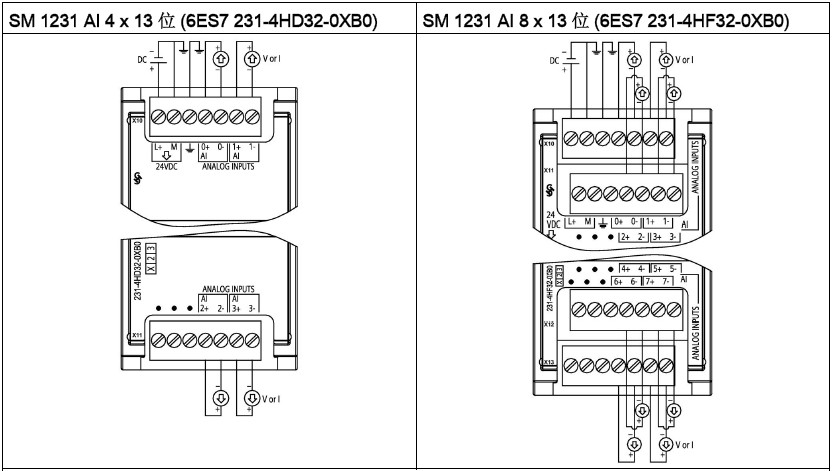
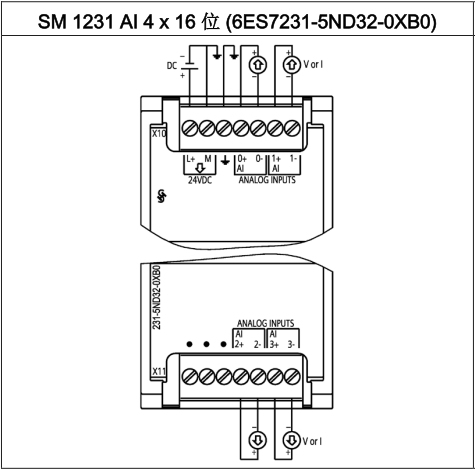
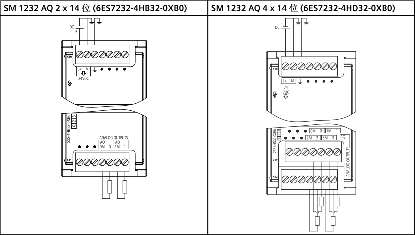
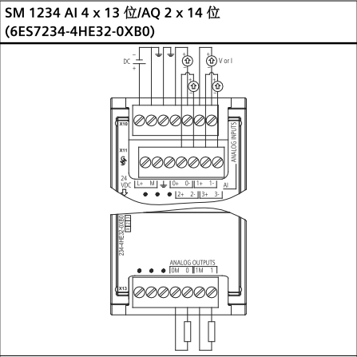
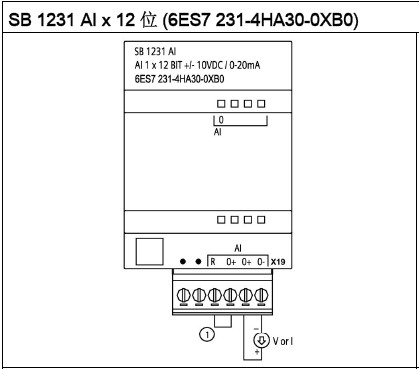
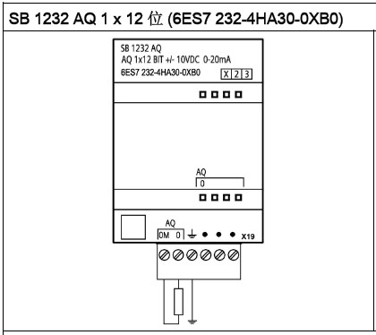
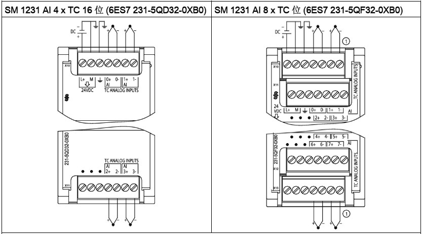
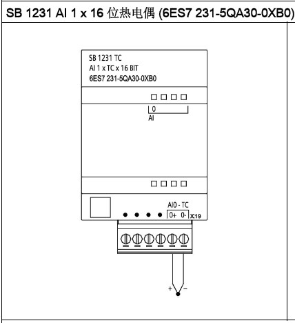
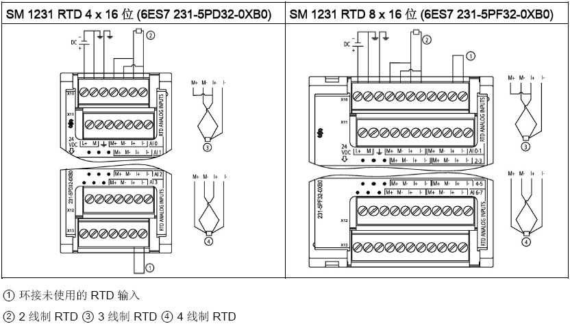
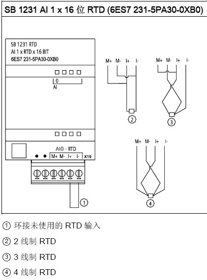

# 模拟量模块

### SM1231 模拟量输入

{width="833"
height="471"}{width="475" height="469"}

### SM 1232 模拟量输出

{width="828" height="469"}

### SM 1234 模拟量输入/输出

{width="447" height="447"}

### SB 1231 模拟量输入（信号板）

{width="419" height="370"}

### SB 1232 模拟量输出（信号板）

{width="420" height="374"}

### AI 连接传感器接线方式

图1. 4 线制传感器

{width="450" height="400"}

 

图2. 3 线制传感器

{width="450" height="405"}

 

图3. 2 线制传感器

{width="450" height="414"}

 

## TC 信号模块

### TC 信号模块接线

{width="833" height="461"}

### TC 信号板接线

{width="428" height="468"}

## []{#RTD}RTD 信号模块

### RTD 信号模块接线

{width="832" height="476"}

### RTD 信号板接线

{width="422" height="570"}
