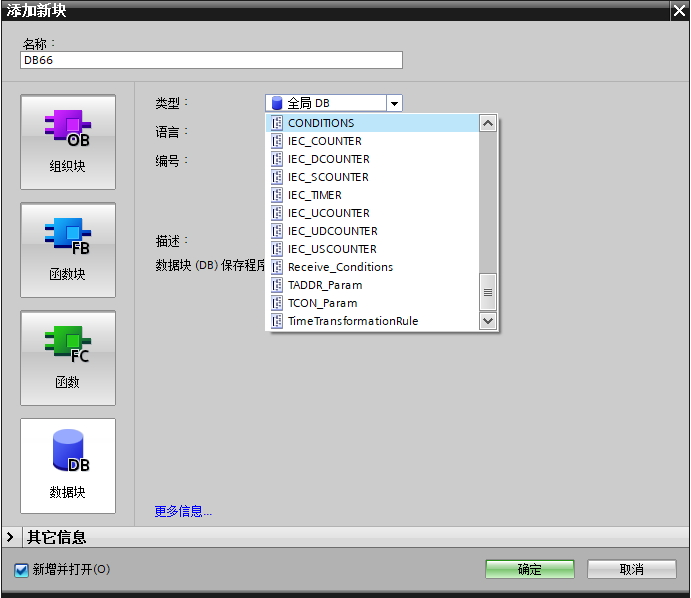

# 系统数据类型（SDT）

系统数据类型由系统提供具有预定义的结构，结构由固定数目的具有各种数据类型的元素构成，不能更改该结构。系统数据类型只能用于特定指令。

可以在DB块、OB/FC/FB接口区使用。

表1 常见系统数据类型

| 系统数据类型 | 字节长度 |         说明       |
|-----------|---------|--------------------------|
|IEC_TIMER |16| 定时器结构   此数据类型可用于“TP”、“TOF”、“TON”、“TONR”、“RT”和“PT”指令|  
|IEC_SCOUNTER|3| 计数值为 SINT 数据类型的计数器结构   此数据类型用于“CTU”、“CTD”和“CTUD”指令|
|IEC_USCOUNTER|3| 计数值为 USINT 数据类型的计数器结构   此数据类型用于“CTU”、“CTD”和“CTUD”指令|
|IEC_COUNTER| 6 |计数值为 INT 数据类型的计数器结构   此数据类型用于“CTU”、“CTD”和“CTUD”指令|
|IEC_UCOUNTER| 6 |计数值为 UINT 数据类型的计数器结构  此数据类型用于“CTU”、“CTD”和“CTUD”指令|
|IEC_DCOUNTER|12 |计数值为 DINT 数据类型的计数器结构   此数据类型用于“CTU”、“CTD”和“CTUD”指令|
|IEC_UDCOUNTER| 12| 计数值为 UDINT 数据类型的计数器结构   此数据类型用于“CTU”、“CTD”和“CTUD”指令|
|ERROR_STRUCT| 28| 编程错误信息或 I/O 访问错误信息的结构   此数据类型用于“GET_ERROR”指令|
|CREF| 8| 数据类型 ERROR_STRUCT 的组成   在其中保存有关块地址的信息|
|NREF| 8 |数据类型 ERROR_STRUCT 的组成   在其中保存有关操作数的信息|
|VREF| 12| 用于存储 VARIANT 指针 < br> 此数据类型用在运动控制工艺对象块中|
|CONDITIONS |52| 用户自定义的数据结构，定义数据接收的开始和结束条件   此数据类型用于“RCV_CFG”指令|
|TADDR_Param| 8 |指定用来存储通过 UDP实现开放用户通信的连接说明的数据块结构   此数据类型用于“TUSEND”和“TURCV”指令|
|TCON_Param |64 |指定用来存储那些通过工业以太网实现开放用户通信的连接说明的数据块结构   此数据类型用于“TSEND”和“TRCV”指令|
|HSC_Period |12 |使用扩展的高速计数器，指定时间段测量的数据块结构   此数据类型用于“CTRL_HSC_EXT”指令|

表1中的部分数据类型还可以在新建DB块时，直接创建系统数据类型的DB，如图1所示。通过这种方法建立出的DB块可以配合DB_ANY类型使用，参见[链接1](./08-DB_ANY.md#udt2-指向-udt-或-sdt-建立的-db-块的-db_any)、[链接2](./08-DB_ANY.md#typeofdb3-与指定数据类型比较)。

此外通过以下方式也可以实现建立系统数据类型DB

1\. 定时器计数器自动生成的背景DB

2\. 计数器自动生成的背景DB

3\. 开放式用户通信程序建立的基于TCON_IP_V4（无法通过添加新块的方式创建）、TADDR_Param、TCON_Param的DB块

## 根据SDT定义DB块

{width="691" height="598"}

图1 建立SDT类型的DB
