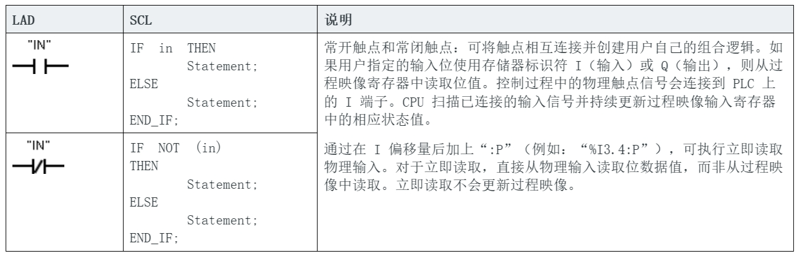
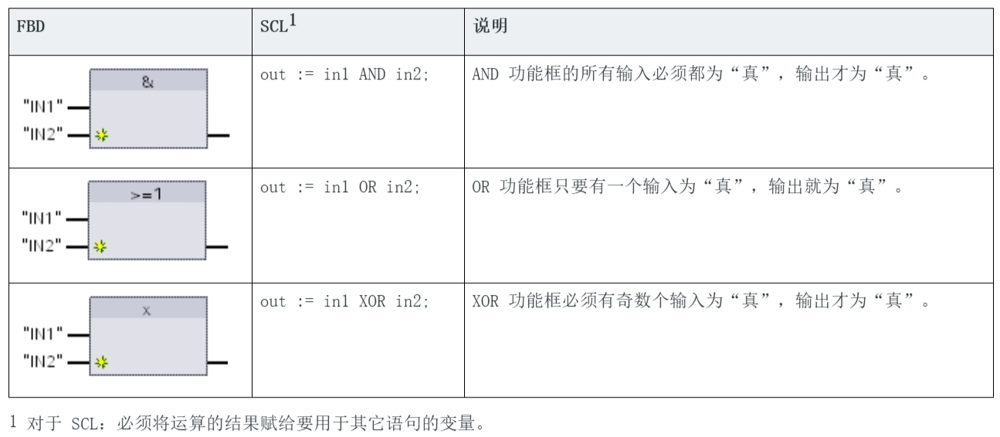
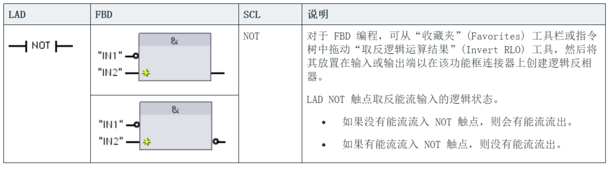
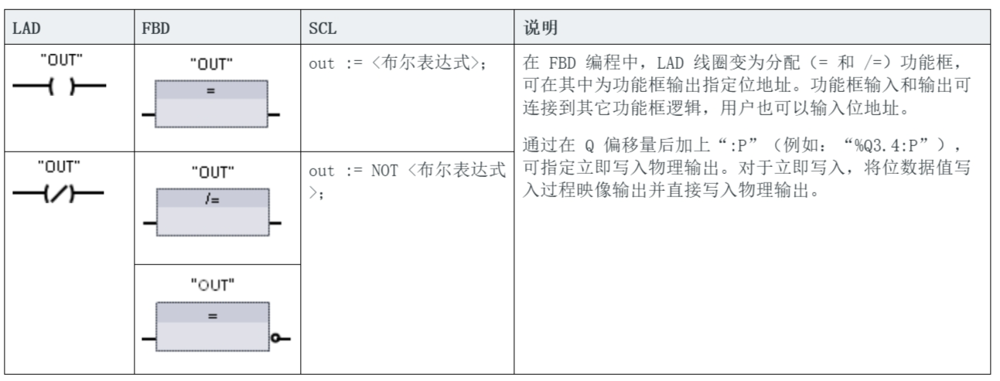

# 位指令

​使用 LAD 和 FBD 处理布尔逻辑非常高效。SCL 不但非常适合处理复杂的数学计算和项目控制结构，而且也可以使用 SCL 处理布尔逻辑。

## LAD 触点

常开触点和常闭触点

参数的数据类型

|​参数|​数据类型|​说明|
|----|-------|------------------|
|​IN   | ​Bool    |    ​分配位  |

- ​在赋的位值为 1 时，常开触点将闭合 (ON)。
- ​在赋的位值为 0 时，常闭触点将闭合 (ON)。
- ​以串联方式连接的触点创建 AND 逻辑程序段。
- ​以并联方式连接的触点创建 OR 逻辑程序段。

## FBD、AND、OR、XOR 功能框 

在 FBD 编程中，LAD 触点程序段变为与 (&)、或 (>=1) 和异或 (x) 功能框程序段，可在其中为功能框输入和输出指定位值。也可以连接到其它逻辑框并创建用户自己的逻辑组合。在程序段中放置功能框后，可从“收藏夹”(Favorites) 工具栏或指令树中拖动“插入输入”(Insert input) 工具，然后将其放置在功能框的输入侧以添加更多输入。也可以右键单击功能框输入连接器并选择“插入输入”(Insert input)。

​功能框输入和输出可连接到其它逻辑框，也可输入未连接输入的位地址或位符号名称。执行功能框指令时，当前输入状态会应用到二进制功能框逻辑，如果为真，功能框输出将为真。

AND、OR 和 XOR 功能框

参数的数据类型

|​参数|​数据类型|​说明|
|----|-------|------------------|
|​IN1 ，IN2 | ​Bool    |   输入位  |

## NOT 逻辑反相器

取反 RLO（逻辑运算结果）

## 输出线圈 和 赋值功能框

线圈输出指令写入输出位的值。如果用户指定的输出位使用存储器标识符 Q，则 CPU 接通或断开过程映像寄存器中的输出位，同时将指定的位设置为等于能流状态。控制执行器的输出信号连接到 CPU 的 Q 端子。

在 RUN 模式下，CPU 系统将连续扫描输入信号，并根据程序逻辑处理输入状态，然后通过在过程映像输出寄存器中设置新的输出状态值进行响应。CPU 系统会将存储在过程映像寄存器中的新的输出状态响应传送到已连接的输出端子。

赋值和赋值取反

参数的数据类型

|​参数|​数据类型|​说明|
|----|-------|------------------|
|​OUT | ​Bool    |  分配位  |

- 如果有能流通过输出线圈或启用了 FBD“=”功能框，则输出位设置为 1。
- ​如果没有能流通过输出线圈或未启用 FBD“=”赋值功能框，则输出位设置为 0。
- ​如果有能流通过反向输出线圈或启用了 FBD“/=”功能框，则输出位设置为 0。
​- 如果没有能流通过反向输出线圈或未启用 FBD“/=”功能框，则输出位设置为 1。
