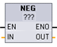

# NEG（取反）

## NEG（求二进制补码）指令

| ​LAD/FBD \*| ​SCL | ​说明 |
| --- | --- | --- |
|  | -(in); | ​使用 NEG 指令可将参数 ​IN​ 的值的算术符号取反并将结果存储在参数 ​OUT​ 中。 NEG（求二进制补码） |

!!! note "\* : LAD 和 FBD：单击“???”并从下拉菜单中选择数据类型。"

## 参数的数据类型

| ​参数 | ​数据类型\*| ​说明 |
| --- | --- | ---|
| ​IN | ​SInt, Int, DInt, Real, LReal​, 常数 | ​数学运算输入 |
| ​OUT | ​SInt, Int, DInt, Real, LReal | ​数学运算输出 |

!!! note "\* :参数 IN1、IN2 和 OUT 的数据类型必须相同。"

## ENO 状态

| ​ENO | ​说明 |
|---| ----|
| ​1  | ​无错误 |
| ​0  | ​结果值超出所选数据类型的有效数值范围。  ​以 ​SInt​ 为例：NEG (-128) 的结果为 +128，超出该数据类型的最大值。 |