### 应用举例

假设在旋转机械上有单相增量编码器作为反馈，接入到 S7-1200 CPU，要求在计数
25000 个脉冲时，计数器复位，置位 M0.5，并设定新预置值为 50000
个脉冲，当计满 50000 个脉冲后复位 M0.5，并将预置值再设为
25000，周而复始执行此功能。

针对此应用，选择 CPU
1214C，高速计数器为：HSC1。模式为：单相计数，内部方向控制，无外部复位。脉冲输入接入
I0.0，使用 HSC1 的计数值等于参考值 1 中断（CV=RV）功能实现此应用。

组态步骤：先在设备与组态中，选择
CPU，单击属性，激活高速计数器，并设置相关参数。此步骤必须事先执行，S7-1200
的高速计数器功能必须要先在硬件组态中激活，才能进行下面的步骤。添加硬件中断块，关联相对应的高速计数器所产生的预置值中断，在中断块中添加高速计数器指令块，编写修改预置值程序，设置复位计数器等参数。将程序下载，执行功能。

#### 硬件组态

如图 1 所示，进入 CPU 的硬件视图。

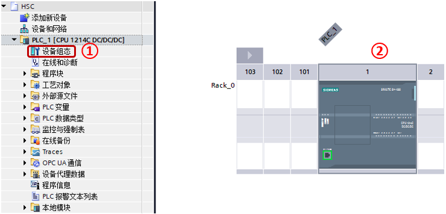{width="740" height="356"}

图 1. 选中CPU

①展开 PLC，左键双击设备组态

②在 CPU 硬件视图，左键选中 CPU

如图 2 所示，启用高速计数器。

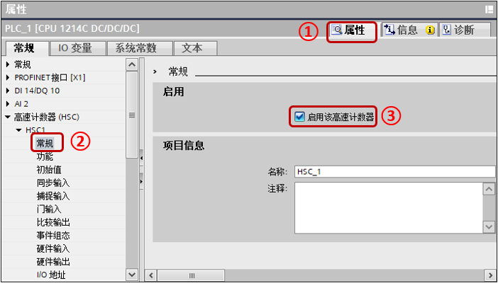{width="702" height="400"}

图 2. 选择属性打开组态界面

①左键选择属性

②在导航栏中选择"高速计数器（HSC）"，在 HSC1 中选择"常规"

③勾选"启用该高速计数器"

如图 3 所示，设置高速计数器基本设置。\
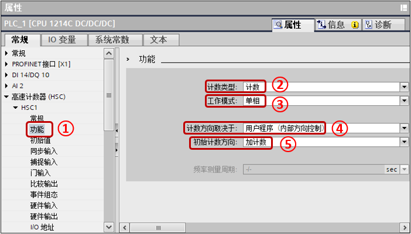{width="702" height="400"}

图 3. 激活高速计数功能

①在 HSC1 中选择\"功能\"

②计数类型选择"计数"

③工作模式选择"单相"

④计数方向取决于选择"用户程序（内部方向控制）"

⑤初始计数方向选择"加计数"

如图 4 所示，设置计数器初始值。

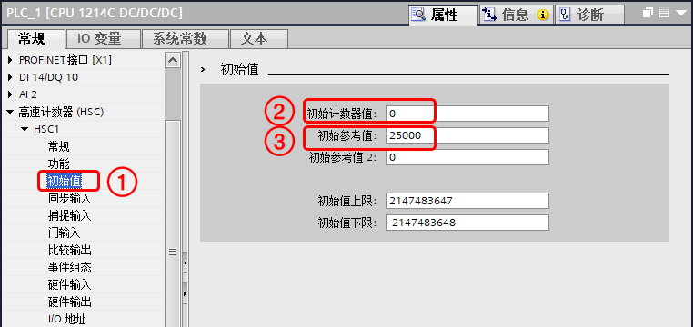{width="762" height="360"}

图 4. 计数器初始值

①在 HSC1 中选择\"初始值\"

②初始计数器值设置"0"

③初始参考值设置"25000"

如图 5 所示，组态事件。

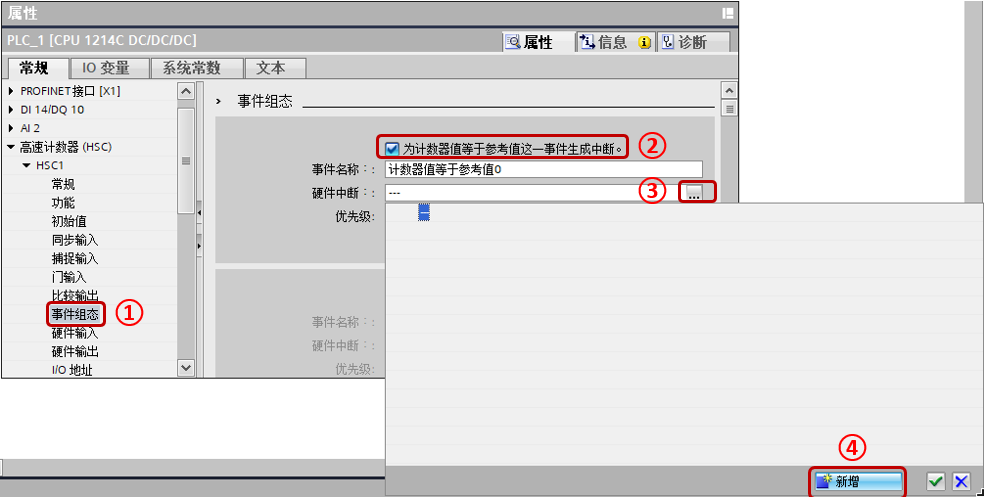{width="985" height="497"}

图 5. 事件组态

①在 HSC1 中选择\"事件组态\"

②激活"为计数器值等于参考值这一事件生成中断"

③左键点击该按钮在弹出页面选择所需的硬件中断

④如果没有硬件中断或者没有所需要的硬件中断，则左键点击按钮"新增"，会弹出页面，如图
6 所示

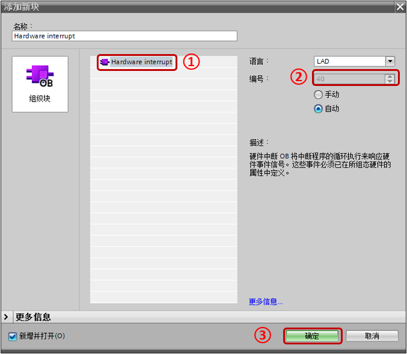{width="677" height="589"}

图 6. 添加新的硬件中断

①选择\"Hardware interrupt\"

②注意该硬件中断的中断 OB 编号

③左键点击"确定"按钮

如图 7 所示，设置硬件输入点。

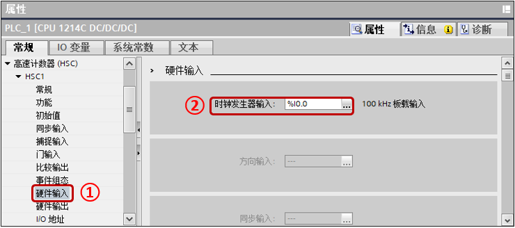{width="740" height="328"}

图 7. 设置输入点

①在 HSC1 中选择\"硬件输入\"

②在时钟发生器输入中选择所需的 I 点，例如例子中的"I0.0"

如 图8 所示，查看 HSC 的计数值地址。

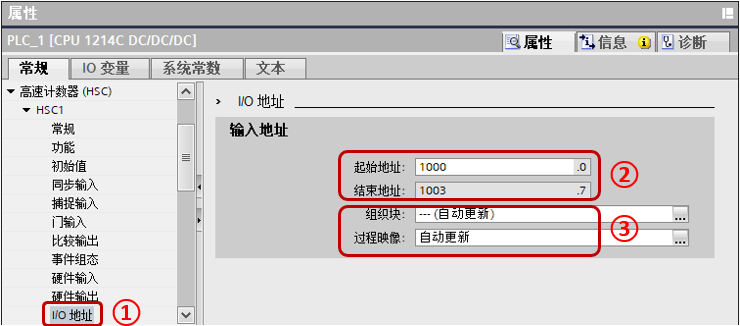{width="740" height="326"}

图 8. 计数值地址

①在 HSC1 中选择\"I/O 地址\"

②起始地址到结束地址为 HSC 实际计数器值的地址，图中地址为 ID1000。

③组织块和过程映像一般设置默认，可以设置计数值在指定 OB 更新。

如图 9 所示，设置 I 点的输入滤波器时间。

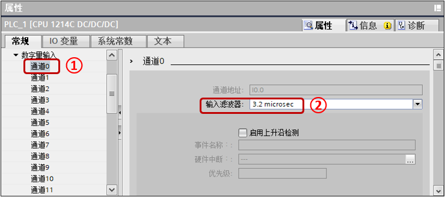{width="740" height="327"}

图 9. 输入滤波器

①在 CPU 或者信号板中找到使用的通道

②在输入滤波器设置合适的滤波值，固件 V4.0
版本开始需要设置，具体可以参考页面，[为什么 S7-1200
高速计数器只能检测到低频率的脉冲信号](04-FAQ.html)。

至此硬件组态部分已经完成，下面进行程序编写。

#### 程序编写

如图 10 所示，展开项目树中的 PLC 的程序块，选择所需的硬件中断。

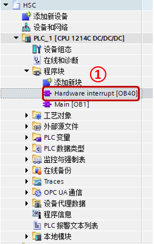{width="260" height="412"}

图 10. 打开硬件中断块

①左键双击打开所需的硬件中断

如图 11 所示，在指令列表中找到工艺指令 \-- 计数 \-- CTRL_HSC_EXT。

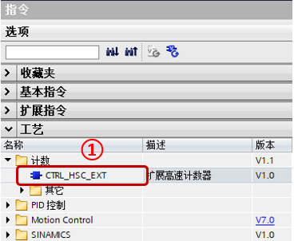{width="368" height="302"}

图 11. 添加高速计数器

①在图中位置找到所需指令，将指令拖入硬件中断的程序编辑器，会产生如图 12
所示的调用选项，只能选择单个实例，单击"确定"按钮。

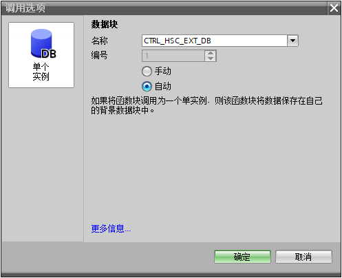{width="497" height="404"}

图 12. 定义指令背景数据块

如图 13 所示，新建 DB，新建变量，数据类型为 HSC_Count。

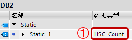{width="271" height="82"}

图 13. 高速计数器变量

①在数据类型处手动输入 HSC_Count，输入完回车确认。

如图 14 所示，在硬件中断内编程。\

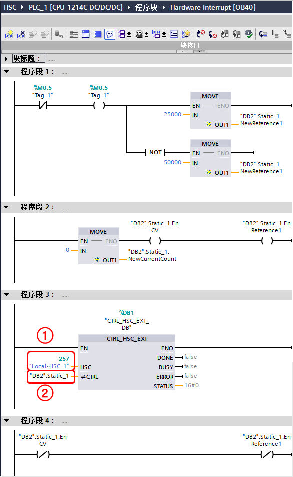{width="585" height="951"}

图 14. 硬件中断编程

程序段 1： M0.5 作为标志位，在 OB1 第一个扫描周期置位，参考下面图
15，该标志位为 1 时指代参考值为 25000 时，为 0 时指代参考值为 50000 时。

当进入中断时，反转标志位，并赋值新的参考值。

程序段 2：设置新的当前值为 0，设置新的当前值使能，设置新的参考值使能。

程序段 3：触发高速计数器指令

①输入高速计数器标识符，以 HSC1
为例，建议输入符号名"Local\~HSC_1"而非只是数值。

②在 CTRL 处输入图 13 处新建的变量。

程序段 4：取消新的当前值使能，取消新的参考值使能。

如图 15 所示，在 OB1 中编写程序，初始化标志位 M0.5 以及软件门，然后将图
14 中的程序段 3 复制到 OB1 即可。

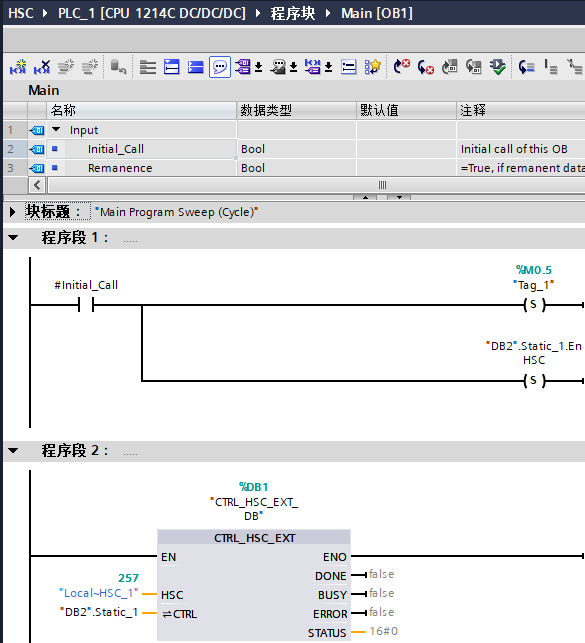{width="585" height="643"}

图 15. OB1 程序

至此程序编制部分完成，将完成的组态与程序下载到 CPU
后即可执行，当前的计数值可在\"DB2\".Static_1.CurrentCount 中读出。
