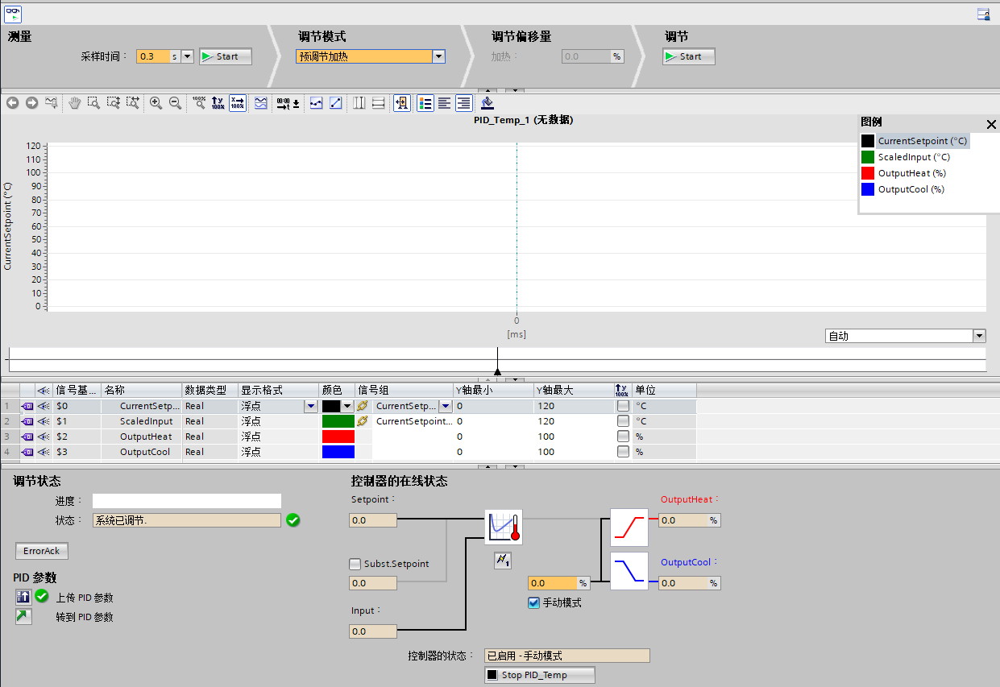
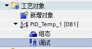
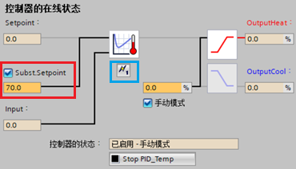

### PID_Temp 自整定 {#pid_temp-自整定 .STYLE1}

要使受控系统达到满足要求的控制效果，PID
控制器的参数要合适。由于受控系统的特性不尽相同，因此，受控系统的 PID
参数也不相同。

可通过参数访问方式手动调试，在调试面板中观察曲线图后调整对应的 PID
参数。也可使用指令提供的参数自整定功能。

### 调试面板

调试面板是用于调试 PID 控制器的工具，如图 1 所示。
可以在趋势视图中监视加热和制冷的设定值、过程值以及输出值随时间变化的曲线。

调试面板支持以下功能：

-   控制器预调节
-   控制器精确调节
-   在趋势视图中监视当前闭环控制
-   通过指定手动 PID 输出值和替代设定值来测试受控系统
-   将 PID 参数的实际值保存到离线项目

{width="1241" height="853"}

图 1. 调节面板

### S7-1200 PID_Temp 自整定功能

PID
自整定是按照一定的数学算法，通过外部输入信号激励系统，并根据系统的反应数据来计算
PID 参数。

S7-1200
提供了两种整定方式，预调节和精确调节。经过预调节和精确调节后获得最佳 PID
参数。

#### 预调节

预调节功能在对输出值跳变的过程响应中，搜索拐点，根据受控系统的最大斜率与时间计算
PID 参数，如图 2 所示。

过程值越稳定，PID
参数就越容易整定，结果也会越准确。只要过程值的上升速率明显高于噪声，就可以容忍过程值的噪声。最可能的情况是处于"未激活"和"手动模式"工作模式下。

重新计算前会自动备份 PID 参数。

{width="1235" height="349"}

图 2. 预调节

PID_Temp 的预调节类型：\

-   预调节加热
-   预调节加热和制冷
-   预调节制冷

如果要调节加热和制冷过程的 PID 参数，先后使用\"预调节加热\"
和\"预调节制冷\"与单独使用\"预调节加热和制冷\"
相比，可获得更好的控制响应。但是，分两个步骤进行预调节将需要更长的时间。

**常规要求**

-   已在循环中断 OB 中调用 PID_Temp 指令。
-   ManualEnable = FALSE
-   Reset = FALSE
-   PID_Temp 处于下列模式之一：\"未激活\"、\"手动模式\"或\"自动模式\"。
-   设定值和过程值均在组态的限值范围内

**预调节加热的相关要求**

-   \| 设定值 -- 过程值 \| \> 0.3 \* \| 过程值上限 -- 过程值下限 \|
-   \| 设定值 -- 过程值 \| \> 0.5 \* \| 设定值 \|
-   设定值 \> 过程值

**预调节加热和制冷的相关要求**

-   在\"基本设置\"中已激活制冷输出
-   在\"输出值的基本设置\"中已激活切换加热/制冷的 PID 参数方式
-   \| 设定值 -- 过程值 \| \> 0.3 \* \| 过程值上限 -- 过程值下限 \|
-   \| 设定值 -- 过程值 \| \> 0.5 \* \| 设定值 \|
-   设定值 \> 过程值

**预调节制冷的相关要求**

-   在\"基本设置\"中已激活制冷输出
-   在\"输出值的基本设置\"中已激活切换加热/制冷的 PID 参数方式
-   已成功执行\"预调节加热\"或\"预调节加热和制冷\"，尽量使用同一设定值。
-   \| 设定值 -- 过程值 \| \< 0.05 \* \| 过程值上限 -- 过程值下限 \|

如果预调节完成时没有报错，则 PID 参数调节成功。PID_Temp
将切换到自动模式并使用已调节的参数。 PID 参数断电保持。

如果预调节失败，PID_Temp 将根据已组态的方式对错误作出响应。

注意：如果进度条长时间无变化，有可能是调节功能受到限制，请单击\"调节模式\"中的
\"Stop\" 图标。检查工艺对象的组态，必要时请重新启动控制器调节功能。

#### 精确调节

精确调节将使过程值出现恒定受限的振荡，并根据此振荡的幅度和频率为工作点调节
PID 参数，如图 3 所示。

精确调节得出的 PID 参数通常比预调节得出的 PID
参数具有更好的主控和扰动特性。

重新计算前会自动备份 PID 参数。

{width="1240" height="350"}

图 3. 精确调节

PID_Temp 的精确调节类型：

-   精确调节加热
-   精确调节制冷

**常规要求**

-   已在循环中断 OB 中调用 PID_Temp 指令。
-   ManualEnable = FALSE
-   Reset = FALSE
-   设定值和过程值均处于组态的限值范围内。
-   控制回路已稳定在工作点。
-   不能被干扰。
-   PID_Temp 处于未激活模式、自动模式或手动模式。

**精确调节加热的相关要求**

-   如果将 PID_Temp 组态为加热和制冷控制器
    ，则在达到要开始调节的工作点时必须激活加热输出。 也就是 PidOutputSum
    \> 0.0。

**精确调节制冷的相关要求**

-   已激活制冷输出
-   已激活切换加热/制冷的 PID 参数方式
-   在达到要开始调节的工作点时必须激活制冷输出。也就是 PidOutputSum \<
    0.0。

如果精确调节完成时没有报错，则 PID 参数调节成功。PID_Temp
将切换到自动模式并使用已调节的参数。 PID 参数断电保持。

如果精确调节期间报错，PID_Temp 将根据已组态的方式对错误作出响应。

注意：如果进度条长时间无变化，有可能是调节功能受到限制，请单击\"调节模式\"中的
\"Stop\" 图标。检查工艺对象的组态，必要时请重新启动控制器调节功能。

**加热/制冷控制器的临时调节偏移量**

如果将 PID_Temp 用作加热/制冷控制器 ，则相应设定值对应的 PID 输出值
(PidOutputSum)
必须符合以下要求，这样才能使过程值出现振荡从而成功进行精确调节：

-   精确调节加热的 PID 输出值为正
-   精确调节制冷的 PID 输出值为负

如果不满足上述条件，则可以为精确调节指定一个相反方向上的临时偏移量。

-   精确调节加热过程时的制冷输出偏移量，如图 4 所示。

{width="489" height="89"}

图 4. 加热过程时的制冷输出偏移量

-   精确调节制冷过程时的加热输出偏移量，如图 5 所示。

{width="480" height="86"}

图 5. 制冷过程时的加热输出偏移量

下面举例说明指定精确调节制冷过程时的加热输出偏移量

-   当不指定偏移量时
    -   Setpoint = 过程值 (ScaledInput) = 80 °C
    -   PID 输出值 (PidOutputSum) = 30.0
    -   加热输出值 (OutputHeat) = 30.0
    -   制冷输出值 (OutputCool) = 0.0

> 只有制冷输出时，过程值只能比设定值
> 80℃小，无法使过程值围绕设定值振荡。此时无法执行精确调节。

-   设置加热输出的偏移量= 80.0 ，参考图 5。
    -   Setpoint = 过程值 (ScaledInput) = 80 °C
    -   PID 输出值 (PidOutputSum) = -50.0
    -   加热输出值 (OutputHeat) = 80.0
    -   制冷输出值 (OutputCool) = 50.0

由于指定了加热输出的偏移量，当制冷输出在 50.0
上下变化时，就可以使过程值围绕设定值 80 °C
振荡。也就可以成功执行精确调节。

#### 自整定操作步骤

1\. 在工艺对象里双击调试进入调试界面，如图 6 所示。

{width="189" height="101"}

图 6. 工艺对象里的调试操作

2\. 在调试界面里点击监视按钮转至在线模式，如图 7 所示。

{width="331" height="106"}

图 7. 转至在线监控

3\. 在控制器的在线状态里选中
"Subst.Setpoint"（替代设定值），并输入设定值，这里假设工作点温度是
70℃，然后点击发送按钮，如图 8 所示。

{width="370" height="212"}

图 8. 设置设定值

4.选择调节模式，根据需要设置调节偏移量，点击 "Start"
启动调节，这时可以看到调节进度条在变化，当进度条完成时，调节状态显示系统已调节，如图
9 所示。

{width="584" height="268"}

图 9. 启动自整定

5\. 点击上传 PID 参数按钮，把 PID 参数的在线值上传到起始值，如图 10
所示。

{width="191" height="96"}

图 10. 上传 PID 参数

6\. 回到工艺对象，可以看到 PID_Temp_1 显示在线离线不一致，如图 11
所示。这是因为上一步里上传了 PID
参数到离线项目，这时为了保持一致，需要下载一下这个工艺对象。

{width="214" height="97"}

图 11. 工艺对象在线离线不一致\
