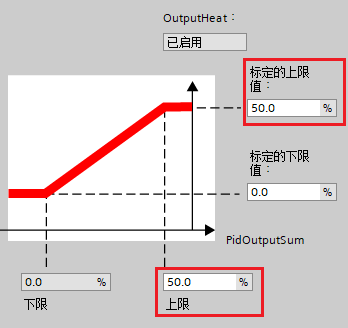

### PID_Temp 常见问题 {#pid_temp-常见问题 .STYLE1}

### []{#a}如何修改 PID 参数的实际值？

通过组态界面离线方式修改参数需要重新下载并重启
PLC。建议在线方式进行操作，方法如下：

1\. 在组态界面点击监控按钮转至在线模式，勾选启动手动输入，直接修改 PID
参数，如图 1 所示。

{width="903" height="399"}

图 1. 在线修改 PID 参数

2\. 在工艺对象里双击调试进入调试界面，如图 2 所示。

{width="189" height="101"}

图 2. 工艺对象里的调试操作

3\. 在调试界面里点击监视按钮转至在线模式，如图 3 红色框所示。

4\. 点击上传 PID 参数按钮，把 PID 参数的在线值上传到起始值，如图 3
蓝色框所示。

{width="983" height="651"}

图 3. 上传 PID 参数

5\. 回到工艺对象，可以看到 PID_Temp_1 显示在线离线不一致，如图 4
所示。这是因为上一步里上传了 PID
参数到离线项目，这时为了保持一致，需要下载一下这个工艺对象。

{width="214" height="97"}

图 4. 工艺对象在线离线不一致

### 如何设置模拟量输出 OutputHeat_PER / OutputCool_PER 的限制值？

下面以 OutputHeat_PER 为例，假设输出标定如图 5 所示，现需要限制
OutputHeat_PER 输出在原来的 0-50% 之间。

{width="342" height="319"}

图 5. 输出值标定

1、在输出设置 \> 输出限值和标定 \> OutputperHeat / OutputperCool
界面中，把 OutputHeat 上限和标定的上限值都改为 50%，如图 6 所示

{width="348" height="328"}

图 6. 修改 OutputHeat 限值

2、在输出设置 \> 输出限值和标定 \> OutputperHeat_PER / OutputperCool_PER
界面中，把 OutputHeat_PER 标定的上限值相应的改为 27648 × 50% =
13824，如图 7 所示。

{width="343" height="335"}

图 7. 修改 OutputHeat_PER 限值
