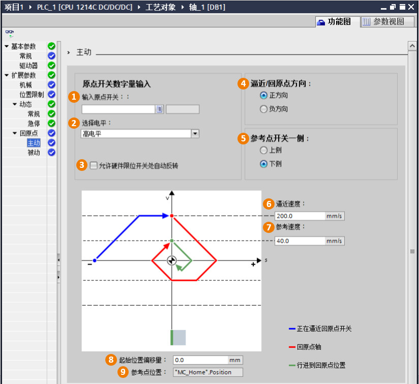
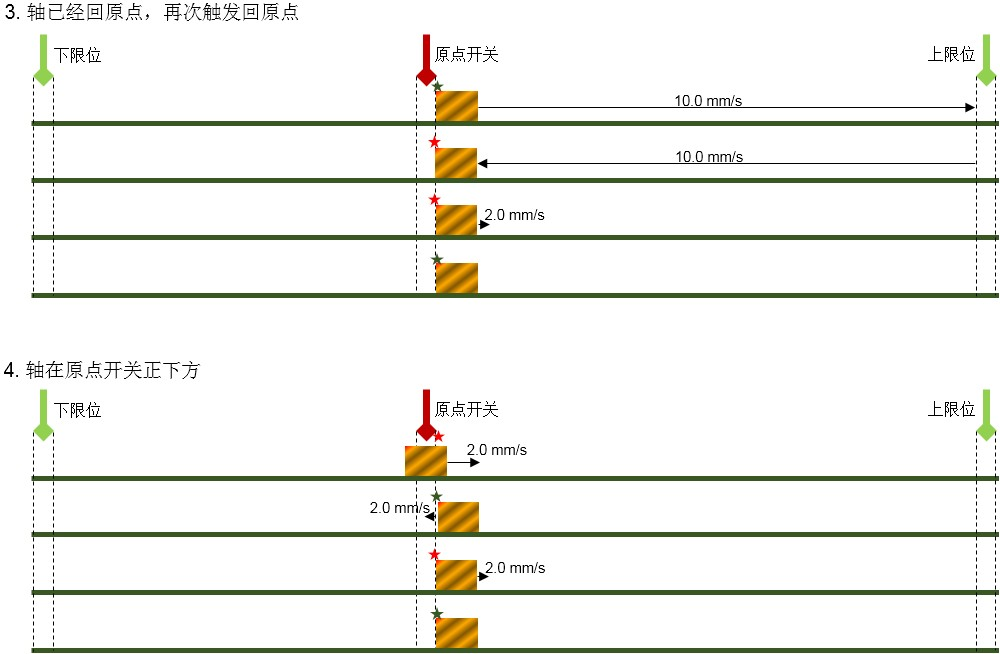
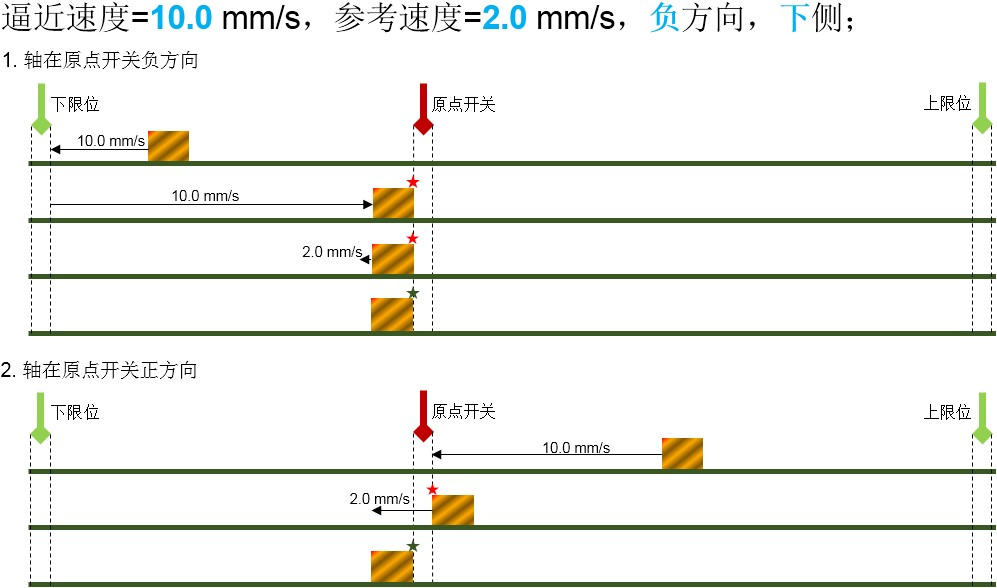
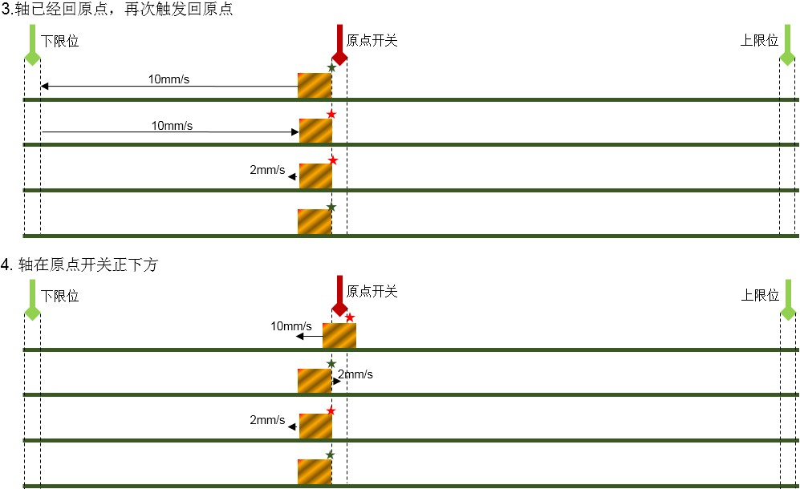
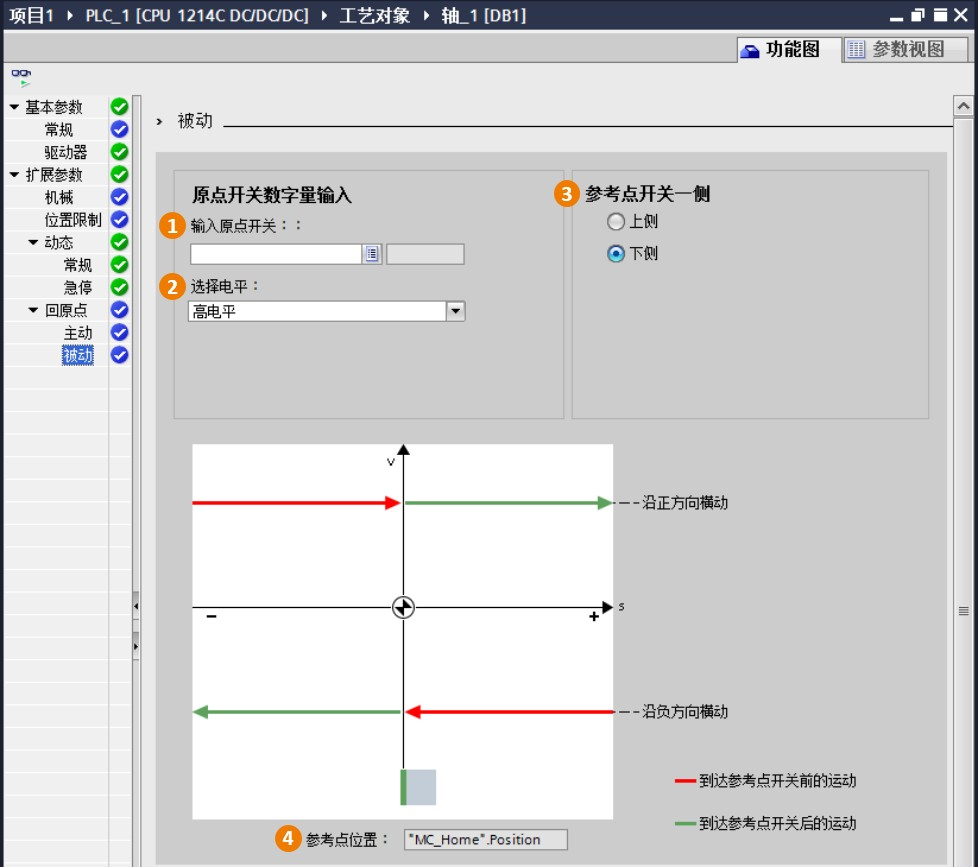

### [功能图\--扩展参数]{#_Toc428444734}-回原点

"原点"也可以叫做"参考点"，"回原点"或是"寻找参考点"的作用是：把轴实际的机械位置和S7-1200程序中轴的位置坐标统一，以进行绝对位置定位。\
一般情况下，西门子PLC的运动控制在使能绝对位置定位之前必须执行"回原点"或是"寻找参考点"。\
"扩展参数-回原点"分成"主动"和"被动"两部分参数。

#### **主动**

在这里的"扩展参数-回原点-主动"中"主动"就是传统意义上的回原点或是寻找参考点。当轴触发了主动回参考点操作，则轴就会按照组态的速度去寻找原点开关信号，并完成回原点命令。

{width="824" height="755"}

**①输入原点开关**：设置原点开关的DI输入点。\
**②选择电平**：选择原点开关的有效电平，也就是当轴碰到原点开关时，该原点开关对应的DI点是高电平还是低电平。\
**③允许硬件限位开关处自动反转**：如果轴在回原点的一个方向上没有碰到原点，则需要使能该选项，这样轴可以自动调头，向反方向寻找原点。\
**④逼近/回原点方向**：寻找原点的起始方向。也就是说触发了寻找原点功能后，轴是向"正方向"或是"负方向"开始寻找原点。

> {width="801" height="208"}
>
> 如果知道轴和参考点的相对位置，可以合理设置"逼近/回原点方向"来缩短回原点的路径。例如，以上图中的负方向为例，触发回原点命令后，轴需要先运行到左边的限位开关，掉头后继续向正方向寻找原点开关。
>
> {width="801" height="209"}
>
> "上侧"指的是：轴完成回原点指令后，以轴的**左**边沿停在参考点开关**右**侧边沿。\
> "下侧"指的是：轴完成回原点指令后，以轴的**右**边沿停在参考点开关**左**侧边沿。\
> 无论用户设置寻找原点的起始方向为正方向还是负方向，轴最终停止的位置取决于
> "上侧"或"下侧"。

**⑥逼近速度**：寻找原点开关的起始速度，当程序中触发了MC_Home指令后，轴立即以"逼近速度"运行来寻找原点开关。\
**⑦参考速度**：最终接近原点开关的速度，当轴第一次碰到原点开关有效边沿儿后运行的速度，也就是触发了MC_Home指令后，轴立即以"逼近速度"运行来寻找原点开关，当轴碰到原点开关的有效边沿后轴从"逼近速度"切换到"参考速度"来最终完成原点定位。"参考速度"要小于"逼近速度"，"参考速度"和"逼近速度"都不宜设置的过快。在可接受的范围内，设置较慢的速度值。\
**⑧起始位置偏移量**：该值不为零时，轴会在距离原点开关一段距离（该距离值就是偏移量）停下来，把该位置标记为原点位置值。该值为零时，轴会停在原点开关边沿儿处。\
**⑨参考点位置**：该值就是⑧中的原点位置值。

\-\-\-\-\-\-\-\-\-\-\-\-\-\-\-\-\-\-\-\-\-\-\-\-\-\-\-\-\-\-\-\-\-\-\-\-\-\-\-\-\-\-\-\-\-\-\-\-\-\-\-\-\-\-\-\-\-\-\-\-\-\-\-\-\-\-\-\-\-\-\-\-\-\-\-\-\-\-\-\-\-\-\-\-\-\-\-\-\-\-\-\-\-\-\-\-\-\-\-\-\-\-\-\-\-\-\-\-\-\-\-\-\-\-\-\-\-\-\-\-\-\-\-\-\-\-\-\-\-\-\-\-\-\-\-\-\-\-\-\-\-\-\-\-\-\-\-\-\-\-\-\-\-\-\-\-\-\-\-\-\-\-\-\-\-\-\-\-\-\-\-\-\-\-\-\-\-\-\-\-\-\-\-\-\-\-\-\-\-\-\-\-\-\-\-\-\-\-\-\-\-\-\-\-\-\-\-\-\-\-\-\-\-\-\-\-\-\-\-\-\-\-\-\-\-\-\-\-\-\-\-\-\-\-\-\-\-\-\-\-\-\-\-\-\-\-\-\-\-\-\-\-\-\-\-\-\-\-\-\-\-\-\-\-\-\-\-\-\-\-\-\-\-\-\-\-\-\-\-\-\-\-\-\-\-\-\-\-\-\--

如下图所示，用例子来说明轴主动回原点的执行过程。根据轴与原点开关的相对位置，分成4种情况：轴在原点开关负方向侧，轴在原点开关的正方向侧，轴刚执行过回原点指令，轴在原点开关的正下方。

{width="998" height="293"}

①当程序以Mode=3触发MC_Home指令时，轴立即以"逼近速度
10.0mm/s"向右（正方向）运行寻找原点开关；\
②当轴碰到参考点的有效边沿，切换运行速度为"参考速度2.0mm/s"继续运行；\
③当轴的左边沿与原点开关有效边沿重合时，轴完成回原点动作。

{width="999" height="284"}

①当轴在原点开关的正方向（右侧）时，触发主动回原点指令，轴会以"逼近速度"运行直到碰到右限位开关，如果在这种情况下，用户没有使能"**允许硬件限位开关处自动反转**"选项，则轴因错误取消回原点动作并按**急停**速度使轴制动；如果用户使能了该选项，则轴将以组态的**减速度**减速（不是以紧急减速度）运行，然后反向运行，反向继续寻找原点开关；\
②当轴掉头后继续以"逼近速度"向负方向寻找原点开关的有效边沿；\
③原点开关的有效边沿是右侧边沿，当轴碰到原点开关的有效边沿后，将速度切换成"参考速度"最终完成定位。

{width="1000" height="654"}

上图中的3和4说明了两种特殊情况下轴的回原点的过程。

下图以4种情况来说明轴以"负方向"和"下侧"的方式主动回原点的过程。

{width="997" height="588"}

{width="997" height="610"}

#### **被动**

被动回原点指的是：轴在运行过程中碰到原点开关，轴的当前位置将设置为回原点位置值。

{width="978" height="867"}

**①输入原点开关**：参考主动会原点中该项的说明。\
**②选择电平**：参考主动回原点中该项的说明。\
**③参考点开关一侧**：参考主动回原点中第5项的说明。\
**④参考点位置**： 该值是MC_Home指令中"Position"管脚的数值。

用例子说明如何实现一个被动回原点的功能：

> 步骤一：在上图中选则"参考点开关一侧"为"上侧"；\
> 步骤二：先让轴执行一个相对运动指令，该指令设定的路径能让轴经过原点开关；\
> 步骤三：在该指令指令的过程中，触发MC_Home指令，设置模式为Mode=2.\
> 步骤四：这时再触发MC_MoveRelative指令，要保证触发该指令的方向能够经过原点开关。
>
> **『结果』**当轴以MC_MoveRelative指令指定的速度运行的过程中碰到原点开关的有效边沿时，轴立即更新坐标位置为MC_Home指令上的"Position"值，如下图所示。在这个过程中轴并不停止运行，也不会更改运行速度。直到达到MC_MoveRelative指令的距离值，轴停止运行。
>
> ###### {width="977" height="761"}
>
> **『结论』** \
> 1.
> 被动回原点功能的实现需要MC_Home指令与MC_MoveRelative指令，或MC_MoveAbsolute指令，或是MC_MoveVelocity指令，或是MC_MoveJog指令联合使用。\
> 2. 被动回原点需要原点开关。\
> 3.
> 被动回原点不需要轴不执行其他指令而专门执行主动回原点功能，而是轴在执行其他运动的过程中完成回原点的功能。
