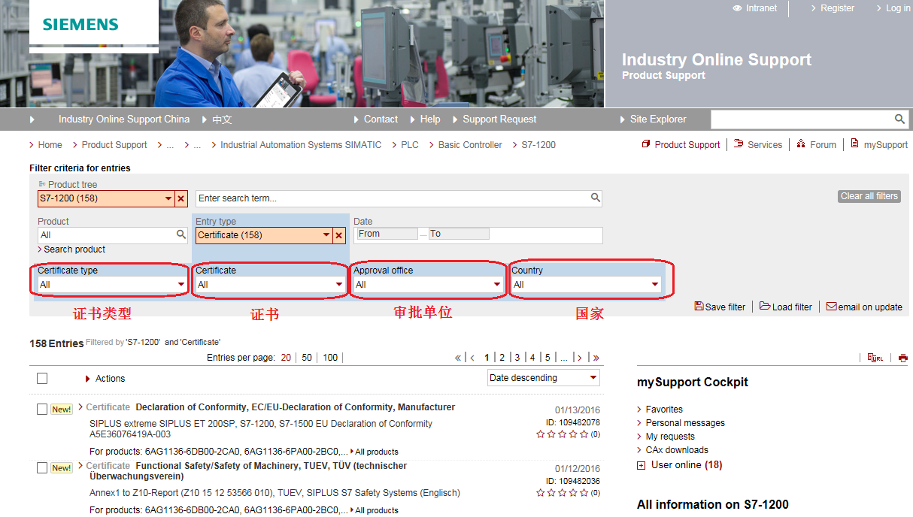

### S7-1200 认证汇总

S7-1200 满足以下认证：

-   CE 认证
-   UL 认证
-   FM 认证
-   IECEx 认证
-   ATEX 认证
-   澳大利亚和新西兰-RCM 标志
-   韩国认证-KC 标志
-   EAC海事认证
-   [CCC 认证](S7-1200_ship_cert/CCC.zip)

### S7-1200 产品认证证书在线下载

{width="15" height="15"} 按住 Shift
键时用鼠标点击下列链接，打开新浏览器窗口。

[**https://support.industry.siemens.com/cs/cn/en/ps/13683/cert**](https://support.industry.siemens.com/cs/cn/en/ps/13683/cert)

点击该链接可以打开西门子全球技术资源库关于S7-1200产品的所有证书信息，如下图所示。在证书分类搜索里可以按照证书类型、证书名称、审批单位或国家进行进一步筛选。

{width="1214" height="688"}

图1. 西门子全球技术资源库

### S7-1200 船级社认证汇总

[美国船级社（ABS）认证](S7-1200_ship_cert/ABS_Type%20Approval%20Certificate%20S7-1200.zip)

到期时间：2025.12.07

[法国船级社（BV）认证](S7-1200_ship_cert/bv_s7-1200.zip)

到期时间：2026.02.23

[挪威德国船级社（DNV·GL）认证](S7-1200_ship_cert/S7-1200_TAA000000K.zip)

到期时间：2023.12.03

[英国船级社（LR）认证](S7-1200_ship_cert/LR22129828TA_-_TAC.zip)

到期时间：2026.03.19

[日本船级社（NK）认证](S7-1200_ship_cert/classnk_s7-1200.zip)

到期时间：2026.12.31

[韩国船级社（KR）认证](S7-1200_ship_cert/NAJ34624-AC001.zip)

到期时间：2022.05.22，目前已过期，待更新

[中国船级社（CCS）认证](S7-1200_ship_cert/CCS_S7-1200_HB20PTB00004_10.zip)

到期时间：2023.11.22

[意大利船级社（RINA）认证](S7-1200_ship_cert/S7-1200_ELE369217XG.zip)

到期时间：2023.01.08，目前已过期，待更新

[俄罗斯船级社（RMRS）认证](S7-1200_ship_cert/RMRS_S7-1200.zip)

到期时间：2024.08.11
