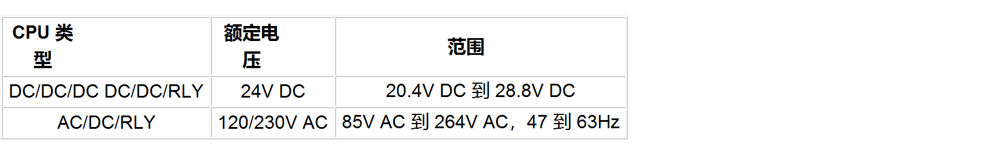
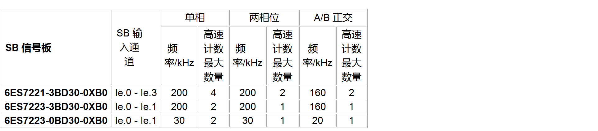
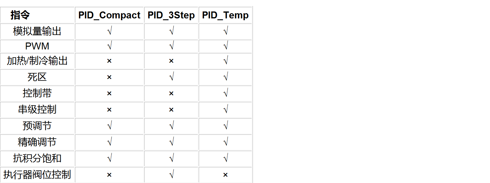

# S7-1200 参数汇总

## 基本功能

### CPU 实时时钟保持时间

- 通常为 20 天，40℃ 时最少为 12 天（免维护超级电容）；
- 使用 BB1297 电池板和 CR1025 电池实时时钟断电保持时间大约为 1 年。

### CPU 数据断电保持时间 

- 设置了断电保持的数据理论上断电保持的时间是无限的，实际保持时间可能与运行环境、电源、EMC 等有关，所以尽可能按照安装要求进行安装、供电等。

### CPU 断电保持数据区大小

- 固件版本为 V4.0 - V4.4 的 CPU 保持性存储器大小为 10k Byte 
- 固件版本为 V4.5 及其以上的 CPU 保持性存储器大小为 14k Byte 

### CPU 工作存储器和负载存储器大小

### PLC 支持的代码块、定时器和计数器

代码块、定时器和计数器

组织块

### PLC 额定电压

### CPU 切断电源后，CPU 的电容维持时间

- 取决于 CPU 的供电类型：AC 120V 时为 20ms；AC 240V 时为 80ms；DC 24V 时为 10ms。

## PLC 通信功能

### CPU 控制 IO设备 / DP 从站数量

S7-1200 CPU 作为 PROFINET IO 控制器时支持 16 个 IO 设备，所有 IO 设备的子模块数量最多为 256 个。

S7-1200 CPU 可以组态最多 3 个 PROFIBUS 通信模块，可以使 CM 1243-5 或 CM 1242-5 的任意组合。每个 DP 主站（CM 1243-5）最多控制 32 个 DP 从站，每个 DP 主站最多扩展 512 个子模块。

### CPU 串口通信模块和通信板

串口模块

### CPU 以太网通信

支持的以太网通信协议

### CPU 连接资源

## PLC 工艺功能

### S7-1200 CPU 运动控制

S7-1200 本体运动控制轴资源：
- 开环控制方式下：最大的脉冲轴个数为 4，无法扩展。
- 闭环控制方式下：固件版本 V4.1 及其以上的版本的 S7-1200 都可以通过 PROFIdrive 或模拟驱动器接口控制最多 8 个驱动器。

### S7-1200 CPU 高速计数器功能

S7-1200 本体和扩展信号板总共提供 6 个高速计数器，可连接 PNP 或 NPN 脉冲输入信号，支持增量型旋转编码器。

S7-1200 高速计数器支持的工作模式有以下 4 种：

- 单相计数，方向由内部或外部控制 
- 两相位 
- A/B 正交计数器 
- A/B 正交计数器四倍频 

S7-1200 CPU 本体输入最大频率

信号板 SB 输入最大频率

### S7-1200 PID 功能

S7-1200 提供 3 个 PID 指令：PID_Compact、PID_3Step、PID_Temp。

S7-1200 所支持的 PID 回路数仅受程序量大小及程序执行时间的影响，没有具体数量的限制，可以同时进行多个回路数的控制。

单个 PID 所需存储区与处理时间

PID 指令功能对比

