### CPU 1211C 接线图

#### **CPU 1211C AC/DC/继电器 (6ES7211-1BE40-0XB0)**

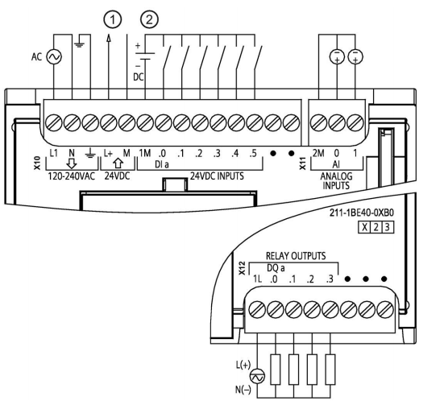{width="551" height="503"}

① 24 VDC 传感器电源

② 对于漏型输入将负载连接到"-"端（如图示）；对于源型输入将负载连接到"+"端

#### **CPU 1211C DC/DC/继电器 (6ES7211-1HE40-0XB0)**

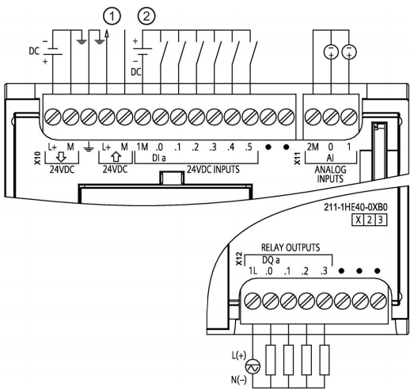{width="523" height="493"}

① 24 VDC 传感器电源

② 对于漏型输入将负载连接到"-"端（如图示）；对于源型输入将负载连接到"+"端

#### CPU 1211C DC/DC/DC (6ES7211-1AE40-0XB0)

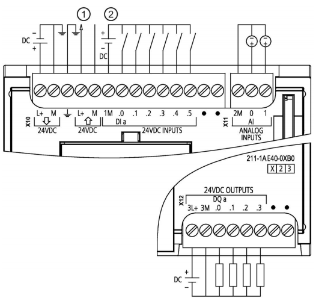{width="531" height="500"}

① 24 VDC 传感器电源

② 对于漏型输入将负载连接到"-"端（如图示）；对于源型输入将负载连接到"+"端

### CPU 1212C 接线图

#### **CPU 1212C AC/DC/继电器 (6ES7212-1BE40-0XB0)**

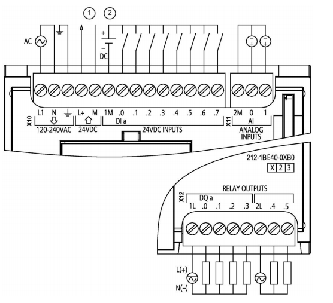{width="556" height="507"}

 

① 24 VDC 传感器电源

② 对于漏型输入将负载连接到"-"端（如图示）；对于源型输入将负载连接到"+"端

#### **CPU 1212C DC/DC/继电器 (6ES7212-1HE40-0XB0)**

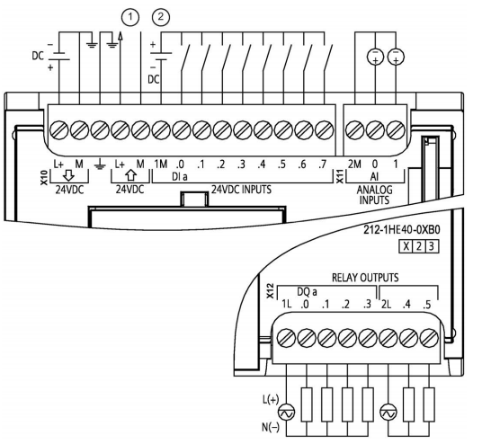{width="536" height="494"}

① 24 VDC 传感器电源

② 对于漏型输入将负载连接到"-"端（如图示）；对于源型输入将负载连接到"+"端

#### CPU 1212C DC/DC/DC (6ES7212-1AE40-0XB0)

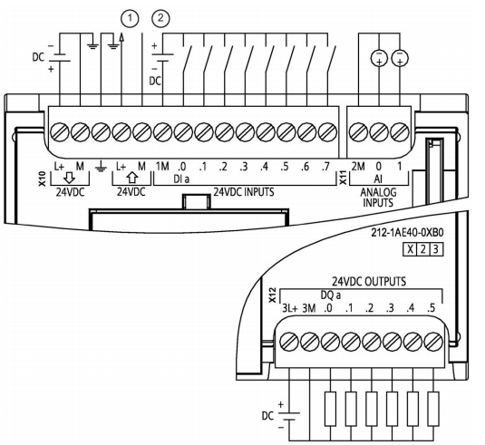{width="535" height="491"}

① 24 VDC 传感器电源

② 对于漏型输入将负载连接到"-"端（如图示）；对于源型输入将负载连接到"+"端

### CPU 1214C 接线图

#### **CPU 1214C AC/DC/继电器 (6ES7214-1BG40-0XB0)**

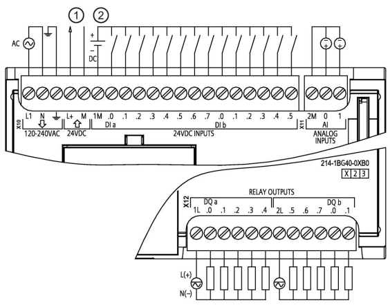{width="564" height="441"}

① 24 VDC 传感器电源

② 对于漏型输入将负载连接到"-"端（如图示）；对于源型输入将负载连接到"+"端

#### **CPU 1214C DC/DC/继电器 (6ES7214-1HG40-0XB0)**

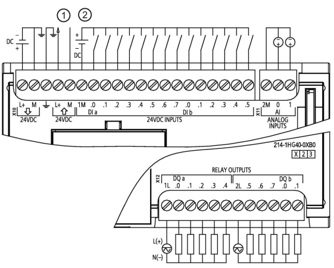{width="561" height="450"}

① 24 VDC 传感器电源

② 对于漏型输入将负载连接到"-"端（如图示）；对于源型输入将负载连接到"+"端

#### CPU 1214C DC/DC/DC (6ES7214-1AG40-0XB0)

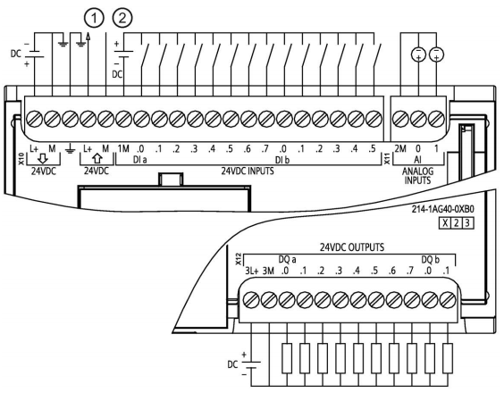{width="564" height="440"}

① 24 VDC 传感器电源

② 对于漏型输入将负载连接到"-"端（如图示）；对于源型输入将负载连接到"+"端

### CPU 1215C 接线图

#### **CPU 1215C AC/DC/继电器 (6ES7215-1BG40-0XB0)**

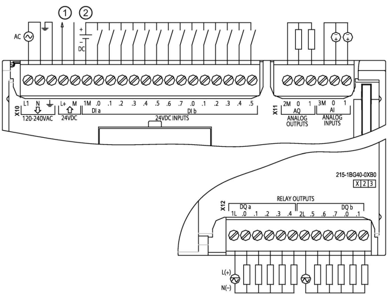{width="657" height="502"}

① 24 VDC 传感器电源

② 对于漏型输入将负载连接到"-"端（如图示）；对于源型输入将负载连接到"+"端

#### **CPU 1215C DC/DC/继电器 (6ES7215-1HG40-0XB0)**

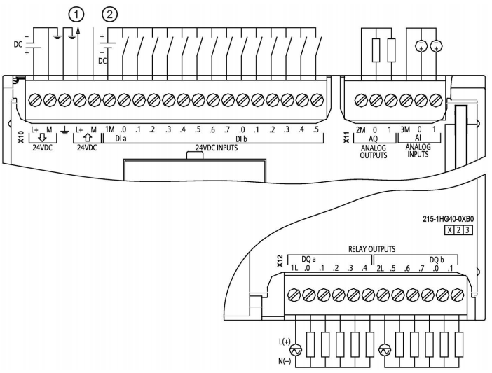{width="702" height="533"}

① 24 VDC 传感器电源

② 对于漏型输入将负载连接到"-"端（如图示）；对于源型输入将负载连接到"+"端

#### CPU 1215C DC/DC/DC (6ES7215-1AG40-0XB0)

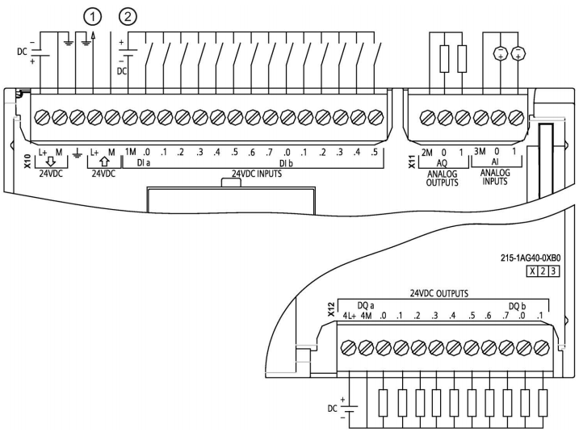{width="717" height="535"}

① 24 VDC 传感器电源

② 对于漏型输入将负载连接到"-"端（如图示）；对于源型输入将负载连接到"+"端

### CPU 1217C 接线图

#### CPU 1217C DC/DC/DC (6ES7217-1AG40-0XB0)

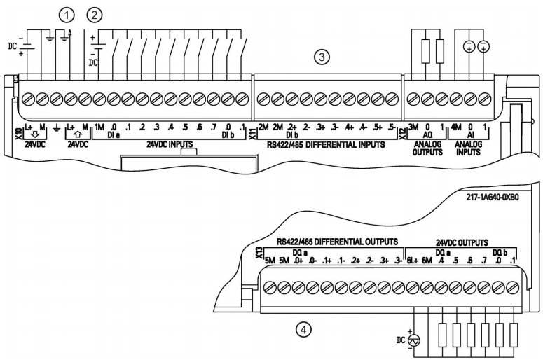{width="775" height="514"}

① 24 VDC 传感器电源

② 对于漏型输入将负载连接到"-"端（如图示）；对于源型输入将负载连接到"+"端

③ 5V差分信号输入

④ 5V差分信号输出

### 常见问题

{width="15" height="15"}**1217C的
5V差分信号能不能当普通的DI/DO点使用？**

答：不能。详情可见《 S7-1200 系统手册 》的附录A

{width="15" height="15"} **S7-1200 CPU
自带模拟量输入通道能否接入 0-20mA 电流信号？怎么接线？**

答：S7-1200 自带模拟量输入通道支持 0-10 V 电压信号。如果需要接 0-20mA
电流信号， 可并联 1个 500Ω 的电阻。

{width="15" height="15"} **注意：使用 500Ω
电阻时，必须注意这种测量方式的功率消耗。 并确保电阻两端外加 DC 24 V
电压时，电阻功率消耗至少为 1.16 W。** **同时， 此方法精度无法保证。**

以 S7-1200 自带模拟量输入通道接入常用的两线制传感器 4-20mA
电流信号为例， 如下图：

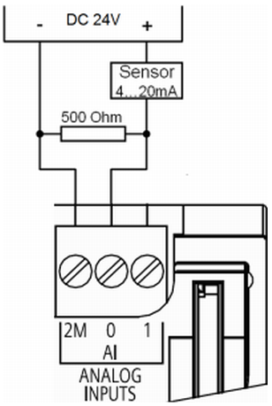{width="308" height="459"}

其他更多接线方式， 请参考以下链接：

如何使用 S7-1200 自带模拟量输入测量 0-20 mA 电流信号?

{width="15" height="15"} 按住 Shift
键时用鼠标点击下列链接，打开新浏览器窗口。

[**https://support.industry.siemens.com/cs/cn/zh/view/67396370**](https://support.industry.siemens.com/cs/cn/zh/view/67396370)
