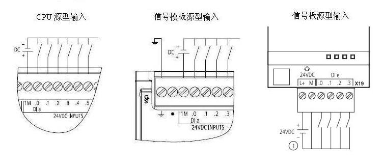

# 数字量信号模块

## SM 1221 数字量输入

{width="691" height="550"}

① 对于漏型输入将"-"连接到"M"（如图示）；对于源型输入将"+"连接到"M"

## SM 1222 数字量输出

{width="692" height="439"}

 

{width="871" height="486"}

 

SM1222 DQ 8 继电器切换模块使用公共端子控制两个电路：
一个常闭触点和一个常开触点。

例如输出\"0\"，当输出点断开时，公共端子 (0L) 与常闭触点 (.0X)
相连并与常开触点 (.0) 断开。 当输出点接通时，公共端子 (0L) 与常闭触点
(.0X) 断开并与常开触点 (.0) 相连。

{width="688" height="486"}

 

## SM 1223 数字量输入/输出

{width="687" height="507"}

 

{width="952" height="508"}

① 对于漏型输入将负载连接到"-"端（如图示）；对于源型输入将负载连接到"+"端

{width="320" height="509"}

## 数字量信号板

通过信号板 (SB, Signal Board) 可以给 CPU 增加 I/O。提供所有 SIMATIC
S7-1200 控制器的低成本有效扩展，同时保持原有空间, SB 连接在 CPU 的前端。

{width="606" height="399"}

## SB 1221 200KHZ数字量输入接线

{width="665" height="322"}

① 仅支持源型输入

## SB 1222 200KHZ数字量输出接线

{width="665" height="321"}

① 对于源型输出将负载连接到"-"端（如图示）；对于漏型输出将负载连接到"+"端

## SB 1223 200KHZ数字量输入/输出接线

{width="665" height="322"}

① 仅支持源型输入

② 对于源型输出将负载连接到"-"端（如图示）；对于漏型输出将负载连接到"+"端

## SB 1223 数字量输入/输出接线

{width="334" height="323"}

① 仅支持漏型输入

## 源型/漏型输入接线说明

支持源型输入的信号板：

-   6ES7 221-3BD30-0XB0
-   6ES7 221-3AD30-0XB0
-   6ES7 223-3BD30-0XB0
-   6ES7 223-3AD30-0XB0

支持漏型输入的信号板：

-   6ES7 223-0BD30-0XB0

支持源型输入的信号模板：

-   6ES7 221-1BF32-0XB0
-   6ES7 221-1BH32-0XB0
-   6ES7 223-1PH32-0XB0
-   6ES7 223-1PL32-0XB0
-   6ES7 223-1BH32-0XB0
-   6ES7 223-1BL32-0XB0

支持漏型输入的信号模板：

-   6ES7 221-1BF32-0XB0
-   6ES7 221-1BH32-0XB0
-   6ES7 223-1PH32-0XB0
-   6ES7 223-1PL32-0XB0
-   6ES7 223-1BH32-0XB0
-   6ES7 223-1BL32-0XB0

可以参考 《 S7-1200 系统手册》

**数字量的输入信号类型总结：CPU
集成的输入点和信号模板的所有输入点都既支持漏型输入又支持源型输入，而信号板的输入点只支持源型输入或者漏型输入的一种**。

漏型输入见模板接线图，源型输入接线参考下图。

{width="750" height="330"}

## 源型/漏型输出接线说明

支持源型输出的信号板：

-   6ES7 222-1AD30-0XB0
-   6ES7 222-1BD30-0XB0
-   6ES7 223-3AD30-0XB0
-   6ES7 223-3BD30-0XB0
-   6ES7 223-0BD30-0XB0

**{width="15" height="15"}
注意：**所有支持源型输出的晶体管输出信号模块都只支持源型输出，不支持漏型输出。

支持漏型输出的信号板：

-   6ES7 222-1AD30-0XB0
-   6ES7 222-1BD30-0XB0
-   6ES7 223-3AD30-0XB0
-   6ES7 223-3BD30-0XB0

支持漏型输出的信号模块：

-   6ES7222-1BH32-1XB0
-   6ES7223-1BL32-1XB0

**{width="15" height="15"}
注意：**数字量的输出信号类型，200
kHZ的信号板输出既支持漏型输出又支持源型输出，除以上六种模块，其余信号板、信号模块、CPU集成集体管输出都只支持源型输出。

## 常见问题

{width="15" height="15"}
**为何SM1223已连接，信号输出通道指示灯也亮，但无电压输出？**

答：S7-1200扩展模块输出通道指示灯电源由总线提供，但信号输出需要模块供电，正确接线方式如下图所示:

{width="590" height="533"}
