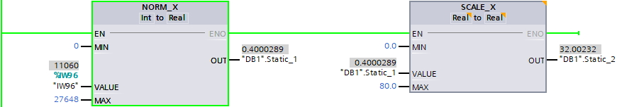
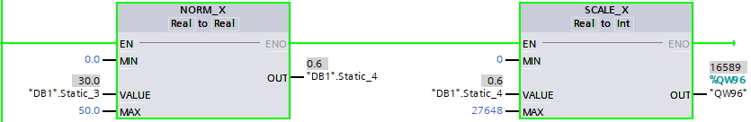

# 信号板

## 模拟量模块、信号板

### 信号类型

|     |     |     |     |     |
| --- | --- | --- | --- | --- |
| 模板型号 | 订货号 | 分辨率 | 负载信号类型 | 量程范围 |
| 模拟量输入 |     |     |     |     |
| CPU 集成模拟量输入 |     | 10 位 | 0 ~ 10 V | 0 ~ 27648 |
| SM 1231 4 x 模拟量输入 | 6ES7 231-4HD32-0XB0 | 12 位 + 符号位 | ±10 V ,±5 V,±2.5 V | -27648 ~ 27648 |
| 0~20 mA，4~20 mA | 0 ~ 27648 |
| SM 1231 4 x 模拟量输入 | 6ES7 231-5ND32-0XB0 | 15 位 + 符号位 | ±10 V ,±5 V,±2.5 V，±1.25 V | -27648 ~ 27648 |
| 0~20 mA，4~20 mA | 0 ~ 27648 |
| SM 1231 8 x 模拟量输入 | 6ES7 231-4HF32-0XB0 | 12 位 + 符号位 | ±10 V ,±5 V,±2.5 V | -27648 ~ 27648 |
| 0~20 mA，4~20 mA | 0 ~ 27648 |
| SM 1234 4 x 模拟量输入/2 x 模拟量输出 | 6ES7 234-4HE32-0XB0 | 12 位 + 符号位 | ±10 V ,±5 V,±2.5 V | -27648 ~ 27648 |
| 0~20 mA，4~20 mA | 0 ~ 27648 |
| SB 1231 1 x 模拟量输入 | 6ES7 231-4HA30-0XB0 | 11 位 + 符号位 | ±10 V ,±5 V,±2.5 V | -27648 ~ 27648 |
| 0~20 mA | 0 ~ 27648 |
| 模拟量输出 |     |     |     |     |
| CPU 集成模拟量输出 |     | 10 位 | 0~20 mA | 0 ~ 27648 |
| SM 1232 2 x 模拟量输出 | 6ES7 232-4HB32-0XB0 | 14 位 | ±10 V | -27648 ~ 27648 |
| 13 位 | 0~20 mA，4~20 mA | 0 ~ 27648 |
| SM 1232 4 x 模拟量输出 | 6ES7 232-4HD32-0XB0 | 14 位 | ±10 V | -27648 ~ 27648 |
| 13 位 | 0~20 mA，4~20 mA | 0 ~ 27648 |
| SM 1234 4 x 模拟量输入/2 x 模拟量输出 | 6ES7 234-4HE32-0XB0 | 14 位 | ±10 V | -27648 ~ 27648 |
| 13 位 | 0~20 mA，4~20 mA | 0 ~ 27648 |
| SB 1232 1 x 模拟量输出 | 6ES7 232-4HA30-0XB0 | 12 位 | ±10 V | -27648 ~ 27648 |
| 11 位 | 0~20 mA | 0 ~ 27648 |

### 输入信号精度计算

先明确两个模拟量输入模块参数：

* 模拟量转换的分辨率
* 模拟量转换的精度（误差）

分辨率是 A/D 模拟量转换芯片的转换精度，即用多少位的数值来表示模拟量。S7-1200 模拟量模块的转换分辨率是12位，能够反映模拟量变化的最小单位是满量程的 1/4096 。

数字化模拟值的表示方法及示例：

|     |     |     |     |     |     |     |     |     |     |     |     |     |     |     |     |     |
| --- | --- | --- | --- | --- | --- | --- | --- | --- | --- | --- | --- | --- | --- | --- | --- | --- |
| 分辨率 | 模拟值 |     |     |     |     |     |     |     |     |     |     |     |     |     |     |     |
| 位   | 15  | 14  | 13  | 12  | 11  | 10  | 9   | 8   | 7   | 6   | 5   | 4   | 3   | 2   | 1   | 0   |
| 位值  | 215 | 214 | 213 | 212 | 211 | 210 | 29  | 28  | 27  | 26  | 25  | 24  | 23  | 22  | 21  | 20  |
| 16位 | 0   | 1   | 0   | 0   | 0   | 1   | 1   | 0   | 0   | 1   | 0   | 1   | 1   | 1   | 1   | 1   |
| 12位 | 0   | 1   | 0   | 0   | 0   | 1   | 1   | 0   | 0   | 1   | 0   | 1   | 1   | 0   | 0   | 0   |

如上表所示，当转换精度小于16位时，相应的位左侧对齐，最小变化位为 16 - 该模板分辨率，未使用的最低位补 “ 0 ”。 如表中 12 位 分辨率的模板则是从 16 - 12 = 4，即低字节的第四位 bit 3 开始变化，为其最小变化单位 23 = 8 （红色背景所示） ，bit 0~bit 2 则补“ 0 ”（黄色背景所示）。则 12 位模板 A/D 模拟量转换芯片的转换精度为23 /215 = 1/4096 。

模拟量转换的精度除了取决于A/D转换的分辨率，还受到转换芯片的外围电路的影响。在实际应用中，输入的模拟量信号会有波动、噪声和干扰，内部模拟电路也会产生噪声、漂移，这些都会对转换的最后精度造成影响。这些因素造成的误差要大于 A/D 芯片的转换误差。

## 模拟量量程计算

可以使用 TIA Portal 指令列表 "转换指令" 中的 “ NORM\_X ”和 SCALE\_X ” 来转换电压、电流信号的模拟量值。

计算公式：

SCALE\_X\_OUT = \[（NORM\_X\_VALUE - NORM\_X\_MIN）/（NORM\_X\_MAX - NORM\_X\_MIN）\] * （SCALE\_X\_MAX - SCALE\_X\_MIN） + SCALE\_X\_MIN

### **一、测量值转换为工程量**

如下图1 程序所示，为标准 4~20 mA 模拟量输入信号，对应 0 ~ 80 MPa 压力的量程换算示例

图 1.测量值转换为工程量示例

其中参数含义如下表1 所示：

表 1.

|     |     |     |     |     |     |
| --- | --- | --- | --- | --- | --- |
| 参数名称 | 数据类型 | 参数含义 | 取值范围 |     |     |
| CPU 集成模拟量输入 | 电压信号 | 电流信号 |
| NORM\_X\_VALUE | Int | 模拟量通道输入范围 | 0 ~ 27648 | -27648 ~ 27648 | 0 ~ 27648 |
| NORM\_X\_MIN | Int | 测量值下限 | 0   | -27648 | 0   |
| NORM\_X\_MAX | Int | 测量值上限 | 27648 | 27648 | 27648 |
| NORM\_X\_OUT | Real | 测量值规格化 | 0.0 ~ 1.0 | 0.0 ~ 1.0 | 0.0 ~ 1.0 |
| SCALE\_X\_MIN | Real | 工程量下限 | \-\-\- | \-\-\- | \-\-\- |
| SCALE\_X\_MAX | Real | 工程量上限 | \-\-\- | \-\-\- | \-\-\- |
| SCALE\_X\_OUT | Real | 工程量值 | \-\-\- | \-\-\- | \-\-\- |

**设置 0-20mA 或者 4-20mA 对应不同的量程范围和 NORM_X 通道测量值下限。如表 2 所示：**

表 2.

|     |     |     |     |
| --- | --- | --- | --- |
| 实际电流输入 | 设置电流范围 | 量程范围 | NORM\_X\_MIN |
| 0-20 mA | 0-20 mA | 0 -27648 | 0   |
| 4-20 mA | 0-20 mA | 5530- 27648 | 5530 |
| 4-20 mA | 0 - 27648 | 0   |

### **二、工程量转换为测量值**

如下图2 程序所示，为标准 4~20 mA 模拟量输出信号，对应 0 ~ 50Hz的变频器频率的量程换算示例

图 2\. **工程量转换为测量值**

其中参数含义如下表 3 所示：

表 3.

|     |     |     |     |     |
| --- | --- | --- | --- | --- |
| 参数名称 | 数据类型 | 参数含义 | 取值范围 |     |
| 电压信号 | 电流信号 |
| NORM\_X\_VALUE | Real | 工程量给定值 | \-\-\- | \-\-\- |
| NORM\_X\_MIN | Real | 工程量下限值 | \-\-\- | \-\-\- |
| NORM\_X\_MAX | Real | 工程量上限值 | \-\-\- | \-\-\- |
| NORM\_X\_OUT | Real | 工程量给定值规格化 | 0.0 ~ 1.0 | 0.0 ~ 1.0 |
| SCALE\_X\_MIN | Int | 测量输出值下限 | -27648 | 0   |
| SCALE\_X\_MAX | Int | 测量输出值上限 | 27648 | 27648 |
| SCALE\_X\_OUT | Int | 测量输出值范围 | -27648 ~ 27648 | 0 ~ 27648 |

**设置 0-20mA 或者 4-20mA 对应不同的量程范围和 SCALE_X 通道输出值下限。如表 4 所示：**

表 4.

|     |     |     |     |
| --- | --- | --- | --- |
| 实际电流使用 | 设置电流输出范围 | 量程范围 | SCALE\_X\_MIN |
| 0-20 mA | 0-20 mA | 0 -27648 | 0   |
| 4-20 mA | 0-20 mA | 5530- 27648 | 5530 |
| 4-20 mA | 0 - 27648 | 0   |

**说明：**工程量相关值取决于使用现场，是无法确定有效值的，唯一能确定的关系是工程量给定或输出值在工程量的下限值和上限值之间，在此不作过多表述。

## 热电偶& 热电阻 模块

### 负载类型

* 热电偶模块：B、N、E、R、S、J、K、T、C、TXK/XK(L)、 电压（范围：± 80mV）  
      
    
* 热电阻模块：Pt100、Pt1000、Cu10、Ni100、电阻（范围：150Ω，300Ω，600Ω）等

### 模板量程计算

热电偶 模块

* 电压信号：满量程对应测量值 -27648 ~ 27648  
      
    
* 温度：测量值除以 10.0 得到温度值；如通道测量值为 253，则对应的温度值为 25.3 度

RTD 模块

* 电阻信号：满量程对应测量值 0 ~ 27648  
      
    
* 温度：测量值除以 10.0 得到温度值；如通道测量值为 253，则对应的温度值为 25.3 度

>  上述数据来自《 S7-1200 系统手册》。

## 常见问题

 **使用了模拟量转换 FC105/106 库的 TIA V10.5 或 TIA V11 的原项目, 用TIA 高版本打开后报错，提示有密码， 如何解决？**

之前 S7-1200 的 FC105/106 的库文件是基于 TIA V10.5 或 TIA V11 的，在 TIA V12 及以后的版本无法使用，提示有密码。

西门子新出了 TIA V13 SP1 的库文件， 建议使用新的 TIA V13 SP1 中的库文件。

关于库文件下载和使用， 请参考以下链接地址：

在 STEP 7 (TIA Portal) 中如何标准化和逆标准化模拟量值?

 按住 Shift 键时用鼠标点击下列链接，打开新浏览器窗口。

[**https://support.industry.siemens.com/cs/cn/zh/view/77316903**](https://support.industry.siemens.com/cs/cn/zh/view/77316903)