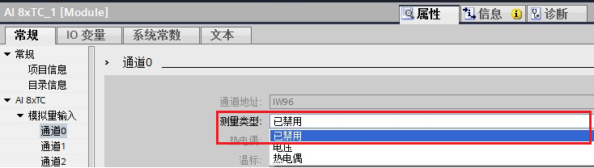
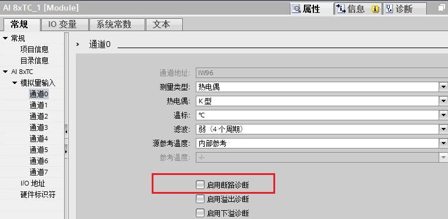
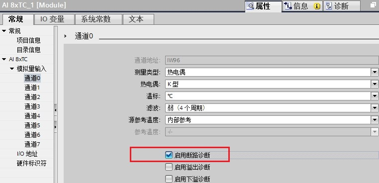
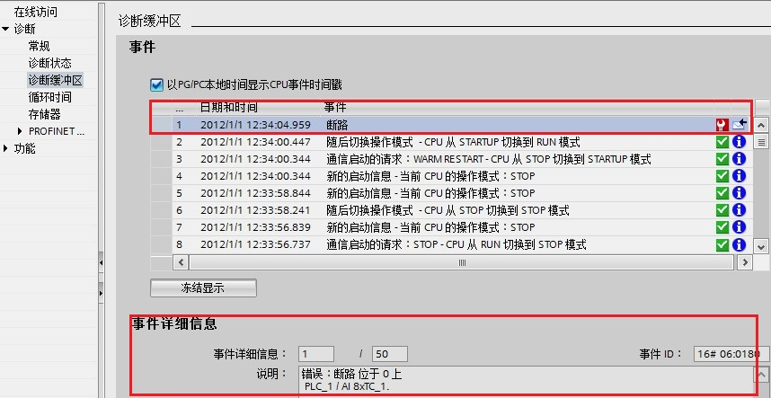
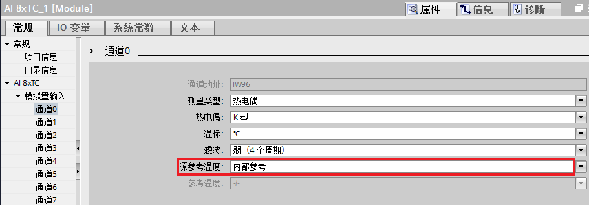
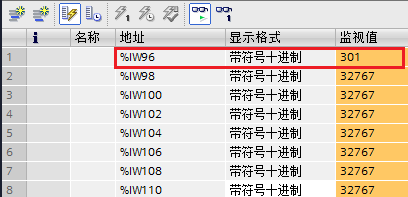
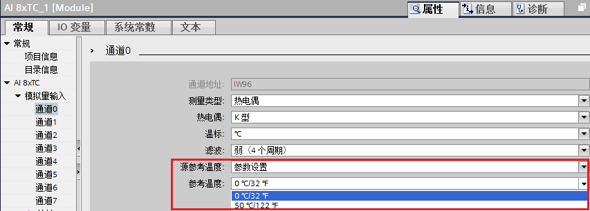
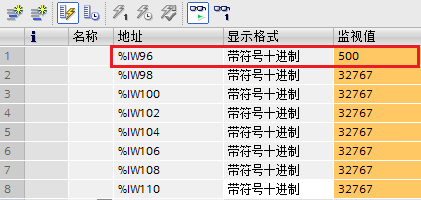
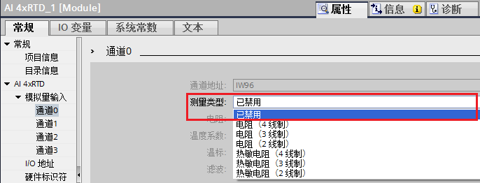

### 模拟量输入输出模块常见问题

**{width="15" height="15"} S7-1200
模拟量模块的输入/输出阻抗指标是多少？**

**答：**详情可见《 S7-1200 系统手册 》的附录A 。

CPU 模拟量输入阻抗：

-   电压型信号：≥ 100 KΩ

信号模板模拟量输入阻抗：

-   电压型信号：≥ 9 MΩ
-   电流型信号：250Ω

信号模板及信号板模拟量输出阻抗：

-   电压型信号：≥ 1000 Ω
-   电流型信号：≤ 600 Ω

**{width="15" height="15"} S7-1200
模拟量模块的输入/输出信号传输距离？**

**答：**模拟量模块的输入/输出信号传输距离，从接线方面考虑，使用双绞屏蔽电缆最大可以连接
100 m 的长度，
还要考虑现场电磁干扰等现实状况。一般电压信号易受现场干扰且长距离传输也会造成信号的衰减，建议尽量近距离传输；电流信号相比电压信号抗干扰能力好些，
相对电压信号传输距离可适当加长。

**{width="15" height="15"} S7-1200
模拟量模块的输入过冲及溢出数值分别是多少？**

对于电压测量范围，S7-1200
模拟量模块的电压输入值与模块通道显示数值对应关系如下表 1 所示：

过冲范围为 27649至32511；下冲范围为-27649至-32512

上溢范围为 32512至32767，下溢范围为 -32513至-32768

  -------- ---------- -------------- --------- --------- --------- ----------
  系统                电压测量范围                                 
  十进制   十六进制   ±10V           ±5V       ±2.5V     ±1.25V     
  32767    7FFF       11.851V        5.926V    2.963V    1.481V    上溢
  32512    7F00                                                    
  32511    7EFF       11.759V        5.879V    2.940V    1.470V    过冲范围
  27649    6C01                                                    
  27648    6C00       10V            5V        2.5V      1.250V    额定范围
  20736    5100       7.5V           3.75V     1.875V    0.938V    
  1        1          361.7μV        180.8μV   90.4μV    45.2μV    
  0        0          0V             0V        0V        0V        
  -1       FFFF                                                    
  -20736   AF00       -7.5V          -3.75V    -1.875V   -0.938V   
  -27648   9400       -10V           -5V       -2.5V     -1.250V   
  -27649   93FF                                                    下冲范围
  -32512   8100       -11.759V       -5.879V   -2.940V   -1.470V   
  -32513   80FF                                                    下溢
  -32768   8000       -11.851V       -5.926V   -2.963V   -1.481V   
  -------- ---------- -------------- --------- --------- --------- ----------

表 1 .SM1231 电压测量范围数值

对于电流测量范围，S7-1200
模拟量模块的电流输入值与模块通道显示数值对应关系如下表 2 所示：

过冲范围为 27649至32511；下冲范围为-1至-4864

上溢范围为 32512至32767，下溢范围为 -4865至-32768

**{width="15" height="15"}
注意：当开路时，模拟量模块通道显示数值是32767。**

  -------- ---------- -------------- ------------- ----------
  系统                电流测量范围                  
  十进制   十六进制   0mA到20mA      4mA到20mA      
  32767    7FFF       23.70mA        22.96mA       上溢
  32512    7F00                                    
  32511    7EFF       23.52mA        22.81mA       过冲范围
  27649    6C01                                    
  27648    6C00       20mA           20mA          额定范围
  20736    5100       15mA           16mA          
  1        1          723.4nA        4mA+578.7nA   
  0        0          0mA            4mA           
  -1       FFFF                                    下冲范围
  -4864    8100       -3.52mA        1.185mA       
  -4865    80FF                                    下溢
  -32768   8000                                    
  -------- ---------- -------------- ------------- ----------

表 2 .SM1231 电流测量范围数值

**{width="15" height="15"} SM1231
模拟量输入模块未使用通道如何处理？**

答：应将未使用的电压输入通道短路。使用导线短接通道的正负两个端子，例如短接
0 通道的 0+ 和 0- 端子；

应将未使用的电流输入通道设置在 0 至 20 mA 范围。\

### 热电偶模块常见问题

**{width="15" height="15"} S7-1200 TC
信号阻抗指标是多少？**

**答：**SM1231 TC 和 SB1231 TC 阻抗参数一样。

-   TC 信号：≥ 10 MΩ

**{width="15" height="15"} S7-1200 TC 信号传输距离？**

**答：**SM1231 TC 和 SB1231 TC 信号传输距离参数一样。

-   TC 信号：≤ 100 m；要求线路阻抗 ≤ 100 Ω

**{width="15" height="15"}SM1231 TC
模块未使用通道如何处理？**

答：对于 SM1231 TC 模块未使用通道， 可以采用以下方法做处理：

方法一：对该通道短路。使用导线短接通道的正负两个端子，例如短接 0 通道的
0+ 和 0- 端子；

方法二：对该通道禁用。在模块的"属性-常规"，对测量类型选择"已禁用"。
如下图 1 所示组态：

{width="734" height="208"}

图 1. SM1231 TC 模块禁用未使用通道

{width="15" height="15"}
**注意：不能将所有通道都选择"已禁用**"。

{width="15" height="15"} **SM1231 TC
模块在通道测量类型选择"已禁用"或"热电偶"时，通道指示灯和数值分别是什么状态？**

（1）通道测量类型"已禁用"：该通道的指示灯不亮，通道读数为最大值 32767；

（2）通道测量类型"热电偶"，未使能"启用断路诊断"，如下图 2
所示：当通道接线存在开路，通道读数为随机值；

{width="762" height="373"}

图 2.未使能"启用断路诊断"

（3）通道测量类型"热电偶"，使能"启用断路诊断"：当通道接线存在开路，此时模板
DIAG 指示灯红色闪烁，对应的通道的灯也红色闪烁， CPU ERROR 灯也红色闪烁；
同时诊断缓冲区报错"断路"，通道读数为最大值 32767；如下图 3， 图 4 所示：

{width="762" height="368"}

图 3.使能"启用断路诊断"

{width="858" height="443"}

图 4.诊断缓冲区事件"断路"

（4）通道测量类型"热电偶"，通道短接，设为"内部参考"，则读到的数值/10为模板的内部温度值（例如：模块内部温度值为30.1℃，
读到数值为301）；如下图 5，图 6 所示：

{width="856" height="299"}

图 5.内部参考

{width="408" height="197"}

图 6. SM 1231 模块内部温度值

（5）通道测量类型"热电偶"，通道短接，设为"参数设置"，则读数为设定的温度值\*10
（例如：50℃，读到数值为 500） ；如下图 7， 图 8 所示：\

{width="853" height="306"}

图 7. 参数设置和参考温度

{width="421" height="200"}

图 8. 温度值读数

以上 5 种情况， 总结表格如下表 3 所示：

  ---------- -------------------- -------------- ------------ -------------- ------------ ---------------------------------
  测量类型   源参考温度           启用断路诊断   通道接线     模块 DIAG 灯   通道指示灯   通道数值
  已禁用     \-                   \-             开路或短接   绿色亮         不亮         32767
  热电偶     内部参考或参数设置   未使能         开路         绿色亮         绿色亮       随机值
  热电偶     内部参考或参数设置   使能           开路         红色闪烁       红色闪烁     32767
  热电偶     内部参考             未使能或使能   短接         绿色亮         绿色亮       通道读数值/10为模板的内部温度值
  热电偶     参数设置             未使能或使能   短接         绿色亮         绿色亮       读数为设定的温度值\*10
  ---------- -------------------- -------------- ------------ -------------- ------------ ---------------------------------

表 3. SM1231 TC 模块通道"已禁用"或"热电偶"，通道指示灯和数值状态

### 热电阻模块常见问题

**{width="15" height="15"} S7-1200 RTD
信号阻抗指标是多少？**

**答：**SM1231 RTD 和 SB1231 RTD 阻抗参数一样。

-   RTD 信号：≥ 10 MΩ

**{width="15" height="15"} S7-1200 RTD 信号传输距离？**

答：SM1231 RTD 和 SB1231 RTD 信号传输距离参数一样。

-   RTD 信号：≤ 100 m；要求线路阻抗 ≤ 20 Ω，对于10 Ω 的RTD则要求线路阻抗
    ≤ 2.7Ω

{width="15" height="15"} **SM1231 RTD
模块未使用通道如何处理？**

对于 SM1231 RTD 模块未使用通道， 可以采用以下方法做处理：

方法一：对该通道短路（短接方法详见 [**RTD
信号模块接线**](01-wiring.html#RTD)）；

方法二：对该通道禁用。在模块的"属性-常规"，对测量类型选择"已禁用"。
如下图 9 所示组态：

{width="686" height="262"}

图 9.禁用 SM1231 RTD 模块未使用通道

{width="15" height="15"}
**注意：不能将所有通道都选择"已禁用**"。

方法三：RTD 模块连接一个电阻（如 2 线制 RTD 连接，方法详见 **[RTD
信号模块接线](01-wiring.html#RTD)**）。

{width="15" height="15"} **SM1231 RTD
模块在通道测量类型选择"已禁用"或"热敏电阻"时，通道指示灯和数值分别是什么状态？**

同 SM1231 RTC 模块，SM1231 RTD
模块在通道测量类型选择"已禁用"或"热敏电阻"时，通道指示灯和数值分别是以下状态。如下表
4 所示：

  ---------- -------------- ------------ -------------- ------------ ---------------------------------
  测量类型   启用断路诊断   通道接线     模块 DIAG 灯   通道指示灯   通道数值
  已禁用     \-             开路或短接   绿色亮         不亮         32767
  热敏电阻   未使能         开路         绿色亮         绿色亮       随机值
  热敏电阻   使能           开路         红色闪烁       红色闪烁     32767
  热敏电阻   未使能或使能   短接         绿色亮         绿色亮       通道读数值/10为模板的内部温度值
  电阻       未使能或使能   短接         绿色亮         绿色亮       0
  ---------- -------------- ------------ -------------- ------------ ---------------------------------

表 4. SM1231 RTD 模块通道"已禁用"或"热敏电阻"，通道指示灯和数值状态

{width="15" height="15"} **SM1231 RTD
模块在通道测量类型选择"电阻"时，能测量哪些阻值的电阻？**

能测量150/300/600欧。此时，额定上限数值为 27648。如下表 5 所示：

  范围   低于范围最小值   额定范围下限   稳定范围上限    超出范围最大值   25℃时的额定范围精度   -20℃到60℃时的额定范围精度
  ------ ---------------- -------------- --------------- ---------------- --------------------- ---------------------------
  150Ω   不适用           0（0Ω）        27648（150Ω）   176.383Ω         ±0.05%                ±0.1%
  300Ω   不适用           0（0Ω）        27648（300Ω）   352.767Ω         ±0.05%                ±0.1%
  600Ω   不适用           0（0Ω）        27648（600Ω）   705.534Ω         ±0.05%                ±0.1%

表 5. SM1231 RTD 模块测量的电阻范围
