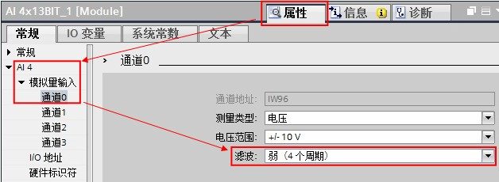
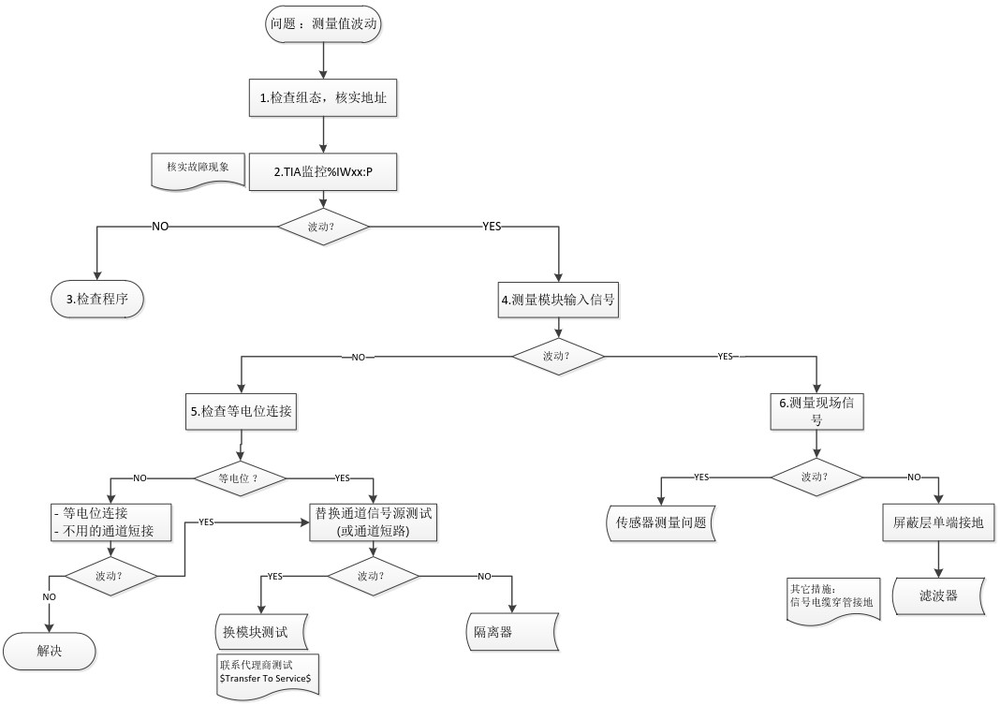

### 为什么使用S7-1200模拟量输入模块时接收到变动很大的不稳定的值？

可能的原因如下：

1.可能模拟量输入模块和现场传感器分别使用了自供电或隔离的电源，而两个电源没有彼此连接，即模拟量输入模块的电源和现场传感器的信号地没有连接；这将会产生一个很高的上下振动的共模电压，影响模拟量输入值。

2.另一个原因可能是模拟量输入模块接线太长或绝缘不好受到电磁干扰。

可以用如下方法解决：

1.连接现场传感器的负端与模块上的公共M端以补偿此波动。（但要注意，确保这是两个电源系统之间的唯一联系。）

背景是：

* 模拟量输入模块内部是非隔离的；
* 共模电压必须小于12V且大于-12V；
* 对于60Hz干扰信号的共模抑制比为40dB。

2.使用模拟量输入滤波。

点击“设备视图”，选择需要设置模拟量输入滤波的模块；如图 1 所示：

* 选择需要滤波的通道；
* 选择滤波强度。

图1.设置模拟量输入滤波

滤波得出的数值就是已采样的 n 个数值的平均值，而 n 就是周期数。如图2所示：

|     |
| --- |
| 平滑化选项（采样平均） |
| 无（1个周期）：不求平均值 |
| 弱（4个周期）：4次采样 |
| 中（16个周期）：16次采样 |
| 强（32个周期）：32次采样 |

表1\. “滤波”选项对应的采样次数

### S7-1200 模拟量输入模块接收到测量值波动时的检测方法和步骤

当 S7-1200 模拟量输入模块接收到测量值波动时，可通过如图 2 所示的步骤进行检查：

图2.检查方法