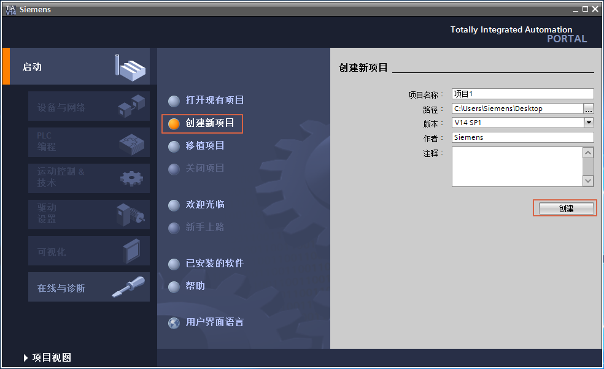
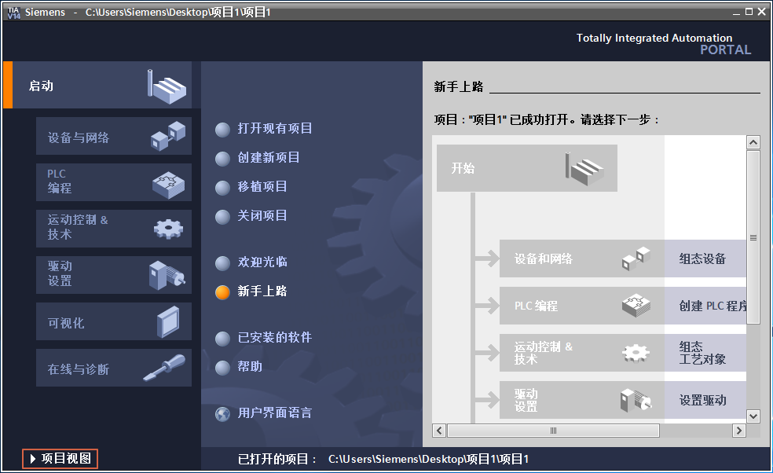
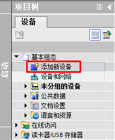
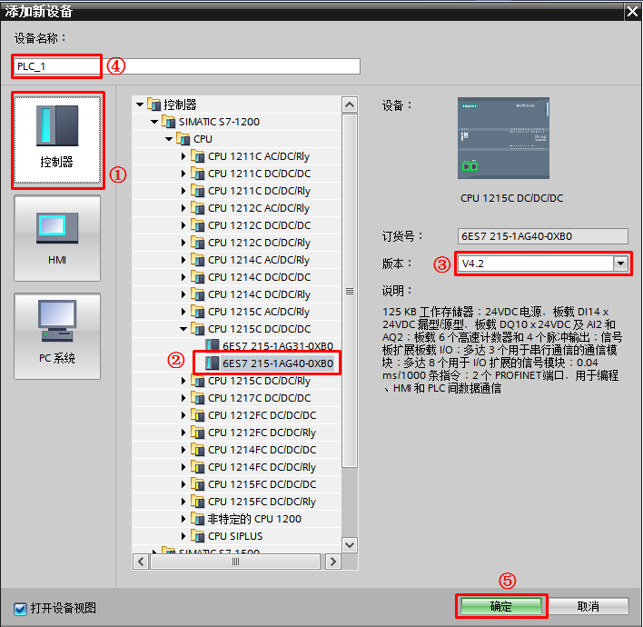
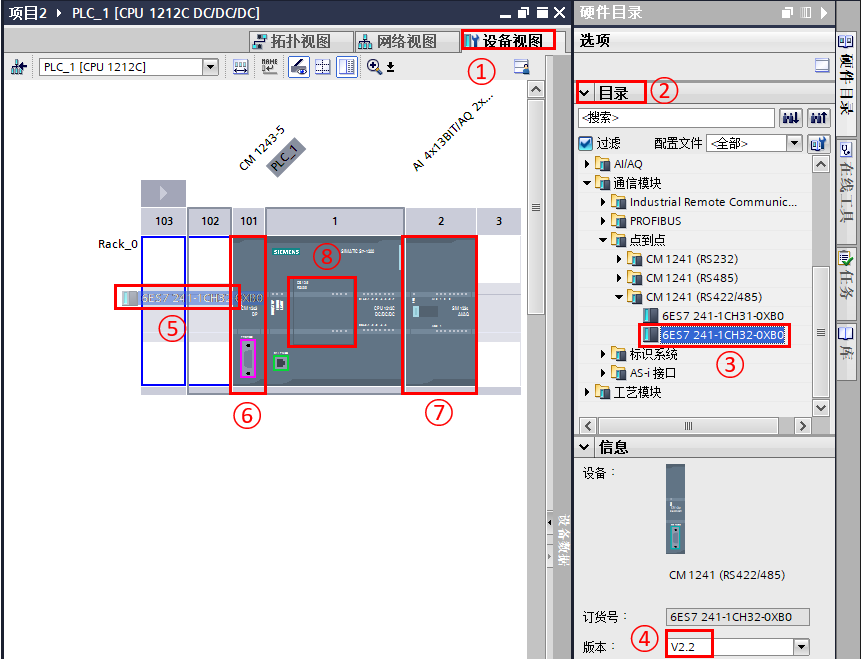
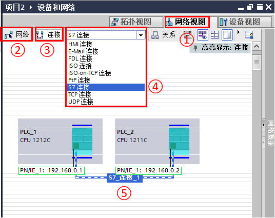
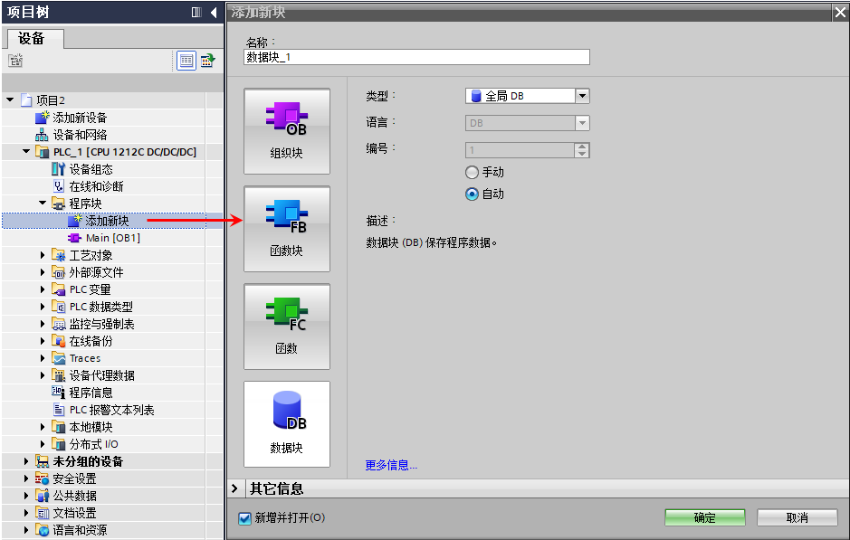
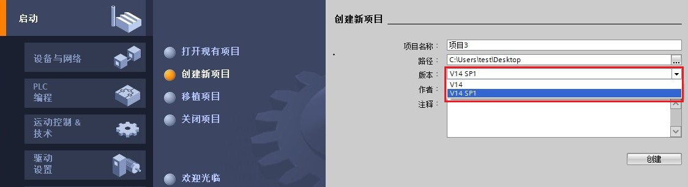

# 项目的新建

TIA Portal STEP 7
软件向用户提供了非常简便、灵活的项目创建、编辑和下载方式。用户不需要购买专用编程电缆，仅使用以太网卡和以太网线即可实现对
S7-1200 CPU 的监控和下载。

## 快速创建新项目

以 TIA PORTAL V14SP1
为例，在桌面中双击图标{width="52"
height="51"}启动软件，软件界面包括 Portal
视图和项目视图，两个界面中都可以新建项目。

在 Portal
视图中，单击"创建新项目"，并输入项目名称，路径和作者等信息，然后点击"创建"即可生成新项目，如图
1 所示。

图 1.创建新项目

之后用户需要切换到项目视图，即点击"项目视图"，如图 2 所示，

{width="984" height="602"}

图 2.切换到项目视图

## 硬件组态

用户创建 S7-1200 项目有两种办法：手动组态和在线上载。

**一、手动组态**

手动组态通常在已知所有产品的完整订货号的情况下采用，这种方式的优点是可以完全离线进行设备组态，组态过程中不需要设备在线。

1、添加 PLC

S7-1200
自动化系统需要对各硬件进行组态、参数配置和通信互连。项目中的组态要与实际系统一致，系统启动时
CPU
会自动监测软件的预设组态与系统的实际组态是否一致，如果不一致会报错，此时
CPU 能否启动取决于启动设置。

下面介绍在项目视图中如何进行项目硬件组态。进入项目视图，在左侧的项目树中，单击"添加新设备"，如图
3 所示，随即弹出添加新设备对话框，如图 4
所示。在该对话框中选择与实际系统完全匹配的设备即可。

{width="224" height="273"}

图 3.选择新设备

{width="708" height="690"}

图 4.选择新设备

①选择"控制器"；

②选择 S7-1200 CPU 的型号；

③选择 CPU 的版本；

④设置设备名称；

⑤点击"确定"完成新设备添加。

从 V4.5 版本开始，添加完成设备后会弹出 PLC
安全设置对话框，**详细介绍请参见 [PLC
安全向导设置](../../08-Function/22-Security_Wizard.html)**。

在添加完成新设备后，与该新设备匹配的机架也会随之生成。所有通信模块都要配置在
S7-1200 CPU 左侧，而所有信号模块都要配置在 CPU 的右侧，在 CPU
本体上可以配置一个扩展板。配置方法如图 5 所示。

在硬件配置过程中，TIA
博途会自动检查模块的正确性。在硬件目录下选择模板后，则机架中允许配置该模块的槽位边框变为蓝色，不允许配置该模块的槽位边框无变化。

如果需要更换已经组态的模块，可以直接选中该模块，在鼠标右键菜单中选择"更改设备类型"命令，然后在弹出的菜单中选择新的模块。

{width="861" height="659"}

图 5.硬件配置步骤

①单击打开设备视图；

②打开硬件目录；

③选择要配置的模板；

④选择模板的正确版本号；

⑤拖拽到机架上相应的槽位；

⑥通信模块配置在 CPU 的左侧槽位；

⑦IO 及工艺模板配置在 CPU 的右侧槽位；

⑧信号板，通信板及电池板，则配置在 CPU 的本体上（仅能配置 1 个）。

S7-1200 系列模块的连接特点是：

- 信号模板插于 CPU 上，最多可以连接一个
- I/O 模块连接在 CPU 右侧，CPU 1214(F)C/1215(F)C/1217C 最多允许连接 8个，CPU 1212(F)C 最多允许连接 2 个，CPU 1211C 无法连接 I/O 模块
- 通信模块连接在 CPU 左侧，最多可以连接 3 个

二、**自动检测上载硬件信息**

参见[链接](06-detect%20hardware.html#detect)

## 网络组态

组态好 PLC 硬件后，可以在网络视图中组态PROFIBUS
，PROFINET网络，创建以太网的S7连接或HMI连接等，如图 6 所示。

{width="536" height="425"}

图 6. 网络组态步骤

①单击打开"网络视图"；

②以图形方式将接口进行联网；

③单击选择"连接"；

④选中 CPU 后，在这里选择要创建的连接类型；

⑤以拖拽的方式建立连接，视图会出现一个轨道连接，表示连接已经创建。

{width="15" height="15"} **注意**：
网络视图的以太网连接中虽然有多种连接选项，但对于 S7-1200 PLC V4.4
及其之前只能在此创建 S7 或 HMI 连接。从 V4.5 开始 TCP、UDP、ISO-on-TCP
可以在此创建连接，方法参见[链接](../../11-Comm/01-Ethernet/07-OUC_Config.html)。

## 添加程序块

设备配置完成后，用户可继续根据自动化任务设计用户程序。用户可以在 CPU
中添加：

- OB：组织功能块
- FC：功能块
- FB：带背景数据的功能块
- DB：数据块

用户点击左侧的项目树中的"添加新块"即可打开添加新块的窗口，如下图 7
所示：

{width="939" height="597"}

图 7. 添加新程序块

## STEP 7 (TIA Portal) V14 SP1 项目创建

使用 STEP 7 V14 SP1 软件能在创建新项目时选择项目版本为 V14 或者 V14
SP1，如图 8 所示。

创建后， STEP 7 V14 SP1 与 STEP7 V14 项目使用相同的后缀名.ap14。

{width="1124" height="307"}

图 8. STEP 7 V14 SP1 创建新项目
