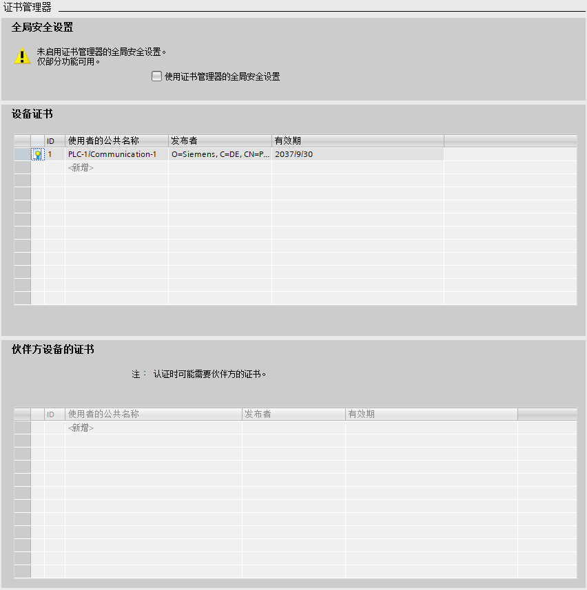
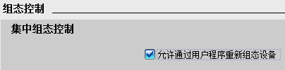

# CPU 参数属性配置

通过参数分配可以设置所有组件的属性，这些参数将装载到 CPU 中，并在 CPU
启动时传送给相应的模块。

在项目中添加 CPU 后，通过打开设备视图，选中机架上的
CPU，下方的巡视窗口的 CPU 属性中可以配置 CPU 的各种参数，CPU
的通信接口，本体的输入输出，启动特性，保护等设置。下面以 CPU 1215C V4.6
为例介绍 CPU 的参数设置。如图 1 所示。

图 1 CPU 属性

- ①左键双击 **设备视图**，打开项目视图
- ②左键单击 CPU
- ③左键单击 **属性** 标签
- ④左键单击 **常规** 标签，下方会显示出 CPU 的所有可以设置的参数

## 常规

单击属性视图中的 **常规** 选项，进行下列参数设置：

- **项目信息**：可以编辑名称，作者及注释等信息。
- **目录信息**：查看 CPU 的订货号，组态的固件版本及特性描述。
- **标识与维护**：V4.0开始支持。用于标识设备的名称，位置等信息， 可以使用 **Get_IM_Data** 指令读取信息进行识别。
- **校验和**：V4.2 开始支持。在编译过程中，系统将通过唯一的校验和来自动识别PLC 程序。基于该校验和，可快速识别用户程序并判断离线在线 PLC程序是否相同。通过指令 **GetChecksum** 可以读取在线程序校验和，**详细介绍请参见[链接](../03-instruction/02-Extend/03-Others/02-GetChecksum.md)** ，如图2 所示：

图 2 标识与维护及校验和

## PROFINET 接口

单击 **PROFINET 接口 \[X1\]**，配置以下参数：

**常规**：标识 PROFINET 接口 的名称，作者和注释

**以太网地址**：如图 3 所示。

图 3 配置以太网地址

- ① **接口连接到**：可以从下拉菜单中选择本接口连接到的子网，也可以添加新的网络；
- ② **IP 协议**：默认为 **在项目中设置 IP 地址**，此时在项目组态中设置 IP地址，子网掩码等。如果使用路由器，则激活 **使用路由器**，并设置路由器地址。也可以选择 **在设备中直接设定IP 地址**，则可以在程序中使用指令 **T_CONFIG**或者通过在线访问、Automation
Tool、HMI 等方式分配地址，T_CONFIG 修改 IP，**详细介绍请参见**[**使用T-CONFIG 指令修改 S7-1200 的 IP地址和设备名称**](../../08-Function/11-T_Config.md)。

- ③ **PROFINET**：

    - 激活 **在设备中直接设定PROFINET设备名称** ，则表示不在硬件组态中组态设备名称，而是在程序中使用指 **T_CONFIG** 或者通过在线访问、Automation Tool、HMI 等方式分配设备名。
    - 激活 **自动生成 PROFINET 设备名称**，TIA Portal 根据接口名称自动生成PROFINET 设备名称。
    - **转换的名称**，是指此 PROFINET 设备名称转换为符合 DNS惯例的名称，用户不能修改。
    - **设备编号**，是指 PROFINET IO设备的编号。在发生故障时可以通过编程读取该编号。对于 IO 控制器默认为 0，无法修改。
    - **时间同步**：可以激活 **通过 NTP 服务器启动同步时间**。NTP（Network Time Protocol）即网络时间协议，可用于同步网络中系统时钟的一种通用机制。可以实现跨子网的时间同步，精度则取决于所使用的NTP 服务器和网络路径等特性。在 NTP 时间同步模式下，CPU的接口按设定的 **更新间隔**时间（单位为秒）从 NTP服务器定时获取时钟同步，时间间隔的取值范围在 10秒到一天之间，这里最多可以添加 4 个 NTP 服务器。
    - **CPU 与该设备中的模块进行数据同步**：是指同步 CM/CP 的时间和 CPU 的时间。

:::{warning}

建议在 CM/CP 和 CPU中，只对一个模块进行时间同步，以便使站内的时间保持一致。详细介绍请参见 [S7-1200时间同步](../../08-Function/24-TimeSync/01-NTP_PLC.md)。
:::

**操作模式**：V4.0 开始可以设置是否是 **IO 设备**。如果该 CPU 作为智能设备，则激活 **IO设备**，并在 **已分配的 IO 控制器中**， 选择该 IO 设备的 IO 控制器（如果 IO控制器不在同一项目中，则选择 **未分配**）。并根据需要选择是否激活 **PN接口的参数由上位 IO控制器进行分配** 和 **优先启用** 等参数，以及设置智能设备的通信传输区等。

**详细介绍请参见**[**S7-1200 与 S7-1200/S7-1500 Profinet IO通信**](../../11-Comm/02-Bus/02-Profinet/03-I_Device/01-S7-1200.htm)。

**高级选项**：可以对 **接口选项**，**介质冗余**，**实时设定** 和 **端口** 进行设置。用于设置 Profinet IO的一些设置，例如发送时钟，不带可更换介质时支持设备更换，MRP环网，端口的设置等。

**Web 服务器访问**：激活 **启用使用该接口访问 Web 服务器**，则可以通过该接口访问集成在 CPU内部的 Web 服务器。

## 数字量输入输出

**常规**：单击数字量输入/输出的 **常规** 选项可以输入项目信息：

- **名称**：定义更改组件的名称
- **注释**：说明模块或设备的用途

**数字量输入**：以通道 0 的组态为例进行说明，如图 4 所示。

图 4 配置数字量输入通道

- ① **通道地址**：输入通道的地址，首地址在 **I/O 地址** 项中设置；
- ② **输入滤波器**：为了抑制寄生干扰，可以设置一个延迟时间，即在这个时间之内的干扰信号都可以得到有效抑制，被系统自动滤除掉，默认的输入滤波时间为6.4 ms；
- ③ **启用上升沿或下降沿检测**：可为每个数字量输入启用上升沿和下降沿检测，在检测到上升沿或下降沿时触发过程事件。

  - **事件名称**：定义该事件名称
  - **硬件中断**：当该事件到来时，系统会自动调用所组态的硬件中断组织块一次。如果没有已定义好的硬件中断组织块，可以点击后面的省略按钮并新增硬件中断组织块连接该事件。

- ④ **启用脉冲捕捉**：根据 CPU的不同，可激活各个输入的脉冲捕捉。激活脉冲捕捉后，即使脉冲沿比程序扫描循环时间短，也能将其检测出来。

**数字量输出**：设置如图 5 所示：

图 5 配置数字量输出通道

- ① **对 CPU STOP 模式的响应**：设置数字量输出对 CPU 从运行状态切换到 STOP状态的响应，可以设置为保留最后的有效值或者使用替代值；
- ② **通道地址**：输出通道的地址，首地址在 **I/O 地址** 项中设置；
- ③ **从 RUN 模式切换到 STOP 模式时，替代值1** ：如果在数字量输出设置中，选择 **使用替代值**，则此处可以勾选，表示从运行切换到停止状态后，输出使用 **替代值1** ，如果不勾选表示输出使用 **替代值0** 。如果选择了 **保持上一个值** 则此处为灰色不能勾选。
  
**I/O 地址** ：数字量地址设置如图 6 所示。

图 6 数字量输入输出地址设置

- **输入地址**：
  
    - ① **起始地址**：模块输入的起始地址；
    - ② **结束地址**：系统根据起始地址和模块的 IO数量自动计算并生成结束地址；
    - ③ **组织块**：可将过程映像区关联到一个组织块，当启用该组织块时，系统将自动更新所分配的过程映像分区；
    - ④ **过程映像**：选择过程映像分区。

    - **自动更新** ：在每个程序循环内自动更新I/O过程映像（默认）。
    - **无**：无过程映像，只能通过立即指令对此I/O进行读写。
    - **PIPx**：可以关联到③中所选的组织块。同一个映像分区只能关联一个组织块，一个组织块只能更新一个映像分区。系统在执行分配的OB时更新此  PIP。如果未分配 OB，则不更新 PIP。
    - **PIP OB 伺服**：为了对控制进行优化，将运动控制使用的所有 I/O模块（如，工艺模块，硬限位开关）均指定给过程映像分区 **PIP OB伺服**。这样 I/O 模块即可与工艺对象同时处理。

- **输出地址**：设置与输入类似。

:::{warning}

    所有输入输出的地址都在过程映像区之内，如果没有选择组织块和分区，默认情况下过程映像区是自动更新。
:::

## 模拟量

**常规**：单击模拟量输入/输出的 **常规** 选项可以输入项目信息：

- **名称**：定义更改组件的名称
- **注释**：说明模块或设备的用途

**模拟量输入**:组态如图 7 所示。

图 7 模拟量输入组态

- ① **积分时间**：通过设置积分时间可以抑制指定频率的干扰；
- ② **通道地址**：首地址在模拟量的 **I/O 地址** 中设置；
- ③ **测量类型**：本体上的模拟量输入只能测量电压信号，所以选项为灰，不可设置；
- ④ **电压范围**：测量的电压信号范围为固定的 0～10V；
- ⑤ **滤波**：模拟值滤波可用于减缓测量值变化，提供稳定的模拟信号。模块通过设置滤波等级（无、弱、中、强）计算模拟量平均值来实现平滑化。
- ⑥ **启用溢出诊断**：如果激活 **启用溢出诊断** ，则发生溢出时会生成诊断事件。

**模拟量输出** :组态如图 8 所示。

图 8 模拟量输出组态

- ① **对 CPU STOP 模式的响应**：设置模拟量输出对 CPU 从 RUN 模式切换到 STOP模式的响应，可以设置为保留最后的有效值或者使用替代值；
- ② **通道地址**：模拟量输出首地址在模拟量的  **I/O 地址** 中设置；
- ③ **模拟量输出的类型**：本体上的模拟量输出只支持电流信号，所以选项为灰，不可设置；
- ④ **电流范围**：输出的电流信号范围为固定的 0～20mA；
- ⑤ **从 RUN 模式切换到 STOP模式时，通道的替代值**：如果在模拟量输出设置中，选择 **使用替代值**，则此处可以设置替代的输出值，设置值的范围为0.0～20.0mA，表示从运行切换到停止状态后，输出使用设置的替代值。如果选择了 **保持上一个值** 则此处为灰色不能设置；
- ⑥ **启用溢出（上溢）/下溢诊断**：激活溢出诊断，则发生溢出时会生成诊断事件。集成模拟量都是激活的，而扩展模块上的则可以选择是否激活。

**I/O 地址**：模拟量 I/O 地址设置与数字量 I/O 地址设置相似。

## 高速计数器

如果要使用高速计数器，则在此处设置中激活 **启用该高速计数器** 以及设置计数类型，工作模式，输入通道等。**详细介绍请参见**[**高速计数器**](../../10-Technology/01-HSC/01-HSC.md)。

## 脉冲发生器

如果要使用高速脉冲输出 PTO/PWM
功能，则在此处激活 **启用该脉冲发生器**，并设置脉冲参数等。 **详细介绍请参见[运动控制功能基本组态](../../10-Technology/03-MC/03-Basic_Config.md)**、[**PWM配置**](../../10-Technology/04-PWM/02-Config.md)。

## 启动

**启动**: 设置如图 9 所示。

图 9 CPU 启动选项设置

**详细介绍请参见** [**S7-1200启动模式**](../../08-Function/Startup.md)。

## 循环

**循环** 的设置如图 10 所示。

图 10 CPU循环时间设置

- ① **循环周期监视时间** ：设置程序最大的循环周期时间，范围为 1～6000ms，默认值为 150 ms。超过这个设置时间，CPU 会报故障。超过 2倍的最大循环周期检测时间，无论是否编程时间错误中断 OB80，CPU都会停机。在编程了时间错误中断 OB80 后，当发生循环超时时 CPU将响应触发执行 OB80 的用户程序，程序中可使用指令 **RE_TRIGR** 来重新触发CPU 的循环时间监控，最长可延长到已组态 **循环周期监视时间**  10 倍；
- ② **最小循环时间** ：如果激活了 **启用循环 OB的最小循环时间** ，当实际程序循环时间小于这个时间，操作系统会延时新循环的启动，直到达到了最小循环时间。在此等待时间内，将处理新的事件和操作系统服务。

## 通信负载

**通信负载** 用于设置 CPU 总处理能力中可用于通信过程的百分比，如图 11所示。 这部分CPU处理能力将始终用于通信，当通信不需要这部分处理能力时，它可用于程序执行。可设置的范围为15～50%，默认值为 20%。占用 **通信负载** 的通信包括：博途软件监控，HMI连接及 PLC 间的 S7 通信等。

图 11 CPU 通信负载设置

:::{tip}

    如果由通信引起的循环负荷设置百分比过大，则会显著延长 CPU扫描时间，所以要慎重增加该通信负载百分比。
:::

## 系统和时钟存储器

- **系统和时钟存储器** :页面可以设置 M存储器的字节给系统和时钟存储器，然后程序逻辑可以引用他们的各个位用于逻辑编程。
- **时钟存储器位**：组态的时钟存储器的每一个位都是不同频率的时钟方波。

**详细介绍请参见[系统和时钟存储器](../../08-Function/03-System_Clock_Memory.md)**。

## SIMATIC Memory Card

V4.5开始支持。可组态存储卡使用寿命的百分比值，超出所组态的使用寿命百分比值时，CPU将生成一个诊断中断和一条诊断缓冲区条目（维护事件）。这样，在 SIMATIC存储卡因到达最大访问次数而不可用之前，用户有充足时间更换存储卡。 如图 12所示。

如果不使用存储卡则无需修改该参数。

图 12 存储卡时效性

## Web服务器

如果要使用 Web 服务器，在此界面激活 **在此设备上的所有模块上激活Web服务器**。**详细介绍请参见** [**Web服务器快速入门**](../../11-Comm/06-Web_Server/01-intro.html)。

## 支持多语言

V4.0 开始支持。用于在 Web 服务器或 HMI上显示消息和诊断的文本语言，S7-1200 PLC 最多支持 2种语言，在下拉列表中选择所使用的语言，如图 13
所示。选择的语言是在项目树的 **语言与资源 \> 项目语言** 中启用。 **详细介绍请参见[多语言项目](../../08-Function/20-Language.md)** 。

图 13 支持多语言设置

## 时间

为 CPU 设置时区，如图 14 所示。

图 14 时间设置

- ① **本地时间**：为 CPU 设置本地时间的 **时区**，国内项目一般选择 **(UTC+08:00)北京，重庆，中国香港特别行政区，乌鲁木齐**。
- ② **夏令时**：如果需要使用夏令时，则可以选择 **激活夏令时**，并进行相关设置，中国目前不支持夏令时。

## 防护与安全

**启动安全向导**：V4.5开始支持。此按钮可以启动安全向导，设置防护与安全相关参数，如图 15所示，**详细介绍请参见 [PLC安全向导设置](../../08-Function/22-Security_Wizard.md)**。

图 15 安全设置

- **保护机密的 PLC 组态数据**：V4.5 开始支持。用于设置保护机密的 PLC组态数据的密码，如图 15 所示，**详细介绍请参见 [PLC机密数据保护](../../08-Function/23-Confidential.md)**。
- **访问级别**：此界面可以设置该 PLC 的访问等级，共可设置 4个访问等级，如图 16 所示，**详细介绍请参见** [**S7-1200 CPU保护**](../../08-Function/05-Protect.md)。

图 16 访问级别

**连接机制**：V4.0 开始支持。当用于被其他 SIMATIC CPU S7通讯访问，或者连接非集成项目的 WinCC、HMI、SIMATIC NET等，需要激活该设置，如图 17 所示。

图 17 连接机制

**与 TIA Portal 和 HMI 的通信模式**：V4.5 开始支持。当需要 S7-1200 与 HMI实现安全通信时需要激活并生成 TLS 证书。目前只有 V17 及其以上版本的WinCC、HMI，以及经典 WinCC V7.5 SP2 Upd4才支持该安全通信，对于其他版本请不要激活该设置，如图 18 所示。

图 18 和 HMI 安全通信

**证书管理器**：V4.3 开始支持。用于 S7-1200 安全 OUC 通信、Web 通信、OPC
UA 通信，如图 19 所示。

图 19 证书管理器

**安全事件**：V4.2
开始支持。控制诊断缓冲区内容，避免大量重复事件到来影响查看有价值的诊断事件，如图
20 所示。

图 20 安全事件

**外部装载存储器**：V4.2 开始支持。激活该功能将禁止在 CPU
中插入空存储卡时，将程序从 CPU 移动到存储卡，如图 21 所示。

图 21 外部装载存储器

## OPC UA

V4.4 开始支持。如果要使用 OPC UA 服务器功能，在此界面激活**激活 OPC UA服务器服务器**。**详细介绍请参见** [**OPC UA快速入门**](../../11-Comm/05-OPC/05-OPC_UA/02-UA_Server.md)。

## 高级组态

**DNS组态**：V4.4 开始支持，输入 DNS 服务器地址，可以用于通过域名访问的通信。如图 22所示。

图 22 DNS组态

**组态控制**：V4.1开始支持。组态控制可用于组态控制系统的结构，将一系列相似设备单元或设备所需的所有模块都在具有最大组态的主项目（全站组态方式）中进行组态，操作员可通过人机界面等方式根据现场特定的控制系统轻松选择某种站组态方式。他们无需修改项目，因此也无需下载修改后的组态。节约了重新开发的很多工作量。要想使用组态控制，首先要激活 **允许通过用户程序重新组态设备**（如图 23所示），然后创建规定格式的数据块，通过指令 WRREC 指令将数据记录 196的值写入到 CPU 中，然后通过写数据记录来实现组态控制。

图 23 组态控制配置

**详细介绍请参见**[**组态控制功能组态步骤**](../../08-Function/15-Configure_Control/02-Configuration.md)。

**SNMP**：
V4.6 开始支持。
CPU S7-1200 V4.1 到 V4.5 版本，SNMP功能默认激活，如果需要禁止需要通过用户程序写数据记录的方式实现。
从 V4.6 版本开始，增加此 SNMP 设置，默认不激活，如图 24 所示。

图 24 SNMP 配置

## 连接资源

**连接资源**：显示了 CPU连接中的预留资源与动态资源概览。详细介绍请参见[**资源**](../../11-Comm/01-Ethernet/01-Intro/01-Intro.htm)。

## 地址总览

**地址总览**：可以以表格形式显示已经配置使用的所有输入和输出地址，通过选中不同的复选框，可以设置要在地址总览中显示的对象：输入，输出，地址间隙，插槽。地址总览表格中可以显示地址类型，起始地址，结束地址，字节大小，模块信息，机架，插槽，设备名称，设备编号，归属总线系统（PN，DP），过程映像分区，组织块等信息，如图25 所示。

图 25 地址总览

## 运行系统许可证

V4.4 开始支持。显示了 S7-1200 可以支持的运行系统所需的许可证。目前S7-1200 只支持 OPC UA这个运行系统许可证，如果需要使用再购买相关授权以后，还需要在这里激活，才能使用OPC UA 功能，如图 26 所示。**详细介绍请参见** [**OPC UA快速入门**](../../11-Comm/05-OPC/05-OPC_UA/02-UA_Server.md)。

图 26 运行系统许可证

## 中央机架 I/O 扩展模块参数配置

在 TIA Portal的 **设备视图** 下点击要配置参数的模板，在模板属性视图中可设置模板的参数，I/O扩展模块参数配置与本体上的输入输出配置基本相似。详细介绍请参见[数字量输入输出](./02-CPU_Properties.(#)数字量输入输出)、[模拟量](02-CPU_Properties.#AIAQ)。
