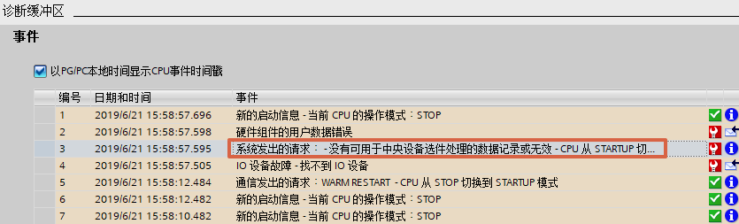
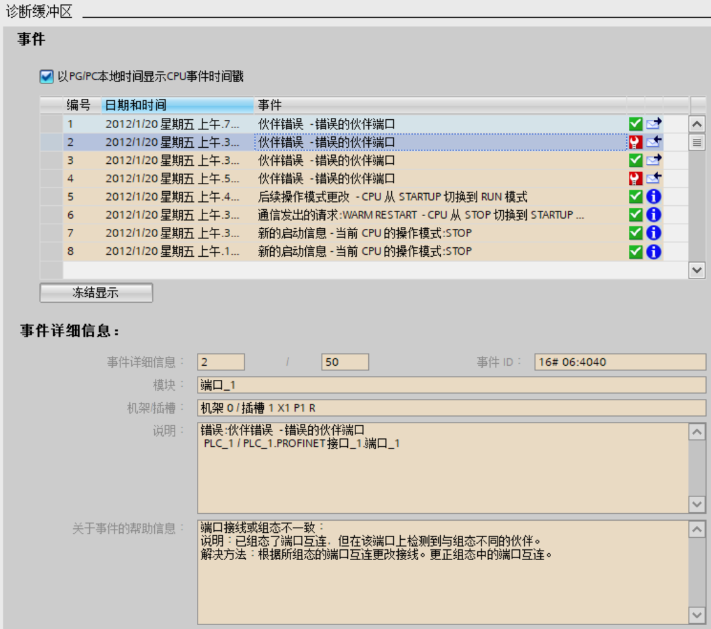

# 基本组态常见问题

## 1. 在时钟同步功能中如何实现使用S7-1200 PLC作为时钟同步的 SNTP sever (服务器)端?

答：S7-1200 只可作为NTP的client(客户)端进行时钟同步,如要实现SNTP
sever(服务器)端功能，可以通过下面的链接下载相应的库。

[**https://support.industry.siemens.com/cs/cn/zh/view/82203451**](https://support.industry.siemens.com/cs/cn/zh/view/82203451)

## 2. 为什么在组态了系统存储器后， \"常 1\"信号在程序中却不生效？

答：组态或修改了系统存储器后，要确保将配置重新下载到CPU，否则组态不生效。

## 3. CPU 属性的\"启动\"特性中, 设置的\"比较预设与实际组态匹配\"，这里的\"匹配\"或者\"兼容\"是什么含义？

答：匹配（兼容性）是指与当前的模块的输入和输出数量相匹配，而且电气和功能特性也相匹配。兼容模块必须能够完全替换已组态的模块；功能性可以更多，但不能比替换的模块少。\
举例说明，
16个通道的数字量输入模块可作为8个通道的数字量输入模块的兼容替换模块。反之则不兼容；16个通道的晶体管数字量输出模块不可作为16个通道的继电器数字量输出模块的兼容替换模块。\
所以，如果设置"仅在兼容时，才启动CPU"并且插入组态的模块兼容时，CPU
启动；如果插入的模块不兼容，则 CPU 无法启动。\
如果选择"即使不兼容也启动 CPU"
的设置，此时如果插槽中插入一个模拟量输出模块或不插入任何模块，则与实际的16
个通道数字量输入的信号模块完全不兼容。虽然无法访问所组态的输入，但 CPU
仍可启动。

## 4. 为什么 CPU 上电后无法启动？

答：若 CPU 上电后无法启动进入到 RUN 模式，可按如下步骤确认：

1.在如图 1 所示的 CPU硬件组态中确认"启动"项中上电后启动是否为"暖启动-RUN模式"，若不是此时应修改组态为"暖启动-RUN模式"，并重新编译、下载硬件组态。

- 若设置为"暖启动-断电前的操作模式"，此时如果是断电前 CPU因故障停止，那么再上电后即使没有故障，CPU也会延续断电前的状态，保持STOP 模式。
- 若设置成"不重新启动"，则 CPU 上电后直接进入 STOP 模式。

图 1 组态启动模式

2.如果此时 CPU 仍然无法启动，需要在线查看 CPU 的诊断缓冲区，查看导致 CPU
无法启动的具体原因，如图 2 所示。

例如，诊断中报错"没有可用于中央设备选件处理的数据记录或无效"。

图 2 诊断缓冲区

这是因为在 CPU
属性的"组态控制"中已激活"允许通过用户程序重新组态设备"，如图 3
所示，但启动 OB 未传送一个有效的组态数据记录，则 CPU 从启动模式返回到
STOP 模式。

图 3 组态控制

3.CPU 还有可能因如下故障进入 STOP 状态

- 中央机架上的硬件模块出现故障
- 中央机架的模块进行热插拔
- CPU 供电不稳定或供电线路上受到干扰
- CPU 插入存储卡
- 同一程序循环中出现两次"超出最大周期时间"情况且没有复位循环定时器

## 5. 为什么 CPU 读取的本地时间与当前实际时间相差 7 小时或者 8 小时?

答：因为当前的实际时间是中国的北京时间，而CPU属性中\"时间\"的默认时区为东一区:UTC+01:00，并且有些版本默认激活夏令时，在CPU属性中，必须先将本地时间的\"时区\"设置为中国所在的东八区：UTC+08：00，然后取消夏令时设置，并将配置下载到CPU后，才能读取到正确的本地时间。

## 6. 为什么在 CPU 的属性中，\"保护/防护与安全\"页面的\"连接机制\"中，无法激活\"允许从远程伙伴（PLC，HMI，OPC\...)使用 PUT/GET 访问\"，显示为灰色？

答：造成这个现象的原因是因为已经将CPU的保护等级设置为最高\"不能访问（完全保护）\"（如图
4 所示）必须设置成其他保护等级，才能激活该选项。

图 4 保护设置

## 7. 能否使用高版本 TIA 博途打开低版本 TIA 博途创建的项目？

答：可以参考以下[链接](10-update.html)。

## 8. 能否使用高版本 TIA 博途上载 CPU 中低版本 TIA 博途下载过的项目？

答：可以参考以下[链接](09-upload_compatibility.html)。

## 9. 如何解决 CPU 诊断缓冲区报错"伙伴错误------错误的伙伴端口"？

答：如下图 5 所示，CPU诊断缓冲区报错"伙伴错误------错误的伙伴端口"，如图 6 所示，因为 CPU
组态了拓扑视图，但实际物理拓扑与组态拓扑不一致。

类似的错误，如："伙伴错误------检测不到相邻方"，也因组态的拓扑与实际不一致。

解决方法：修改为正确的拓扑，或者删除拓扑视图中的连线。

图 5 诊断缓冲区

图 6 拓扑视图
