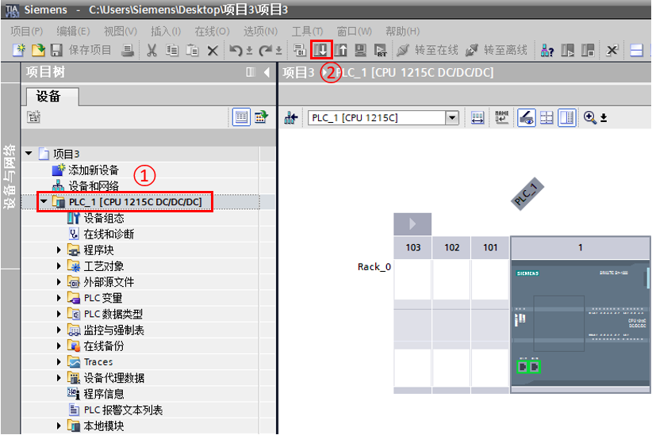
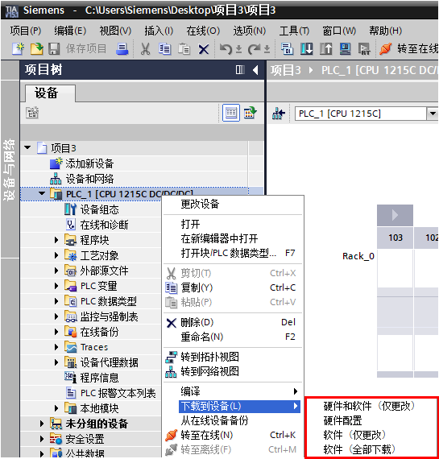
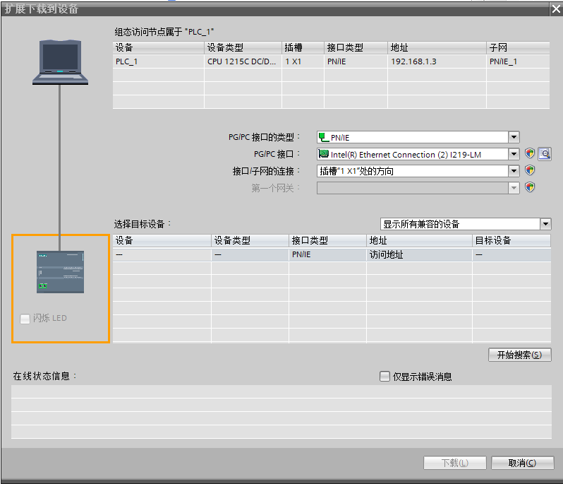
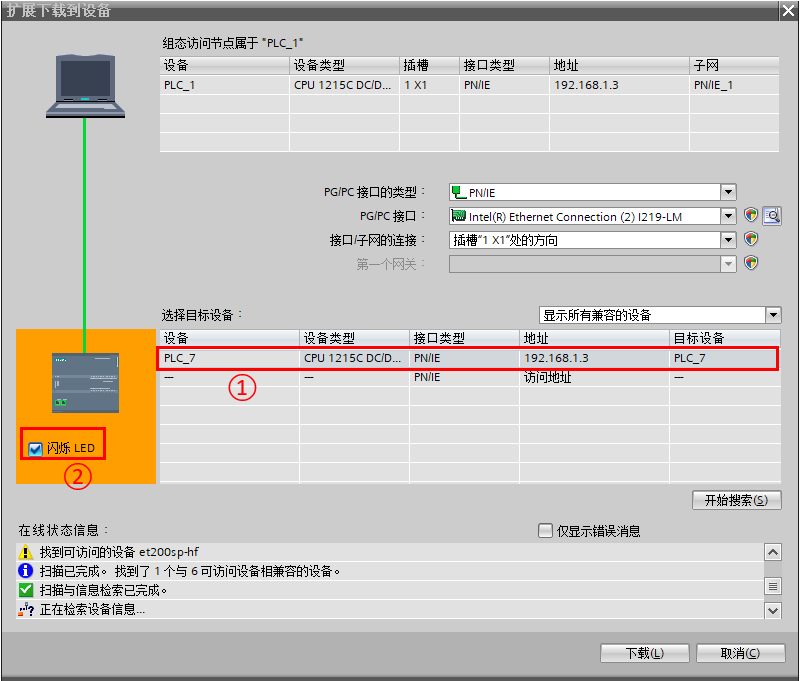
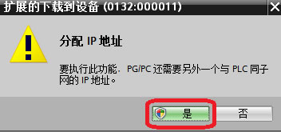
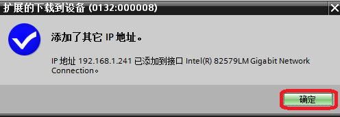
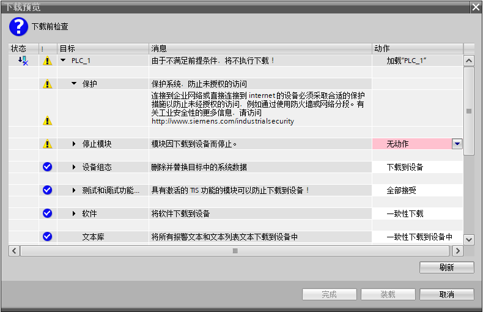
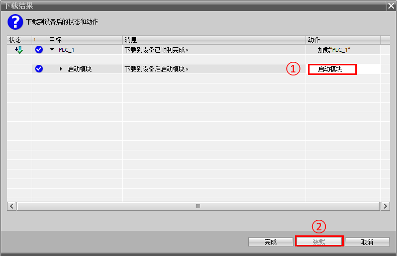
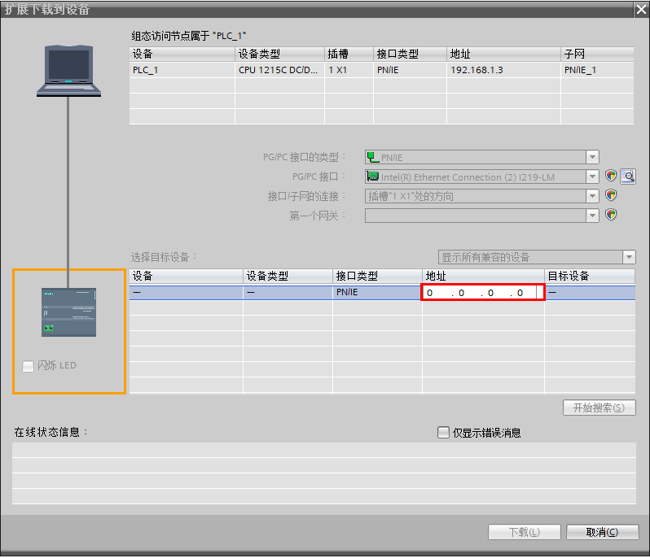

## 项目的下载

S7-1200的CPU本体上集成了PROFINET通信口，通过这个通信口可以实现CPU与编程设备的通信。

此外，S7-1200 可以通过连接CM1243-5扩展模块，然后电脑通过PC ADAPTER USB
A2电缆、或者电脑上的CP卡（例如CP5612）通过PROFIBUS DP线进行下载。

当然，S7-1200 还可以通过连接CP1243-1扩展模块，然后电脑通过网线进行下载。

在这里只介绍最常用的第一种方法，后两种方法只需在下载页面修改接口类型或接口即可。

STEP 7 TIA Portal 软件向用户提供了简便、灵活的下载方式，操作步骤如下：

* 1.在项目树中，选中需要下载的项目文件夹，然后执行菜单命令 **在线\>下载到设备** 或直接点击工具栏上的图标 **下载到设备**，如图01所示。

{width="822" height="549"}

图01.项目下载

另外，还可以下载单独的组件，例如硬件组态和程序块。在项目树中，右键点击项目文件夹，如图02所示，在弹出的菜单中会提供如下菜单命令：

- **下载到设备〉硬件和软件（仅更改）**：设备组态和改变的程序下载到CPU中。
- **下载到设备〉硬件配置**：只有硬件组态下载到CPU中。
- **下载到设备〉软件（仅更改）**：只有改变的程序块下载到CPU中。
- **下载到设备〉软件（仅更改）**：下载所有的程序块到CPU中。

!!! note "注意"

    {width="15" height="15"} S7-1200下载程序必须是一致性下载，也就是无法做到只下载部分块到CPU

{width="545" height="570"}

图02.单独组件下载

* 2.在弹出的 **扩展的下载到设备** 对话框中，设置PG/PC接口类型，其 **PG/PC接口** 下拉选项中选择编程设备的网卡，点击 **开始搜索**，如图03所示。

{width="798" height="685"}

图03.搜索设备

* 3.搜索到可访问的设备后，选择要下载的PLC，当网络上有多个S7-1200PLC时，通过 **闪烁LED** 来确认下载对象，点击 **下载** 按钮，如图04所示。

{width="800" height="681"}

图04.选择下载对象

* 4.如果编程设备的IP地址和组态的PLC不在一个网段，需要给编程设备添加一个与PLC同网段的IP。在弹出的对话框中分别点击 **是** 和 **确定** ，如图05和图06所示。

{width="352" height="165"}

图05.添加同网段IP确认

{width="496" height="171"}

图06.添加IP完成\

* 5.项目数据必须一致。如果项目没有被编译，在下载前会自动被编译。在 **下载预览** 对话框，会显示要执行的下载信息和动作要求。

{width="790" height="510"}

图07.下载预览窗口

如果需要下载修改过的硬件组态且CPU处于运行模式时，需要把CPU转为停止模式，如图08所示。

{width="789" height="510"}

图08.CPU运行模式要求\

* 6.下载后启动CPU，如图09所示。

{width="790" height="509"}

图09.启动CPU

## 下载常见问题

* 1.下载菜单中的下载到设备和扩展的下载到设备有什么区别？

下载到设备等同于工具栏的下载按钮，当项目文件下载过后，项目会自动记录之前的下载行为，当点击下载到设备或者工具栏下载按钮，PC将直接和CPU建立连接，直接跳到如图07的下载预览页面。如果之前没有下载过项目文件，点击下载到设备或者工具栏下载按钮会跳到如图04的页面，需要设置接口，搜索等，然后才可以下载。

而点击扩展的下载到设备，就会像下载到设备，并且之前没有下载过项目文件的状态，从如图04的页面开始进行。

* 2.通过无线路由或远程通信无法搜索到CPU，该如何下载？

因为第三方路由器通常不支持搜索CPU所需的DCP协议，所以只能通过直接访问CPU的IP地址去下载，如图10所示，在扩展的下载到设备页面的下方的访问地址处直接输入CPU的IP地址即可。

{width="798" height="686"}

图10 直接输入访问地址

* 3.什么情况下下载不会停机，什么情况下会停机？

下表列出了可在 **RUN** 操作模式下进行下载的程序和组态更改，按 CPU
的固件版本排序。

表格说明：

- **RUN**：可在 **STOP** 操作模式以及 **RUN** 操作模式下将更改下载到 CPU。
- **RUN (<21)** ： CPU 在一个程序周期中最多可以集成 20
    个全新或修改过的对象/块。
- **RUN (Init)** ：改可以在 **RUN** 操作模式下进行下载；下载的数据块会重新初始化。
- **STOP**：更改只能在 **STOP** 操作模式下进行下载。
- **STOP(Reset)** ：更改只能在 **STOP** 操作模式下进行下载；所有数据（包括保持性数据）都会重置。

  |                             |   V1.0 - 2.1      |    V2.2 - V3.0  |    V4.0 及更高版本    |
  |:-------------------------------------------------------|:---------------------------------|:-------------------------|:---------------------|
  |更改操作/类型                       |   可能的下载模式     |
  |硬件组件的已修改属性。其中包括对硬件配置注释的更改     |STOP             |     STOP |         STOP |
  |修订的注释（新的、修订的、删除的），硬件配置的注释除外  | STOP           |   RUN     |         RUN  |
  |同时下载的块数                                      |  STOP        |      RUN (<11)|         RUN (<11)|
  |将 PLC 程序下载到设备中并复位                      | STOP (Reset)  |      STOP (Reset)      |    STOP (Reset)|
  |新 OB                                            |    STOP       |    STOP        |      STOP|
  |修改的 OB：代码更改                                |    STOP       |  RUN        |     RUN    |
  |属性已修改的 OB（例如，周期时间更改）                  | STOP       | STOP          |    STOP|
  |删除的 OB                                            | STOP       |    STOP      |        STOP|
  |新的 FB/FC/DB/用户数据类型 (UDT)                           | STOP    |  STOP      |        RUN|
  |删除的 FB/FC/DB/用户数据类型 (UDT)                           |  STOP      |      RUN| RUN|
  |修订的 FB/FC：代码更改                                        |  STOP     |       RUN | RUN|
  |修订的 FB/FC：接口更改                                                |  STOP     |   STOP|RUN|
  |修改的 DB（未启用存储器预留区域）：已修改、添加或删除的变量的名称/类型   |STOP        |   STOP| RUN (Init)|
  |修改的 DB（已启用存储器预留区域）：添加的新变量                   |  无       |  无|      RUN|
  |修改的用户数据类型 (UDT)                                       |    STOP   |  STOP|  RUN (Init)|
  |添加新的 PLC 变量（定时器、计数器、位存储器）                    | STOP      | STOP|  RUN|
  |修改的保持性设置（定时器、计数器、位存储器、DB区域）             | STOP       | STOP|STOP|
  |添加的硬件组件                                                |    STOP   | STOP |STOP|
  |修改的 DB：修改的属性（更改"仅存储在装载内存"属性）             |  STOP      | STOP |RUN (Init)|

注：启用存储器预留区域是 V4.0及更高版本 CPU
的功能，具体参见[ **下载但不重新初始化** ](./05-download_run.md)章节。

* 4.STEP 7 V13 SP1 编写的 S7-1200 V4.0项目， 可以正常下载到 FS: 04 S7-1200 CPU，但是无法下载到 FS:05 S7-1200 CPU，ERROR 指示灯红色闪烁报错， CPU 无法启动 。为什么？

S7-1200 V4.2 模块兼容 V4.0 和 V4.1模块，且新订购的 V4.2 模块是 FS:05。

当使用 STEP 7 V13 SP1 编写 的 S7-1200
V4.0项目无法正常下载时，可考虑检查以下内容：

- 先检查 STEP7 V13 SP1 编写的 S7-1200 V4.0项目是否启用了高数计数器功能；
- 从"在线和诊断"检查实际使用的 S7-1200 固件版本。

如果 STEP 7 V13 SP1 编写 的 S7-1200 V4.0项目使用了高数计数器功能
，且实际使用的 S7-1200 CPU 版本是V4.2 FS:05， 则无法执行下载，CPU ERROR
指示灯红色闪烁报错 ，CPU 无法启动。

这是因为 S7-1200 V4.2 高速计数器新增了门控制等功能，
不能将旧版本组态的下载到 V4.2 FS: 05 CPU。

解决方法：

- 1.将项目升级至STEP 7 V14，然后重新组态高速计数器后将项目下载到 V4.2 FS: 05 CPU。

- 2.将 S7-1200 CPU 升级到 V4.2.1后再执行项目下载。
