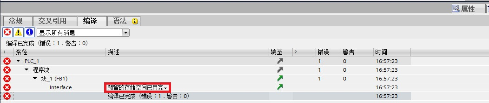

## S7-1200 下载但不重新初始化

### 说明

为了可以编辑已经过调试且在系统上正常运行的 PLC 程序，S7-1200 V4 及更高版本的 CPU 支持在运行时对FB块或数据块接口进行扩展。无需将 CPU 设置为 STOP 模式，即可下载已修改的块，而不会影响数据块其他的值。这是一种简单的更改程序的方式。这一加载过程（无需重新初始化的下载）不会对所控制的过程造成负面影响。

### 工作原理

原则上，每个FB块或数据块都默认有一个存储器预留区域，用于后续的接口更改。在初期并未使用该存储器中所预留的区域。如果确定在编译和下载块之后加载接口更改，则需激活存储器预留区域。之后声明的所有变量都将保存到存储器预留区域中。后续的下载不会影响已经加载变量的值。

如果决定稍后在工厂没有运转时修改程序，那么还可以一次性重置一个或多个块的存储器布局。通过该操作，可以将所有变量从预留区域移动到常规区域。预留存储器清除后，可供以后的接口扩展时使用。

### 要求

如果满足以下要求，1200 CPU 则可使用"无需重新初始化的下载"功能：

- 1.使用 S7-1200 V4 及更高版本的 CPU。
- 2.FB块使用 LAD、FBD 或 SCL 创建。
- 3.DB块由用户创建。
- 4.FB或DB必须是"优化访问"。

### 基本步骤

如果希望扩展FB块或数据块的接口，请执行以下步骤，然后在不重新初始化的情况下加载块。

- 1.在默认情况下，所有块在非保持性存储器中都预留有一个100个字节的空间，并在需要时，可以调节存储器预留区域的大小或在保持性存储器中定义其它存储器预留区域。
- 2.激活存储器预留区域。
- 3.扩展块接口。
- 4.编译块。
- 5.将块下载到 CPU。

## 设置块扩展的预留存储器

### 简介

基本上，每个FB块或数据块在默认情况下都预留了100个字节的区域。这一预留区域不在块的保持型存储区中。默认情况下，保持型存储区中没有提供预留区域，这是因为保持型存储器仅限 CPU 使用。

可以更改默认值100个字节，这适用于项目中所有新创建的块。此外，还可以单独更改特定块中预留区域的大小，并在保持型存储区中为特定块定义一个预留区域。

### 设置新块中预留存储器的大小

如果要在项目中为所有新创建的块设置预留存储器的大小，请按以下步骤操作：

- 1.在"选项"菜单中，选择"设置"命令。将在工作区中显示"设置"窗口。
- 2.在区域导航中选择"PLC 编程 > 常规"组。
- 3.在"下载但不重新初始化"组中，在"存储器预留"的输入框中输入为块接口进行后续扩展而分配的所需字节数。新创建的FB块和全局数据块现在获得了一个具有指定大小的预留存储器。 已经存在的块不受此次更改的影响。

说明
此设置仅对支持"下载但不重新初始化"功能的块有效。 其它块不受此设置的影响。

图1.为所有新创建的块设置预留存储器的大小

### 设置现有块中预留存储器的大小

如果要设置现有块中预留存储器的大小，请按以下步骤操作：

- 1.在项目树中选择该块。
- 2.右键快捷菜单中选择"属性"命令。将打开"属性"对话框。
- 3.在浏览区中选择"下载但不重新初始化"组。
- 4.在"预留的存储空间大小"输入框中输入所需的字节数。
- 5.如果要在保持型存储器中定义一个预留区域，请选择"启用下载，但不重新初始化保持性变量"复选框并在"预留可保持性存储器"输入框中输入所需的字节数。

:::{note} 
如果已为当前块 **激活了预留存储器** ，那么无法再更改预留存储器的大小。
:::

图2.设置现有块中预留存储器的大小

## 激活存储器预留区域

### 简介

每个FB块或数据块都被分配有一个默认存储器预留区域。但是，该存储器预留区域在初期并未使用。如果已编译且加载了块，然后希望稍后加载接口更改，那么请激活存储器预留区域。随后声明的所有变量都将保存到存储器预留区域中。

### 要求

- 1.块目前已被编译。
- 2.块包含存储器预留区域。

### 步骤

若要为FB块或全局数据块激活存储器预留区域，请按以下步骤操作：

- 1.打开块。
- 2.选择工具栏上的"下载但不重新初始化"按钮。

### 结果

- 1.所有新声明的变量都将保存在存储器预留区域中，因此可以在不影响正在运行的进程的情况下进行下载。
- 2.无法再删除现有变量。 除了"默认值"、"起始值"和"注释"属性之外，其它属性均不得再进行更改。

图3.激活存储器预留区域

## 扩展块接口或数据块

### 简介

在激活FB块或全局数据块的预留存储器之后，可添加新变量。

### 要求

预留存储器已激活。

### 步骤

要声明其它变量，请按以下步骤操作：

- 1.选择声明部分，例如"Input"、"Output"、"InOut"或"Static"。
- 2.在所选区域中，声明一个或多个变量，并在列中输入其属性。在 FB 的"保持性"列中，只能在"保持性"和"非保持性"之间进行选择，预留存储器中无法使用选项"在 IDB 中设置"。无法在结构化数据类型变量中添加新的变量。例如：无法在现有结构中声明任何新的结构元素。 但是，可以在预留存储器中创建新结构。
- 3.编译发生变更的块，例如，在项目树中选择该块，然后在快捷菜单中选择命令"编译 > 软件（仅变更）"。在编译期间，新声明的变量将插入到预留存储器中。 如果预留存储器过小，编译将终止，并显示一条错误消息，通知发生错误。
- 4.加载发生变更的块，例如，在项目树中选择该块，然后在快捷菜单中选择命令"下载到设备 > 软件（仅变更）"。加载块扩展时，仅初始化定义有初始值的新加变量。并不会重新初始化现有在线变量。

图4.如果预留存储器过小，编译将终止

## 禁用存储器预留区域

### 简介

为了稍后在工厂尚未运转时修改块的存储器布局，可以禁用预留存储器。通过此操作，可以将所有变量从预留区域移动到常规区域。预留存储器仍然存在，可供之后进行接口扩展时使用。并再次具有块属性中所定义的空间大小。

### 说明
请注意，在禁用预留存储器之后，需要对块进行编译并再次加载。 在禁用存储器预留区域后，无法执行"无需重新初始化的下载"。

### 要求

块中的预留存储器已激活。

### 步骤

如果要激活FB块或全局数据块的预留存储器，请按以下步骤操作：

- 1.打开块。
- 2.选择工具栏上的"下载但不重新初始化"按钮。

### 结果

通过此操作，可以将之前位于预留区域的所有变量都移动到常规区域。因此，需要对块进行编译并再次加载，CPU 中变量的值在加载期间重新初始化。

图5.取消存储器预留区域

## 重置预留存储器

### 简介

如果决定稍后在工厂尚未运转时修改程序，那么可以一次性重置块的存储器布局。通过此操作，可以将所有变量从预留存储器移动到常规存储区域中。预留存储器清除后，可供以后的接口扩展时使用。

### 要求

- 1.块中的预留存储器已激活。
- 2.预留存储器包含有变量。

### 步骤

要重置一个或多个块的预留存储器，请按以下步骤操作：

- 1.选择"程序块"文件夹，或该文件夹中的特定块。
- 2.在快捷菜单中，选择"编译 > 软件（复位存储器预留区域）"命令。

### 结果

之前位于预留存储器中所选块的所有变量，都从此区域移动到常规区域中。块已经过重新编译。变量在下一次加载期间重新初始化。块中所组态的预留存储器将保留，且继续保持活动状态。

图6.重置预留存储器

:::{warning}

重置预留存储器时，在预留存储器中之前设置的所有变量都将在下次加载时 **重新初始化** 。 这适用于保持性和非保持性变量。

在工厂运行期间，更改变量值将导致严重的财产损失和人身伤害！ 因此，在重置预留存储器后必须先在测试环境中进行全面彻底地程序检查之后，才能使用.
:::