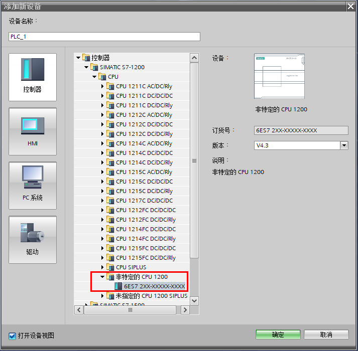
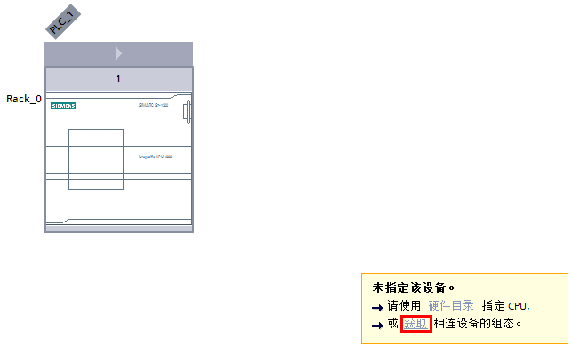
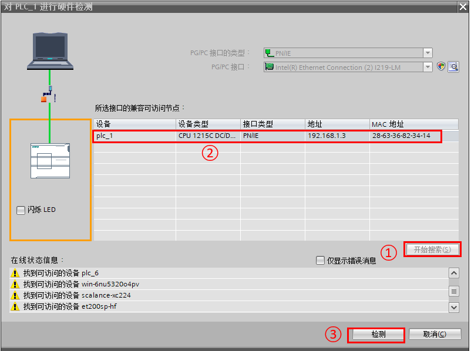
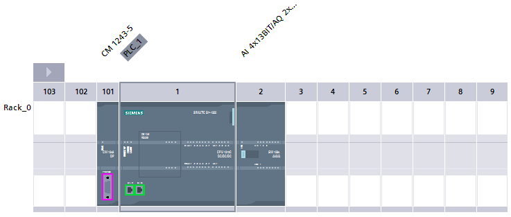
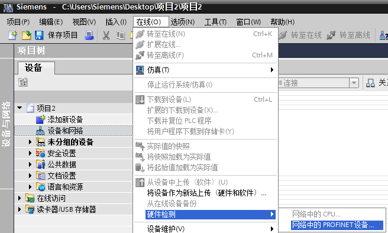
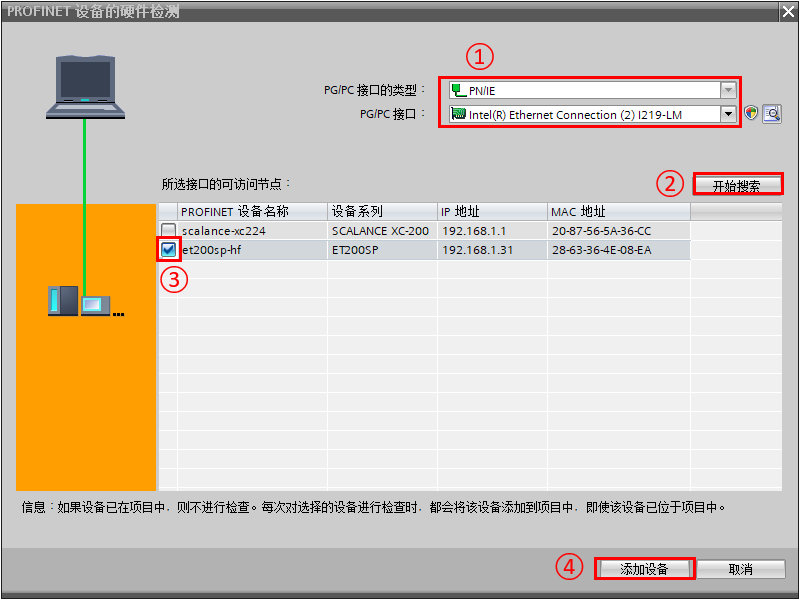
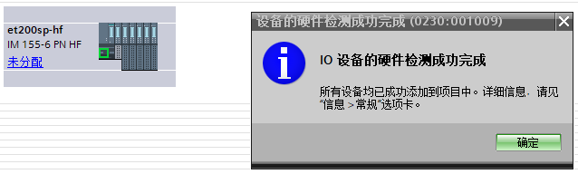
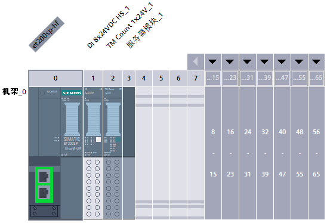

# 硬件检测

## 自动检测CPU主机架硬件信息

如果您可以使用电脑在线连接
S7-1200CPU，且CPU的扩展模板都已经被插接完毕，您可以使用自动检测这种更为简便的方式完成设备的硬件配置。

CPU处于出厂设置，用户从未下载设备配置到CPU，也从未为CPU分配IP地址，也可采用 **自动检测** 方式完成设备配置。

* 1.添加新设备，选择 **控制器**，在 **SIMATIC S7-1200** 下面选择 **非特定的CPU 1200** ，在右边版本选择合适的版本

{width="713" height="700"}

图1 添加非特定的CPU 1200

* 2.点击确定后，弹出项目视图，在一个透明的CPU下面的对话框中，点击 **获取** 按钮。

{width="643" height="390"}

图2 项目视图

* 3.{width="802" height="598"}

图3 硬件检测

在硬件检测窗口中完成以下操作

①点击开始搜索按钮

②在可访问节点中显示所有兼容的S7-1200并选择

③点击检测按钮

* 4.硬件信息上载成功后，用户可以在设备视图中看到所有模块的类型，包括CPU、通信模块、信号模板和I/O模块：

{width="737" height="313"}

图4 硬件信息上载成功

:::{attention}

    硬件信息上载的只是 CPU(包含以太网地址)及主机架模块的型号以及版本，分布式IO以及模块参数配置是不能获取上来的，必须重新组态及配置所需参数并下载，才能保证CPU正常运行。
:::

## 自动检测分布式IO硬件信息

在TIA PORTAL
V15开始，软件增加功能，可以在线检测并识别与电脑相连的PROFINET
IO设备，这样在组态时候避免了逐个检查模块版本、订货号的繁琐。这样该功能结合CPU主机架的检测功能，使得S7-1200的组态更加便捷。

:::{attention}

    对于ET200SP模块目前无法检测出底座颜色

* 1.创建TIA
PORTAL项目，在 **在线** 菜单，选择 **硬件检测** ，选中其下级的 **网络中的PROFINET设备\...**

{width="656" height="394"}

图5 选择功能

* 2.在弹出对话框做如下操作

{width="801" height="599"}

图6 搜索设备

①PGPC接口的类型选择PN/IE，接口选择电脑网卡

②点击 **开始搜索** 按钮

③在搜索到的设备中选择需要添加的设备

④添加 **添加设备** 按钮

* 3.检测出的设备将显示在网络视图中

{width="638" height="192"}

图7 检测完成

* 4.进入该设备的设备视图，可以看到模块信息已识别出。

{width="548" height="374"}

图8 设备视图
