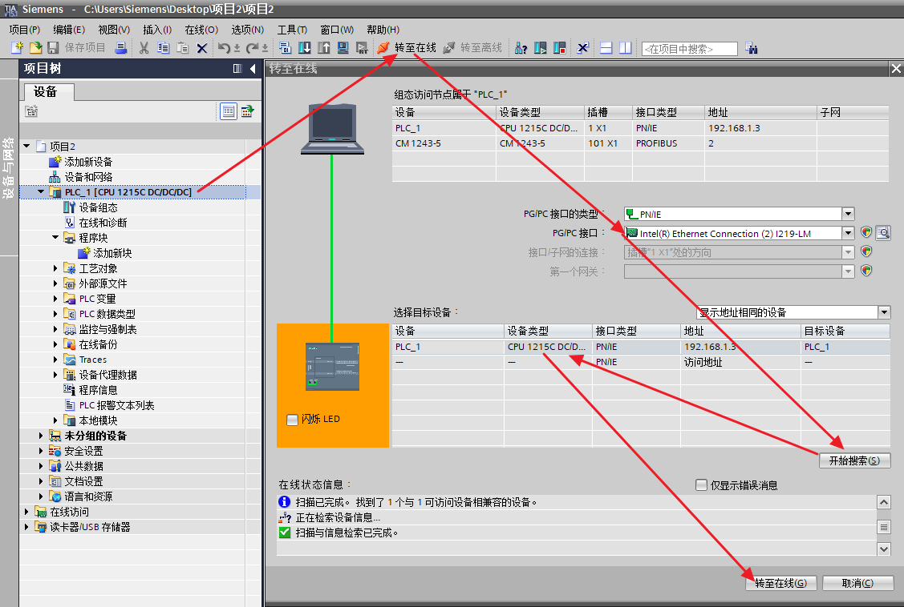
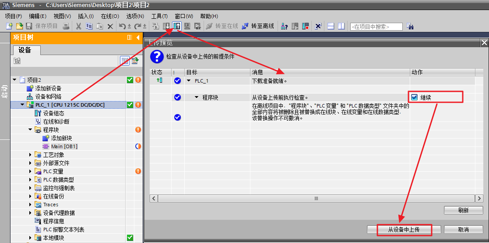
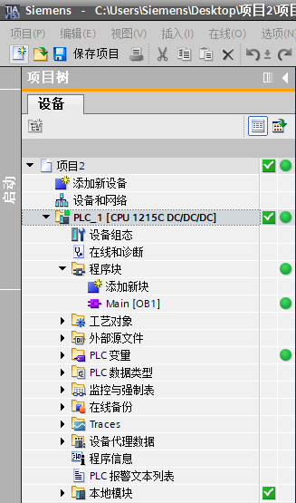
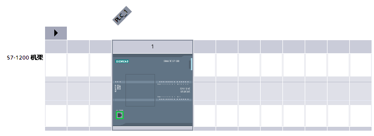
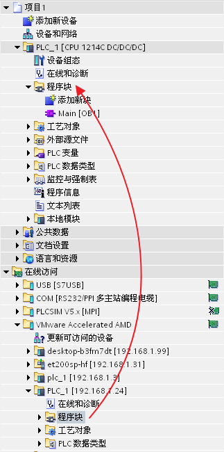
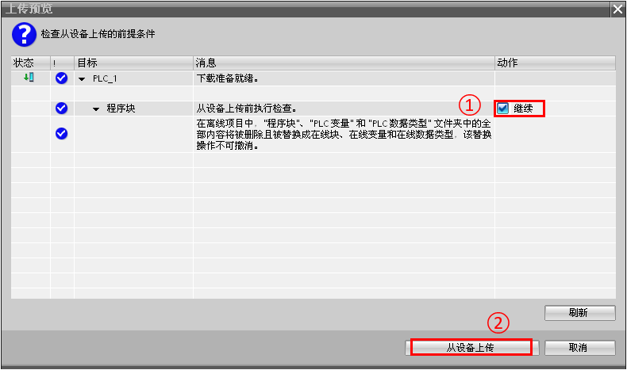

# CPU程序的上载

## 一、上载程序块\--STEP7 V12 及其以上版本软件

1、根据CPU型号添加硬件，或者[自动获取PLC硬件信息](06-detect_hardware.md)后，将CPU转至在线

{width="1127" height="758"}

图1 硬件在线

2、在线后，选中 **上传** 图标，进行上传程序块，具体方式见图6，

{width="1117" height="556"}

图2 上传程序块

3、上传完成如图7所示。

{width="327" height="555"}

图3 上传完成

:::{note}
    要上传的硬件配置和软件必须与 TIA Portal 软件版本兼容。如果设备上的数据是由前版本程序或不同的组态软件创建的，则需确保它们是兼容的。
:::

## 二、上载程序块\--STEP7 V11/V10.5版本软件

1、根据CPU型号添加硬件，或者[自动获取PLC硬件信息](06-detect_hardware.html)

{width="772" height="281"}

图4 设备视图

2、在在线访问的电脑网卡下双击 **更新可访问的设备**，则会自动显示出电脑可访问到的设备，选择需要访问的PLC，展开目录，将程序块拖拽到离线的程序块，就会自动弹出上载对话框。

{width="323" height="650"}

图5 在线访问

3、弹出对话框

{width="790" height="467"}

图6 上载程序块

①勾选 **继续**

②点击 **从设备上传** 执行程序上载，这时CPU里的程序便上载到离线的项目中了。
