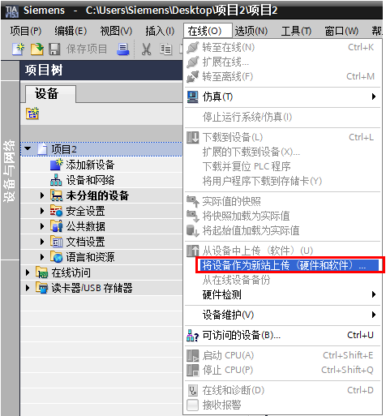
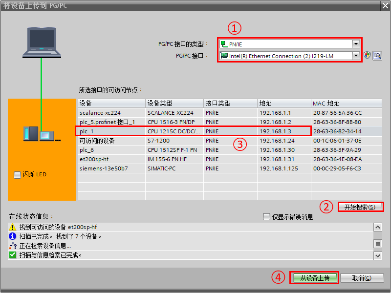
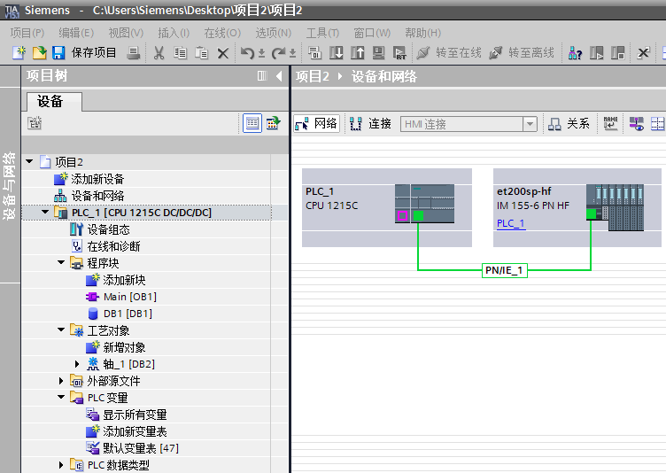
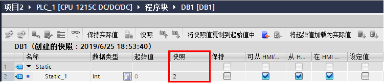
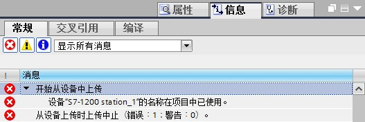
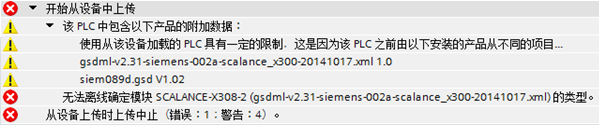

### 站点的上载

#### **STEP7 V13 及以上版本功能：**将设备作为新站上传（硬件和软件）

**软件要求：TIA Portal V13及以上版本**

**固件要求：S7-1200 V4.0及以上版本**

只要满足上述条件，就可以使用\"上传设备作为新站（硬件和软件）\"功能从在线连接的设备上将硬件配置与软件一起上传，并在项目中使用这些数据创建一个新站。

1、在项目树中选择项目名称。在"在线"菜单中，选择"将设备作为新站（硬件和软件）"。打开"将设备上传到
PG/PC"对话框。

{width="476" height="513"}

图1 将设备作为新站（硬件和软件）

2、在"将设备上传到 PG/PC"对话框中执行以下操作

{width="800" height="600"}

图2 将设备上传到 PG/PC

①PGPC接口的类型选择PN/IE，接口选择电脑网卡

②点击"开始搜索"按钮

③在搜索到的设备中选择需要上传的设备

④添加"从设备上传"按钮

**注意：上传时不支持下载时支持的通过输入IP地址搜索CPU的方法，下载时的输入IP方法参见[链接](04-Download.html#IP)**。

3、上载成功后，可以获取 CPU 完整的硬件配置和软件。

{width="752" height="534"}

图3 上载成功

软件部分主要包含：包含注释的程序、包含注释与符号名的DB块、工艺对象配置、包含注释的PLC变量表、PLC数据类型、文本列表等。

4、值得注意的是上传的DB块包含起始值与快照值，快照值也就是上传时DB块变量的实际值，可以用来将其加载为实际值或初始值。

{width="751" height="163"}

图4 DB块快照值

### **上传要点**

1、要上传的硬件配置和软件必须与 TIA Portal 软件版本兼容。
如果设备上的数据是由前版本程序或不同的组态软件创建的，则需确保它们是兼容的，具体兼容性参见[链接](09-upload%20FAQ.html#ver)。

2、 执行将设备作为新站上传时报错需确认离线项目中没有配置与在线 PLC
相同名称的站点，否则上传失败。

{width="527" height="176"}

图5 站点名称相同时上传失败

3、项目中含有TIA Portal 没有的 HSP 或 GSD，则无法上传。

{width="599" height="125"}

图6 上传含 HSP 或 GSD 项目失败
