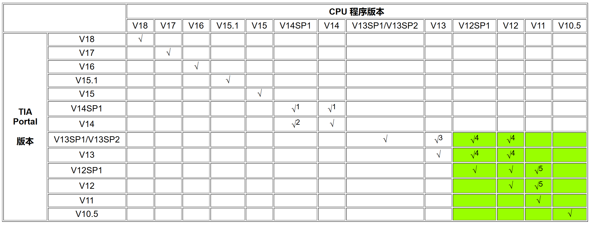
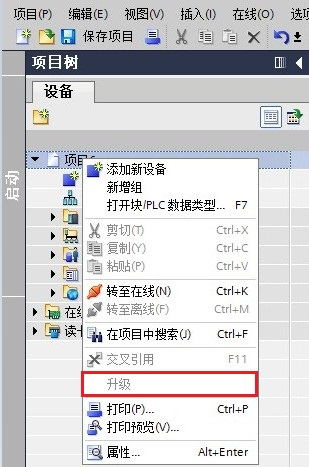
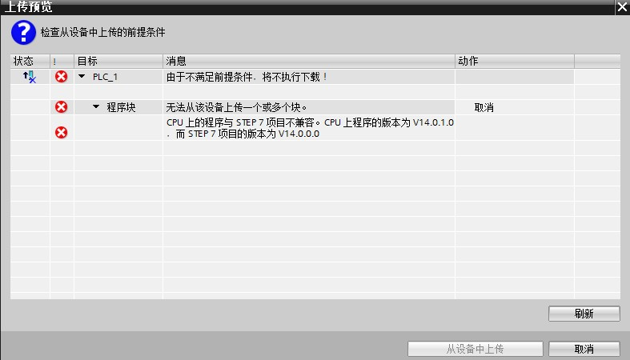
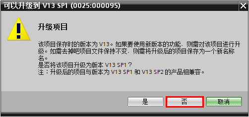
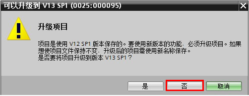
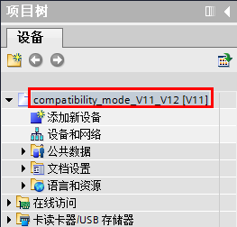

# TIA Portal 版本和 CPU 中程序版本在上传时的兼容性

通常 CPU 内的程序只能使用相同版本的 TIA Portal 软件上传，也就是说例如用
V18 下载的程序只能使用 V18 版本 TIA Portal上传，但是也存在一些特例，或者特殊的解决办法，具体见下表和后面的说明。

:::{tip}

绿色背景的区域只允许使用从 CPU中上载程序块。
:::

## 1. 在 TIA Portal V14 SP1 软件中，上传 TIA Portal V14 或 V14 SP1的项目

在 TIA Portal V14 SP1 软件中能创建两个不同版本的项目：V14 SP1 或
V14（创建方法参考：[TIA Portal V14 SP1项目创建](./01-New_Project.md#快速创建新项目)），因此，在 TIA Portal V14 SP1软件中，能否上传 V14 SP1 或 V14 项目取决于 TIA Portal V14 SP1软件中使用的项目版本。

1\) 当使用 TIA Portal V14 SP1 软件下载 TIA Portal V14 项目到 S7-1200 CPU
，或者直接用TIA Portal V14 下载项目到 S7-1200CPU后，如果用于执行上传操作的软件是 TIA Portal V14SP1版本并且创建项目版本是 TIA Portal V14 SP1，则上传的项目仍然是 TIA Portal V14 版本，并且项目无法升级。

鼠标选中项目，右键选项 **升级** 显示为灰色。

{width="309" height="467"}

图 1 TIA Portal V14 SP1 上传的 TIA Portal V14 项目无法升级

2\) 当使用 TIA Portal V14 SP1 软件下载 TIA Portal V14 SP1 项目到 S7-1200
CPU ，如果用于执行上传操作的软件是 TIA Portal V14 SP1版本但创建项目版本是 TIA Portal V14 ，则无法上传。这其实就相当于用 V14上载 V14SP1 项目，是不支持的。

{width="787" height="450"}

图 2 TIA Portal V14 无法上传 TIA Portal V14 SP1 项目

## 2. 在 TIA Portal V14 软件中，上传 TIA Portal V14 SP1的项目

和 1 的问题原因是一样的，当使用 TIA Portal V14 SP1 软件下载 TIA Portal
V14 项目到 S7-1200 CPU ，如果用于执行上传操作的软件是 TIA Portal V14，则可以上传。否则无法上传。

## 3. 在 TIA Portal V13 SP1 / SP2 软件中,上传TIA Portal V13 的项目

可以从[这里](File/82169157_compatibility_mode_v13_v13sp1.zip)下载一个
TIA Portal V13 的空项目，然后使用 TIA Portal V13 SP1/SP2
打开该项目时，在弹出对话框选择中间的按钮"否"，这样打开的就是 V13
的项目，然后就可以使用正常的方式上传。

{width="502" height="236"}

图 3 TIA Portal V13SP1/SP2 打开 V13 项目

## 4. 在 TIA Portal V13 / V13 SP1/ V13 SP2 软件中，上传 TIA Portal V12/V12SP1 的项目

可以从[这里](File/82169157_compatibility_mode_v12_v13.zip)下载一个 TIA
Portal V12 SP1 的空项目，然后使用 TIA Portal V13 / V13 SP1 / V13 SP2
打开该项目时，在弹出对话框选择中间的按钮"否"，这样打开的就是 V12 SP1
的项目，然后就可以使用正常的方式上传。

{width="502" height="195"}

图 4 TIA Portal V13SP1 打开 V12SP1 项目

## 5. 在 TIA Portal V12 / V12 SP1 软件中，上传 TIA Portal V11的项目

可以从[这里](File/66027369_compatibility_mode_v11_v12.zip)下载一个TIA
Portal V11 的空项目，然后使用 TIA Portal V12 / V12 SP1
打开该项目，这样打开的就是 V11 的项目，然后就可以使用正常的方式上传。

{width="263" height="252"}

图 5 TIA Portal V12SP1 打开 V11 项目
