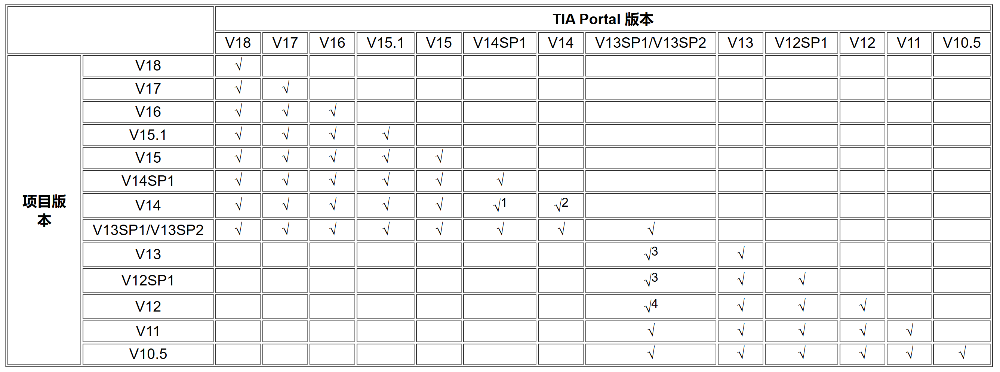
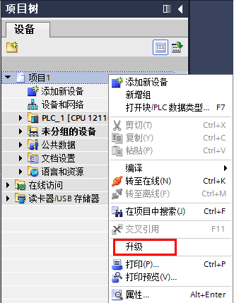
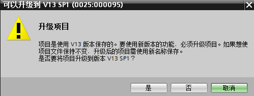
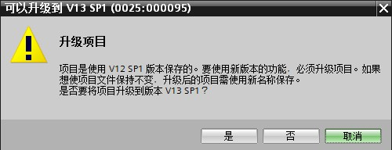
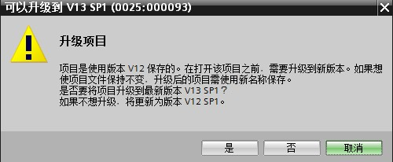

# 项目升级

通常 TIA Portal 的项目可以使用相同版本或者更高版本 TIA Portal版本打开，例如 V15 可以打开 V13SP1的项目，但是存在一些特殊情况，具体见下面的表和说明。

:::{note}

    {width="15" height="15"} 没有注释的√表示：如果相同版本直接打开，如果项目版本低于当前TIA Portal 版本，则可以备份升级至当前 TIA Portal版本，也就是说会保留之前的项目版本，另外复制一个项目升级，也可以取消打开动作。
:::

:::{note}

    {width="15" height="15"} 名词解释：兼容打开项目是指高版本打开低版本项目时，直接打开，不提示升级，可以在打开项目后自行选择升级。
:::

## 1. 在 TIA Portal V14 SP1 软件中，打开 TIA Portal V14 的项目

在 TIA Portal V14SP1 软件中，打开 TIA Portal V14的项目，是兼容打开项目。

同理，TIA Portal V14 SP1 软件打开的是 使用 TIA Portal V14 SP1软件但创建项目版本是 TIA Portal V14 的项目（创建方法参考：[TIA Portal V14 SP1项目创建](./01-New_Project.md)）。

{width="331" height="429"}

图 1 手动升级

## 2. 在 TIA Portal V14 软件中，打开 TIA Portal V14 的项目

相同版本软件打开相同版本创建的项目是没有问题的，还有一个特例就是项目是使用
TIA Portal V14 SP1 软件但创建项目版本是 TIA Portal V14（创建方法参考：[TIA Portal V14 SP1项目创建](./01-New_Project.md)）。这种情况下在 TIA Portal V14软件，也可以打开该项目。

## 3. 在TIA Portal V13SP1/V13SP2 软件中，打开 TIA Portal V13/V12SP1的项目

在 TIA Portal V13SP1/V13SP2 软件中，打开 TIA Portal V13 或 V12SP1的项目时，会弹出以下对话框。

{width="499" height="189"}

图 2 V13SP1/V13SP2 打开 V13 项目

{width="500" height="192"}

图 3 V13SP1/V13SP2 打开 V12 SP1 项目

点击 <kbd>  **是**  </kbd>，则正常的备份升级，点击 <kbd>  **否**  </kbd>，则兼容打开 V13 或 V12SP1
的项目，可以参考图 1 在打开项目后自行选择升级。

## 4. 在 TIA Portal V13SP1/V13SP2 软件中，打开 TIA Portal V12 的项目

在 TIA Portal V13SP1/V13SP2 软件中，打开 TIA Portal V12的项目时，会弹出以下对话框。

{width="500" height="206"}

图 4 V13SP1/V13SP2 打开 V12 项目

点击 <kbd>  **是**  </kbd> ，则正常的备份升级，点击  <kbd>  **否**  </kbd>  ，则将项目备份升级至V12SP1，然后兼容打开该项目，可以参考图 1 在打开项目后自行选择升级。
