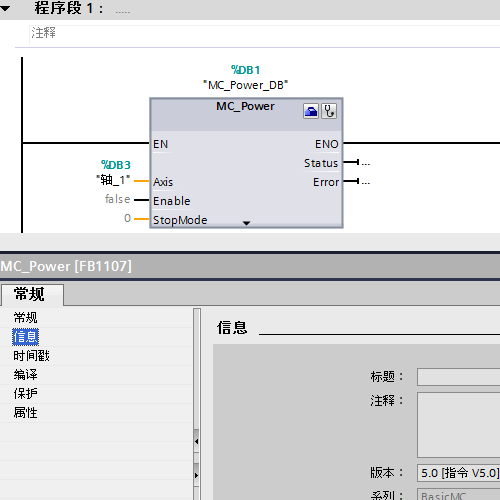
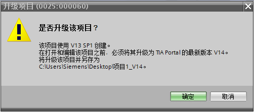
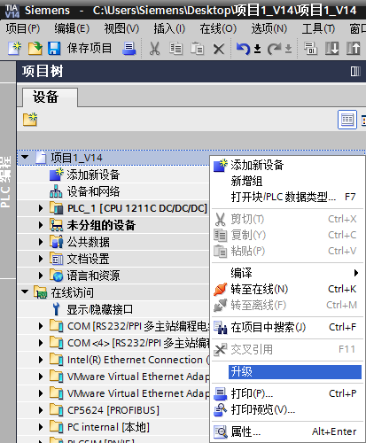
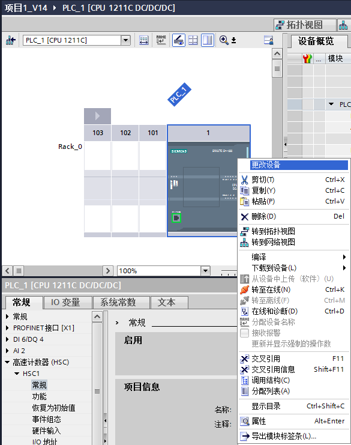
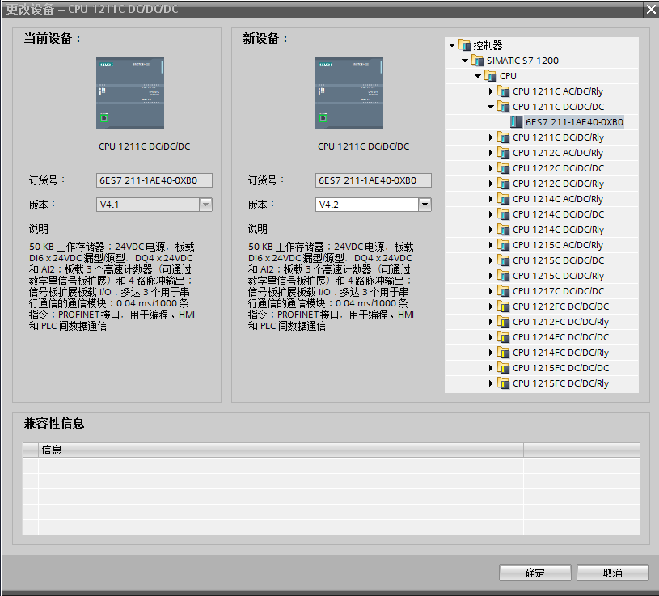
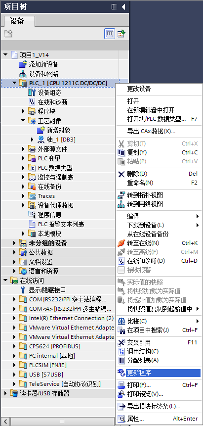
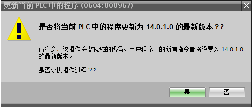
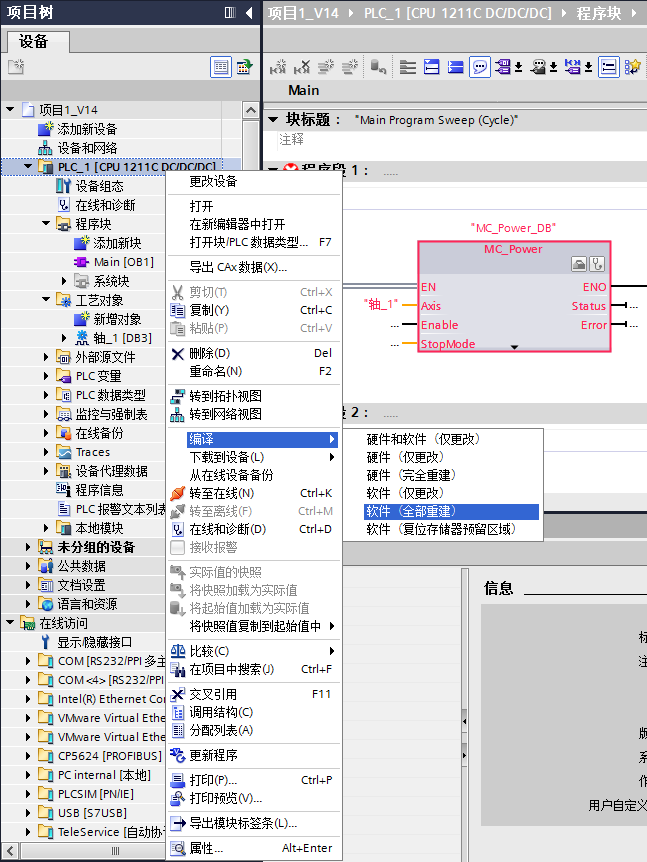
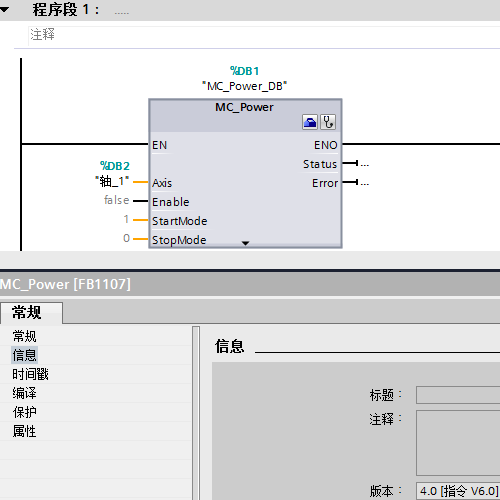

### 更新程序

TIA博图STEP7从V14SP1版本增加新功能："更新程序"，可以将当前CPU中的程序版本更新至能够使用的最高版本，对于通讯、运动控制等版本经常升级的程序非常适用，以下面这个例子说明：

1\. TIA博图STEP7 V13SP1中组态S7-1200
V4.1版本，组态工艺对象PTO轴，此时最高版本V5.0，如图1所示。

{width="500" height="500"}

图 1

2\. 使用TIA博图STEP7
V14SP1版本打开该项目，项目文件升级至V14版本，如图2所示。

{width="502" height="222"}

图 2

3\. 将该项目文件升级为V14SP1版本，如图3所示。

{width="413" height="500"}

图 3

4\. 在设备视图中将CPU版本变更为TIA博图STEP7
V14SP1版本时的最高版本为V4.2，如图4、5所示。

{width="585" height="741"}

图 4

{width="815" height="737"}

图 5

5\.
更新硬件后，并重新编译后，在项目树中右键点击S7-1200站点，在弹出菜单中按下按钮"更新程序"，如图6、7所示。

{width="411" height="861"}

图 6

{width="501" height="213"}

图 7

7\.
更新完毕后，发生变化的程序变为红色，在项目树中右键点击S7-1200站点，在弹出菜单中按下按钮"编译\>软件（全部重建）"，如图8所示。

{width="647" height="862"}

图 8

8\. 编译后工艺对象升级为V6.0，如图9所示。

{width="500" height="500"}

图 9
