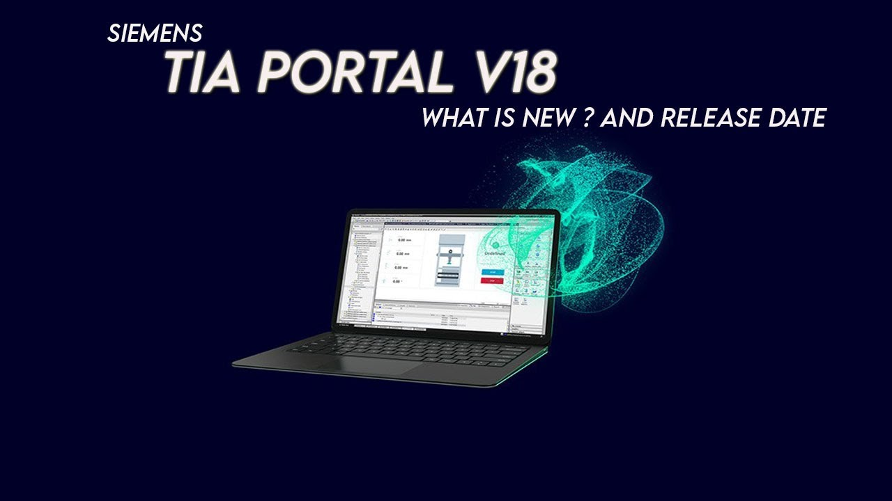
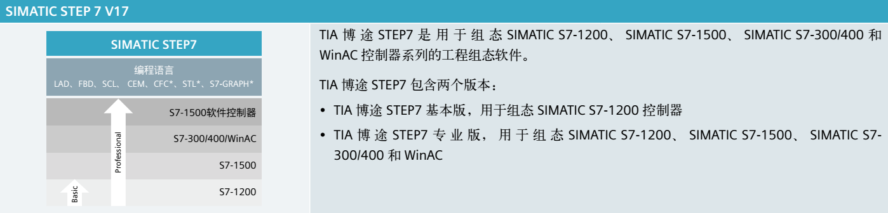

# TIA Portal 组态软件操作

TIA 博途 (TIA Portal)是西门子新推出的，面向工业自动化领域的新一代工程软件平台，
主要包括三个部分：SIMATIC STEP 7、SIMATIC WinCC 和 SIMATIC StartDrive。TIA 博途的
软件体系结构如图 3-1 所示。

## SIMATIC STEP 7 (TIA Portal) 

STEP 7 (TIA Portal) 是用于组态 SIMATIC S7-1200、S7-1500、S7-300/400 和 WinAC 控
制器系列的工程组态软件。STEP 7 (TIA Portal)有 2 种版本，具体使用取决于可组态的控制器
系列，分别介绍如下。

① STEP 7 Basic 主要用于组态 S7-1200，并且自带 WinCC Basic，用于 Basic 面板的 
组态。

② STEP 7 Professional 用于组态 S7-1200、S7-1500、S7-300/400 和 WinAC，且也自带
WinCC Basic，用于 Basic 面板的组态。

## STEP 7 (TIA Portal) V18 软件安装

- .png>){width="25"  height="20"} __[TIA Portal STEP 7 V18 安装]__   最新版本的 STEP 7 (TIA Portal) V18 可以从产品代理商处订购。

## 新建项目

-  __[新建]__   TIA Portal STEP7软件向用户提供了非常简便、灵活的项目创建、编辑和下载方式。
- __[CPU参数]__   通过参数分配可以设置所有组件的属性，这些参数将装载到 CPU 中，并在 CPU 启动时传送给相应的模块。
- {width="25"  height="20"} __[常见问题FAQ]__      回答基本组态常见问题。
  

## 项目下载

 - :material-download: __[下载]__   STEP 7 TIA Portal 软件向用户提供了简便、灵活的下载方式。

 - :material-download-multiple: __[运行时下载]__   S7-1200 下载但不重新初始化，这一加载过程不会对所控制的过程造成负面影响。

 - :material-check-network-outline: __[硬件检测]__     S7-1200CPU，且CPU的扩展模板都已经被插接完毕，可以使用自动检测这种更为简便的方式完成设备的硬件配置。

## 上载

- :material-upload: __[上载程序]__   S7-1200 CPU程序的上载操作。
- :material-upload-network: __[上载站点]__   STEP7 V13 及以上版本功能：将设备作为新站上传（硬件和软件）。
- :material-upload-multiple: __[上传时版本的兼容性]__   TIA Portal 版本和 CPU 中程序版本在上传时的兼容性。

## 升级

- {width="15" height="15"} __[项目升级]__   TIA Portal 的项目可以使用相同版本或者更高版本 TIA Portal版本打开。
- :material-update: __[程序升级]__   TIA博图STEP7从V14SP1版本增加新功能：**更新程序** ，可以将当前CPU中的程序版本更新至能够使用的最高版本。

 [TIA Portal STEP 7 V18 安装]: ../install.md
 [新建]: ./01-New_Project.md
 [CPU参数]: ./02-CPU_Properties.md
 [常见问题FAQ]: ./03-ConfigFAQ.md
 [下载]: ./04-Download.md
 [运行时下载]: ./05-download_run.md
 [硬件检测]: ./06-detect_hardware.md
 [上载程序]: ./07-upload_program.md
 [上载站点]: ./08-upload_station.md
 [上传时版本的兼容性]: ./09-upload_compatibility.md
 [项目升级]: ./10-update.md
 [程序升级]: ./11-Program_Update.md