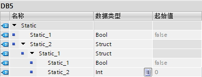
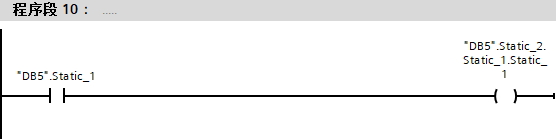
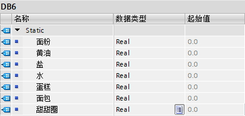
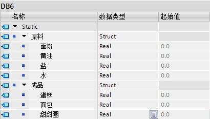
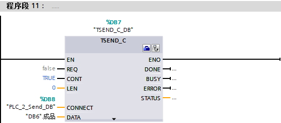
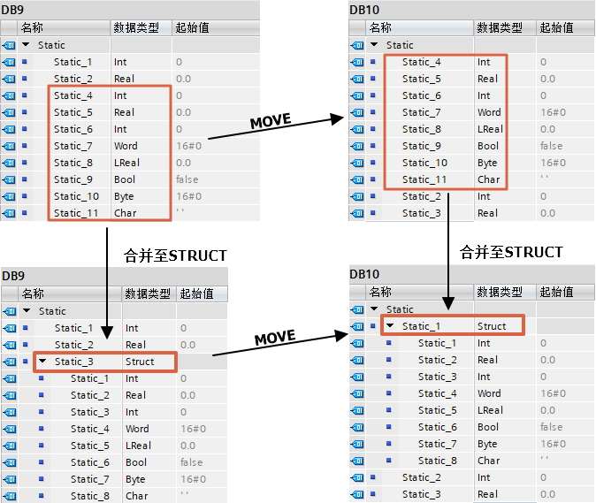
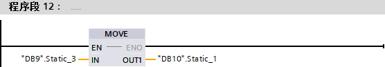

# 结构数据类型（Struct）

Struct类型是一种由多个不同数据类型元素组成的数据结构，其元素可以是基本数据类型，也可以是Struct、数组等复杂数据类型以及PLC数据类型（UDT）等。Struct类型嵌套Struct类型的深度限制为8级。Struct类型的变量在程序中可作为一个变量整体，也可单独使用组成该Struct的元素。Struct
类型可以在DB、OB/FC/FB接口区、PLC数据类型（UDT） 处定义使用。

Struct数据类型使用非常灵活，随时可以使用，但是相对于PLC数据类型 (UDT)
有以下缺点，所以建议需要使用Struct类型时，可以使用PLC数据类型（UDT）代替。

- 维护成本增加：如果对一个Struct进行了多次复制，则在更改过程中该Struct也必需进行相应的多次更改。
- Struct与 PLC 数据类型（UDT）的相同结构不兼容。
- 由于系统会检查所有结构元素的类型是否匹配，因而会导致性能下降。
- 存储空间要求增加：每个Struct都是一个单独的对象，其描述信息将加载到PLC中。

## Struct应用案例

1\. 单独使用组成该Struct的元素时，和普通的变量没有区别，只是每出现一个Struct的嵌套层级，变量名增加一个前缀，如图1-2所示。

{width="410" height="157"}

图1 Struct的定义

{width="556" height="139"}

图2 Struct的使用

2\. Struct可以将一种类型变量放在一起，利于区分，如图3-4所示。

{width="410" height="195"}

图3 原始结构

{width="410" height="232"}

图4 增加了Struct类型的结构

图4和图3功能明显相同，但图4相对图3，分类更加清晰。

3\. 通讯程序中，通常可以把需要发送的数据放在一个Struct中，即看做一个整体，这样在发送区只需填写一个变量即可，如图5所示。

{width="556" height="243"}

图5 使用了图4定义的Struct类型

4\. MOVE指令支持相同Struct类型的直接传送，如果传送双方是大量数据，并且结构相同，可以先分别将双方数据建立在一个结构，然后用一个MOVE指令一次传送即可，如图6所示。

{width="674" height="430"}

程序中直接MOVE，即可传送整个Struct，而不需要若干MOVE。并且，即使两边Struct中的对应元素名称不同也可以传送成功，如图7所示。

{width="556" height="97"}

图7 Struct的传送
