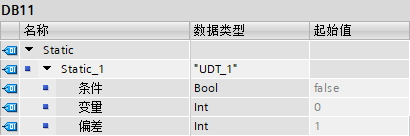
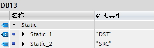

### PLC数据类型（UDT）

从TIA 博途 V11 开始，S7-1200 支持PLC数据类型（UDT）。

UDT类型是一种由多个不同数据类型元素组成的数据结构，元素可以是基本数据类型，也可以是STRUCT、数组等复杂数据类型以及其它UDT等。UDT类型嵌套UDT类型的深度限制为
8 级。\
UDT类型可以在DB、OB/FC/FB接口区处使用。从TIA 博途 V13SP1 开始，S7-1200
V4.0开始，PLC变量表中的I和Q也可以使用UDT类型。\
UDT类型可在程序中统一更改和重复使用，一旦某UDT类型发生修改，执行软件全部编译可以自动更新所有使用该数据类型的变量。\
定义为UDT类型的变量在程序中可作为一个变量整体使用，也可单独使用组成该变量的元素。此外还可以在新建DB块时，直接创建UDT类型的DB，该DB只包含一个UDT类型的变量。\
UDT类型作为整体使用时，可以与Variant、DB_ANY类型及相关指令默契配合。\
理论上来说，UDT是Struct类型的升级替代，功能基本完全兼容Struct类型。

#### UDT建立及应用案例

1\. 新建UDT

点击CPU菜单下，PLC数据类型中的"添加新数据类型"按钮，如图1所示。

{width="209" height="305"}

图1 新建UDT

2\. 在弹出页面可以添加需要的变量、类型、起始值、注释等，如图2所示。

{width="779" height="308"}

图2 定义UDT内的变量

3\. 在图2红框处右键属性常规，可以修改该数据类型的名称，如图3所示。

{width="625" height="352"}

图3 修改UDT名称

4\. DB中使用，如图4所示。

{width="410" height="136"}

图4 定义UDT类型的变量

5\. 程序中使用，类似于Struct，如图5所示。

{width="556" height="164"}

图5 UDT的使用

6\. 根据UDT定义DB块，如图6所示。

{width="693" height="602"}

图6 建立UDT类型的DB

此时打开DB块，可以发现和在DB中新建UDT变量差了层级，在使用内部变量没有太多差别。并且这种方式下，除非修改UDT，否则无法更改DB块中的内容，如图7所示，变量均为灰色。重要用途：参见[DB_ANY](08-DB_ANY.html#UDT)。

{width="410" height="115"}

图7 UDT类型的DB展开

7\. 从TIA 博途
V14SP1开始，相同结构，但不同名称的UDT的变量，可以直接复制，如图8-11所示。

{width="457" height="371"}

图8 定义不同名称的UDT，但内部变量类型相同

{width="310" height="98"}

图9 使用UDT建立变量

{width="556" height="99"}

图10 UDT类型间的MOVE

SCL的版本程序，如图11所示

{width="253" height="15"}

图11 SCL版本程序

#### UDT在PLC变量表的应用

实现功能：将Profinet IO通讯中的I点送入DB，将DB送入Q点，如图12-16所示。

1\. 建立I点和Q点两个UDT，元素变量类型及排布设置参照通讯对象

{width="368" height="137"}

图12 I点定义的UDT

{width="364" height="155"}

图13 Q点定义的UDT

2\. PLC变量表和DB块使用UDT

{width="384" height="288"}

图14 PLC变量表中使用图12-13定义的UDT

{width="410" height="305"}

图14 DB块中使用的UDT类型定义变量

3\. 写MOVE程序传递

{width="643" height="117"}

图16 程序详情

SCL版本程序如图17所示。

{width="201" height="33"}

图17 SCL版本程序
