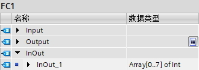
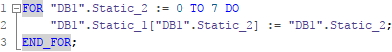
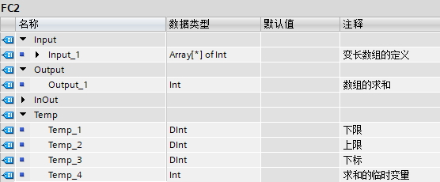

### S7-1200 数组数据类型（ARRAY）

ARRAY类型是由数目固定且数据类型相同的元素组成的数据结构。\
ARRAY类型的定义和使用需要注意以下几点：

-   ARRAY类型可以在DB、OB/FC/FB接口区、PLC数据类型处定义；无法在PLC变量表中直接定义。
-   数组定义：Array\[维度1下限..维度1上限,维度2下限..维度2上限,\...\]of
    \<数据类型\>，最多可包含 6 个维度；
-   数组元素的数据类型包括：除数组类型、Variant类型以外的所有类型；
-   数组下标的数据类型为整数，下限值必须小于或等于上限值，上下限的限值在S7-1200
    V3.0及其以前为Int范围（-32768～+32767），在S7-1200
    V4.0及其以后前为DInt范围（-2147483648
    ～+21474836487），可以使用局部常量或全局常量定义上下限值，数组的元素个数受DB块剩余空间大小以及单个元素大小的限制；
-   从S7-1200
    V2.0开始，下标可以不仅仅是常数、常量，也可以是变量，还可以是混合使用（多维数组），如果编程语言是SCL的话，下标还可以是表达式。使用数组的变量下标，可以在程序中很容易地实现间接寻址。注意，下标变量必须是符号名，不能是DB1.DBW0这种没有对应符号名的绝对地址。
-   从S7-1200
    V4.2开始，FC的Input/Output/InOut以及FB的InOut可以定义形如Array\[\*\]这种变长数组，要求必须是优化FC/FB块，在调用FC/FB的实参中可以填写任意数据类型相同的数组变量；当然，也可以多维变长的数组，例如Array\[\*,\*\]of
    Int。
-   数组可以使用单个数组元素例如\"DB1\".Static_1\[1\]，也可以使用整个数组例如\"DB1\".Static_1。多维数组可以降维使用，例如三维数组：3D\[0..2,0..3,0..4\]of
    Int是一个3×4×5大小的Int数组，3D\[0\]是一个4×5大小的二维Int数组，3D\[0,1\]是一个5个元素的一维Int数组，当然多维数组下标也可以换成变量，例如3D\[Tag_1,1\]这种；
-   S7-1200 V4.2开始，多重背景支持数组形式，即Array of
    FB，这样可以在FB中使用循环指令更方便的编写程序。不支持Array\[\*\] of
    FB。
-   注：在TIA 博途 V10.5 SP2，S7-1200 V1.0的时候，曾经引入FieldRead 和
    FieldWrite 指令，用于数组下标的变址寻址，这种方法在TIA 博途
    V11之后可以由下标变量完全取代，并且更为简化，所以该指令也只是位于"移动操作\>原有"中，用于早期版本向上移植时使用，它的使用方法参见[**FieldRead
    和 FieldWrite
    间接寻址**](../../03-instruction/03-Address/04-Field_Read_Write.html)

本文包含以下内容：

-   [S7-1200 数组的基本使用](04-Array.html#a)
-   [Array\[\*\]使用](04-Array.html#b)
-   [Array of FB的使用](04-Array.html#c)

#### []{#a}S7-1200 数组的基本使用

1\. DB中创建

{width="295" height="81"}

图1 Array在DB中的创建

2\. FC的InOut中创建

{width="330" height="116"}

图2 Array在FC形参中的创建

3\. 数组作为实参

{width="556" height="106"}

图3 Array作为FC的实参

4\. FC程序中使用数组元素，使用形参

{width="556" height="126"}

图4 FC程序中使用形参

5\. FC程序中使用数组元素，下标为变址寻址，使用形参

实现以下功能，将0-7这8个数，送入数组下标为0-7的8个元素，如图5-7所示。

{width="558" height="156"}

图5 FC形参设置

{width="558" height="591"}

图6 程序详情

SCL的版本如图7所示。

{width="261" height="52"}

图7 SCL版本的程序

6\. 在程序中直接使用数组元素

{width="556" height="124"}

图8 程序中直接使用数组元素

7\. 在程序中直接使用数组元素，下标为变址寻址

实现以下功能，将0-7这8个数，送入数组下标为0-7的8个元素，如图9-11所示。

{width="295" height="98"}

图9 DB1的定义

{width="556" height="570"}

图10 程序详情

SCL的版本如图11所示。

{width="392" height="52"}

图11 SCL版本程序

#### []{#b}Array\[\*\]使用

实现以下功能，使用FC的Input定义数组Array\[\*\] of
Int，求变长数组元素的总和

1\. 使用Array\[\*\]
，必须使用如图12所示的指令，计算数组元素的上下限，从而得出元素个数：

{width="331" height="516"}

图12 指令位置

2\. 定义变量，如图13所示。赋初始值，计算上下限，如图14所示。

{width="556" height="230"}

图13 定义形参

{width="556" height="418"}

图14 计算上下限

（1）输入Array\[\*\]类型的变量

（2）所求上下限的维数，从1开始，例如一维数组只能是1，二维数组可以是1也可以是2

（3）该维数下的下限/上限，DINT类型

3\. 求和，如图15所示

{width="556" height="777"}

图15 求和的程序

4\. SCL的版本如图16所示

{width="670" height="117"}

图16 SCL版本程序

5\. OB1中调用实参为不同数组元素个数的数组，如图17所示。

{width="556" height="240"}

图17 OB1调用程序

#### []{#c}Array of FB的使用

实现：FB3多次调用FB4，在FB3内部循环调用，减少程序量。

FB4的两个Input：Start，Stop，一个InOut：Run，建立Array\[0..7\] of
FB4。同时建立变量 Array\[0..7\] of
Struct，作为对应FB4的输入和输出，如图17所示。

{width="540" height="337"}

图17 程序详情
