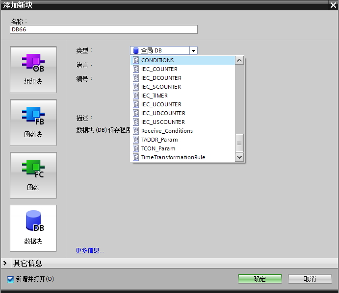

### 系统数据类型（SDT）

系统数据类型由系统提供具有预定义的结构，结构由固定数目的具有各种数据类型的元素构成，不能更改该结构。系统数据类型只能用于特定指令。\
可以在DB块、OB/FC/FB接口区使用。

表1 常见系统数据类型

+-----------------------+-----------------------+-----------------------+
| 系统数据类型          | 长度字节              | 说明                  |
+=======================+:=====================:+:======================+
| IEC_TIMER             | 16                    | 定时器结构。\         |
|                       |                       | 此数据类型可用于"T    |
|                       |                       | P"、"TOF"、"TON"、"TO |
|                       |                       | NR"、"RT"和"PT"指令。 |
+-----------------------+-----------------------+-----------------------+
| IEC_SCOUNTER          | 3                     | 计数值为 SINT         |
|                       |                       | 数                    |
|                       |                       | 据类型的计数器结构。\ |
|                       |                       | 此数据类型用于"CTU"   |
|                       |                       | 、"CTD"和"CTUD"指令。 |
+-----------------------+-----------------------+-----------------------+
| IEC_USCOUNTER         | 3                     | 计数值为 USINT        |
|                       |                       | 数                    |
|                       |                       | 据类型的计数器结构。\ |
|                       |                       | 此数据类型用于"CTU"   |
|                       |                       | 、"CTD"和"CTUD"指令。 |
+-----------------------+-----------------------+-----------------------+
| IEC_COUNTER           | 6                     | 计数值为 INT          |
|                       |                       | 数                    |
|                       |                       | 据类型的计数器结构。\ |
|                       |                       | 此数据类型用于"CTU"   |
|                       |                       | 、"CTD"和"CTUD"指令。 |
+-----------------------+-----------------------+-----------------------+
| IEC_UCOUNTER          | 6                     | 计数值为 UINT         |
|                       |                       | 数                    |
|                       |                       | 据类型的计数器结构。\ |
|                       |                       | 此数据类型用于"CTU"   |
|                       |                       | 、"CTD"和"CTUD"指令。 |
+-----------------------+-----------------------+-----------------------+
| IEC_DCOUNTER          | 12                    | 计数值为 DINT         |
|                       |                       | 数                    |
|                       |                       | 据类型的计数器结构。\ |
|                       |                       | 此数据类型用于"CTU"   |
|                       |                       | 、"CTD"和"CTUD"指令。 |
+-----------------------+-----------------------+-----------------------+
| IEC_UDCOUNTER         | 12                    | 计数值为 UDINT        |
|                       |                       | 数                    |
|                       |                       | 据类型的计数器结构。\ |
|                       |                       | 此数据类型用于"CTU"   |
|                       |                       | 、"CTD"和"CTUD"指令。 |
+-----------------------+-----------------------+-----------------------+
| ERROR_STRUCT          | 28                    | 编程错误信息或 I/O    |
|                       |                       | 访问错误信息的结构。\ |
|                       |                       | 此数据类型            |
|                       |                       | 用于"GET_ERROR"指令。 |
+-----------------------+-----------------------+-----------------------+
| CREF                  | 8                     | 数据类型 ERROR_STRUCT |
|                       |                       | 的组成，在其中保      |
|                       |                       | 存有关块地址的信息。  |
+-----------------------+-----------------------+-----------------------+
| NREF                  | 8                     | 数据类型 ERROR_STRUCT |
|                       |                       | 的组成，在其中保      |
|                       |                       | 存有关操作数的信息。  |
+-----------------------+-----------------------+-----------------------+
| VREF                  | 12                    | 用于存储 VARIANT      |
|                       |                       | 指针。\               |
|                       |                       | 此数据类型用在运      |
|                       |                       | 动控制工艺对象块中。  |
+-----------------------+-----------------------+-----------------------+
| CONDITIONS            | 52                    | 用户自定义的          |
|                       |                       | 数据结构，定义数据接  |
|                       |                       | 收的开始和结束条件。\ |
|                       |                       | 此数据类              |
|                       |                       | 型用于"RCV_CFG"指令。 |
+-----------------------+-----------------------+-----------------------+
| TADDR_Param           | 8                     | 指定用来存储通过 UDP  |
|                       |                       | 实现开放用户通信的连  |
|                       |                       | 接说明的数据块结构。\ |
|                       |                       | 此数据类型用于"T      |
|                       |                       | USEND"和"TURCV"指令。 |
+-----------------------+-----------------------+-----------------------+
| TCON_Param            | 64                    | 指定用来存            |
|                       |                       | 储那些通过工业以太网  |
|                       |                       | 实现开放用户通信的连  |
|                       |                       | 接说明的数据块结构。\ |
|                       |                       | 此数据类型用于        |
|                       |                       | "TSEND"和"TRCV"指令。 |
+-----------------------+-----------------------+-----------------------+
| HSC_Period            | 12                    | 使用扩展的            |
|                       |                       | 高速计数器，指定时间  |
|                       |                       | 段测量的数据块结构。\ |
|                       |                       | 此数据类型用于        |
|                       |                       | "CTRL_HSC_EXT"指令。  |
+-----------------------+-----------------------+-----------------------+

表1中的部分数据类型还可以在新建DB块时，直接创建系统数据类型的DB，如图1所示。通过这种方法建立出的DB块可以配合DB_ANY类型使用，参见[链接1](08-DB_ANY.html#UDT)、
[链接2](08-DB_ANY.html#TypeOfDB)。

此外通过以下方式也可以实现建立系统数据类型DB

1\. 定时器计数器自动生成的背景DB

2\. 计数器自动生成的背景DB

3\.
开放式用户通信程序建立的基于TCON_IP_V4（无法通过添加新块的方式创建）、TADDR_Param、TCON_Param的DB块

#### 根据SDT定义DB块

{width="691" height="598"}

图1 建立SDT类型的DB
