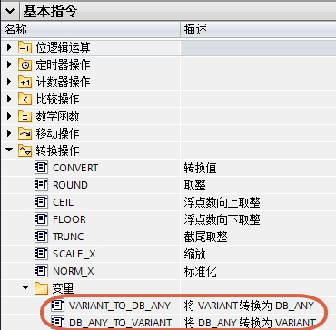
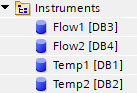
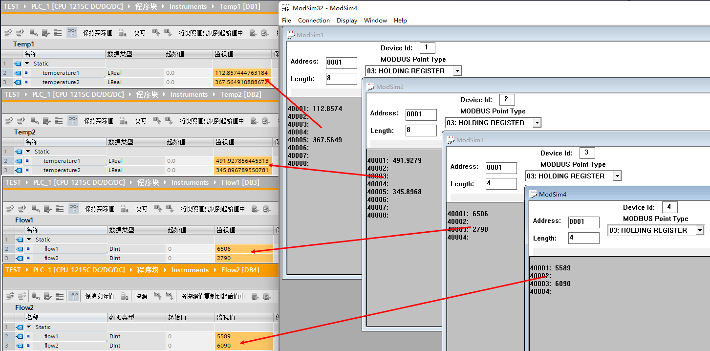
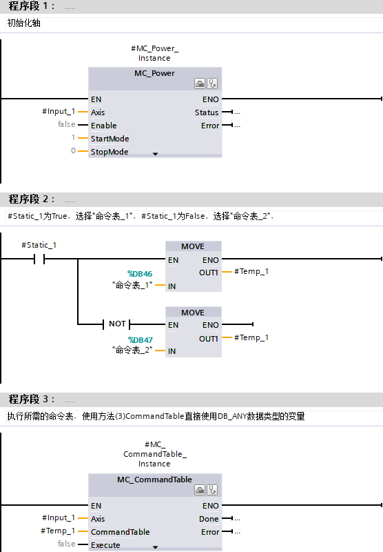

### DB_ANY

从 TIA Portal V12，S7-1200 V2.0 开始，支持 DB_ANY 类型。

DB_ANY 数据类型用来标识任意数据块。对于
S7-1200，可以选择访问编程期间尚不可用的数据块。为此，在访问块的块接口中创建一个
DB_ANY 数据类型的块参数。数据块名称或先前分配给数据块名称的 DB_ANY
数据类型的变量将在运行期间传送到此参数。

DB_ANY 目前有 5 种用法以及 2 个隐藏指令：

-   [指向非优化 DB 的 DB_ANY](08-DB_ANY.html#a)
-   [指向 UDT 或 SDT 建立的 DB 块的 DB_ANY](08-DB_ANY.html#UDT)
-   [与指定数据类型比较](08-DB_ANY.html#TypeOfDB)
-   [用于运动控制的 DB_ANY](08-DB_ANY.html#motion)
-   [用于参数实例的实参](08-DB_ANY.html#para)
-   [隐藏指令](08-DB_ANY.html#inst)

#### []{#a}1. 指向非优化 DB 的 DB_ANY

DB_ANY 指向非优化 DB 块，可以在程序中使用 DB_ANY.% 绝对地址。

这种方法 LAD 和 SCL 都可以使用，这种使用方式类似于 S7-300/S7-400 的
BLOCK_DB，如图 1、2 所示。

{width="556" height="238"}

图 1 指令详情

SCL 的版本，如图 2 所示。

{width="372" height="13"}

图 2 指令 SCL 版本

使用这种方式时注意：

（1） CPU 编译时不检查数据类型，可能会出现如图 3
所示的错误。所以请一定核实数据类型。

{width="556" height="212"}

图 3 错误的数据类型

（2）不检查地址存在与否。如果调用不存在的地址，CPU 会报错如图 4
所示的区域长度错误，所以敬请注意。

{width="215" height="70"}

图 4 区域长度错误

（3）这种绝对地址是不支持变址，例如 %DBW\[x\] 不支持。

（4）不支持对符号名的访问，例如 Input_1.Static_1 不支持。

DB_ANY 作为输入形参，调用参数的时候三种方式：

（1）在 DB_ANY 参数引脚填写 DB 块号，如图 5 所示

{width="556" height="75"}

图 5 参数为 DB 块号

（2）在 DB_ANY 参数引脚填写 DB 块符号名，如图 6 所示

{width="556" height="95"}

图 6 参数为 DB 块符号名

（3）在 DB_ANY 参数引脚填写 DB_ANY 类型的变量，如图 7、8 所示

{width="556" height="135"}

图 7 参数为 DB_ANY 类型变量

{width="556" height="78"}

图 8 DB_ANY 类型变量的定义

DB_ANY 作为输出、输入输出形参，调用参数的时候只能参考图 7 的方式。

根据（1）中的程序，计算结果都是一样的，如图 9 所示。

{width="556" height="119"}

图 9 计算结果

#### []{#UDT}2. 指向 UDT 或 SDT 建立的 DB 块的 DB_ANY

TIA Portal V13SP1，S7-1200 V4.0 开始，如果 DB_ANY 指向通过 PLC
数据类型（UDT）或者系统数据类型（例如 IEC_TIMER 等）建立的 DB 块

S7-1200 在 SCL 中提供了两个指令用于 DB_ANY 和 Variant
类型之间进行转化，如图 10 所示，如图 11、12 所示为指令参数：

{width="370" height="364"}

图 10 指令位置

{width="704" height="26"}

  参数      声明     数据类型   说明
  --------- -------- ---------- ------------------
  in        Input    DB_ANY     待读写的数据块
  err       Output   Int        错误信息
  Ret_val   Return   Variant    Variant 类型参数

图 11 DB_ANY_TO_VARIANT 参数

{width="715" height="29"}

  参数      声明     数据类型   说明
  --------- -------- ---------- ------------------------
  in        Input    Variant    Variant 类型参数
  err       Output   Int        错误信息
  Ret_val   Return   DB_ANY     Variant 实参的 DB 块号

图 12 VARIANT_TO_DB_ANY 指令参数

对于这两个指令，注意：

1\. DB_ANY_TO_VARIANT 指令：DB_ANY 类型实参一定是通过 PLC
数据类型（UDT）或者系统数据类型建立的 DB 块，否则指令会报错，输出的
Variant 需要指向建在块的 Temp 区。

2\. VARIANT_TO_DB_ANY 指令：Variant 类型指向的变量类型可以是通过
DB_ANY_TO_VARIANT 指令转化的 Variant 类型 Temp 变量，也可以是通过 PLC
数据类型（UDT）或者系统数据类型建立的 DB 块，输出的 DB_ANY
不受限制，因为该指令输出的 DB_ANY 只是用于保存 DB 块号。

3\. DB_ANY_TO_VARIANT 是目前 S7-1200 唯一可以初始化 FC/FB/OB 的 Temp
中的 Variant 变量的指令，如果运行正确，则可以使用后续 Variant
处理指令，例如 VariantGet，MOVE_BLK_VARIANT，Serialize 等，之后对
Variant 指向的变量的一切运算最终都会在源 DB_ANY 上体现。

这种方法的使用场合：

如果每种产品有大量数据，有很多种产品，每种产品的数据都是相同结构。可以基于相同结构建立
UDT，每一种产品基于 UDT 建立 DB（也可以在一个 DB 中建立 UDT
的数组，但是从变量名处就无法分清哪种变量对应哪种产品）。然后在一个 DB
块内建立 DB_ANY 的数组，在每个 DB_ANY 变量的起始值处填写需要指向的 DB
块号。可以通过循环的方式访问每个 DB_ANY ，将其转化为
UDT，处理后自动送回该 DB_ANY 。

例子1：DB1-DB8 均为基于 typeMotor 建立的 DB，如图 13 、14 所示。

{width="137" height="172"}

图 13 待使用的 DB_ANY 引用的数据块

{width="410" height="135"}

图 14 基于 typeMotor 建立的 DB

名为 Data 的数据块建立数据类型为Array\[0..7\] of DB_ANY 的变量，如图 15
所示，起始值分别是 DB1-DB8。

{width="376" height="230"}

图 15 DB_ANY 数组及起始值

名为 motorManagement 的 FC 块，参数 InOut 为 typeMotor
类型变量，用于数据处理，如图 16 所示。

{width="331" height="360"}

图 16 motorManagement FC 块

名为 motorCtrl 的 FC 块多次调用 motorManagement，如图 17 所示。

{width="877" height="416"}

图 17 程序详情

最后在 OB1 调用 motorCtrl，如图 18 所示。

{width="561" height="80"}

图 18 motorCtrl 在 OB1 的调用

例子2：使用在 Modbus RTU 上的一个例子。

Modbus RTU 轮询时，通常多次调用 Modbus_Master（或者 MB_MASTER），每个
Modbus_Master 使用不同的参数。也可以写成一个
Modbus_Master，这需要在参数中采取变量的形式，但 DATA_PTR
这个变量只能采取一种结构、UDT
的数组，或者二维数组等。这种方法可以，但不够灵活，因为每个站点变量大小结构可能各不相同。现在的话可以通过
DB_ANY 的方式来做到一个完全通用的 Modbus RTU 轮询程序。

下面例子程序要求：至少 TIA Portal V15，S7-1200 V4.2 版本 MODBUS（RTU）
V4.0 版本，如果不能达到这些版本，某些功能需要被简化。

1\. TIA Portal V14，S7-1200 V4.2 ，则 Modbus_Master 的 DATA_PTR
只能是非优化块，例子程序中的静态变量 statByteString 只能作为 InOut。

2\. S7-1200 V4.0/V4.1，则Array \[\*\] of Struct 也将不支持，例子程序中的
InOut 接口 datas 需要改为 Variant ，处理程序需要使用 MOVE_BLK_VARIANT。

3\. 更低的版本就不支持 Variant 指令了

例子程序的源文件（包含 FB 及通信
UDT，其他不含）链接：[源文件](images/ModbusPoll.scl)，使用链接的方式如下：[使用方法](../../03-instruction/05-SCL/03-FAQ.html#c)。

[以下例程仅供参考。**读者如欲采纳，风险自担**。]{.STYLE2}

例程：

每个 Modbus_Master 的站点，需要将其要读/写的数据结构做成 UDT，并生成对应
DB 块。这里新建两个不同的 UDT，如图 19 所示。

{width="655" height="371"}

图 19 两个站点 UDT

然后基于这两个 UDT 各自建立两个 DB，如图 20 所示。

{width="137" height="93"}

图 20 modbus 从站数据

再建立一个
UDT，用于每个站点的通信参数，包括站号、读写、起始地址、长度、DB
块号，如图 21 所示。

{width="266" height="137"}

图 21 通信 UDT

之后建立该 UDT 的数组，里面提前写入各站点参数，如图 22 所示。

{width="459" height="535"}

图 22 站点参数

建立轮巡 FB 块 ModbusPoll，如图 23 所示为块接口，如图 24 所示为块代码。

{width="637" height="456"}

图 23 块接口

{width="830" height="1294"}

图 24 块代码

最后在 OB1 调用该块，如图 25 所示。

{width="556" height="266"}

图 25 块调用

使用 ModSim32 软件仿真 4 个仪表的测试结果，如图 26 所示。

{width="1453" height="718"}

图 26 测试结果

#### []{#TypeOfDB}3. 与指定数据类型比较

TIA Portal V15 开始，S7-1200 V4.2 开始，增加以下指令，用于 DB_ANY
变量与数据类型的比较，见表 1 所示。

表 1 TypeOfDB 指令

  LAD           SCL        位置
  ------------- ---------- --------------------------------
  EQ_TypeOfDB   TypeOfDB   基本指令 \-- 比较操作 \-- 变量
  NE_TypeOfDB              

DB_ANY 指向的数据块不限于 PLC 数据类型（UDT）或者系统数据类型建立的 DB
块，还可以是 TO 轴的 DB 块，以及 FB 的背景数据块，见表 2 所示。

表 2 指令参数

+-----------------+-----------------+-----------------+-----------------+
| LAD指令         | 操作数1         | 操作数2         | 说明            |
+=================+=================+=================+=================+
| 操作数 1\       | DB_ANY          | 数据类型        | 比较操作数 1    |
| ┫EQ_TypeOfDB┣\  |                 |                 | 对应的 DB       |
| 操作数 2        |                 |                 | 是              |
|                 |                 |                 | 不是基于操作数  |
|                 |                 |                 | 2               |
|                 |                 |                 | 的              |
|                 |                 |                 | 数据类型建立的  |
|                 |                 |                 | ，是则该指令返  |
|                 |                 |                 | 回逻辑运算结果  |
|                 |                 |                 | (               |
|                 |                 |                 | RLO)"1"。如果不 |
|                 |                 |                 | 是则该指令返回  |
|                 |                 |                 | RLO"0"。操作数  |
|                 |                 |                 | 2               |
|                 |                 |                 | 的数据类型包括  |
|                 |                 |                 | PLC             |
|                 |                 |                 | 数据类型（UD    |
|                 |                 |                 | T）、系统数据类 |
|                 |                 |                 | 型、TO轴、FB。  |
+-----------------+-----------------+-----------------+-----------------+
| 操作数 1\       | DB_ANY          | 数据类型        | 较操作数 1      |
| ┫NE_TypeOfDB┣\  |                 |                 | 对应的 DB       |
| 操作数 2        |                 |                 | 是              |
|                 |                 |                 | 不是基于操作数  |
|                 |                 |                 | 2               |
|                 |                 |                 | 的数            |
|                 |                 |                 | 据类型建立的，  |
|                 |                 |                 | 不是则该指令返  |
|                 |                 |                 | 回逻辑运算结果  |
|                 |                 |                 | (RLO)"1"。如果  |
|                 |                 |                 | 是则该指令返回  |
|                 |                 |                 | RLO"0"。操作数  |
|                 |                 |                 | 2               |
|                 |                 |                 | 的数据类型包括  |
|                 |                 |                 | PLC             |
|                 |                 |                 | 数据            |
|                 |                 |                 | 类型（UDT）、系 |
|                 |                 |                 | 统数据类型、TO  |
|                 |                 |                 | 轴、FB。        |
+-----------------+-----------------+-----------------+-----------------+

SCL 指令：TypeOfDB（操作数），操作数是 DB_ANY
类型的参数，该语句输出是数据类型，在程序中只能用在 IF 与 CASE 进行比较。

用法 1：IF 指令，操作数对应的类型与一个变量类型的比较，例如：

IF (TypeOfDB(操作数 1) = 变量类型（例如\"UDT_1\"）)\
\...\
END_IF;

用法2：IF 指令，两个操作数对应的类型比较，例如：

IF (TypeOfDB(操作数 1) = TypeOfDB(操作数 2))\
\...\
END_IF;

用法3：CASE OF 指令，操作数对应的实参的类型与多个变量类型的比较，例如：

CASE (TypeOfDB(操作数)) OF\
UDT_1:\
\...\
UDT_2:\
\...\
ELSE\
\...\
END_CASE;

使用举例：

编写 FC，检查输入 DB_ANY 变量类型，UDT_1 则输出 True，其它则输出
False，如图 27、28 所示。

{width="560" height="616"}

图 27 程序详情

SCL 版本程序，如图 28 所示。

{width="226" height="188"}

图 28 SCL 版本程序

#### []{#motion}4. 用于运动控制的 DB_ANY

S7-1200 V4.2 开始， DB_ANY 可以开始在运动控制中使用

可以使用在形参为 TO_PositioningAxis 和 TO_CommandTable
类型的实参处，包括以下几种：

（1） 当 FC/FB 的输入形参数据类型为 TO_PositioningAxis
时，外部实参可以使用 DB_ANY 数据类型的变量。\
（2） 在 MC_MoveAbsolute/MC_MoveRelative 指令的参数 Axis
处，实参可以直接使用 DB_ANY 数据类型的变量。\
（3） 当 FC/FB 的输入形参数据类型为 TO_CommandTable 时，外部实参可以使用
DB_ANY 数据类型的变量。\
（4） 在 MC_CommandTable 指令的参数 CommandTable 处，实参可以直接使用
DB_ANY 数据类型的变量。

与第 2 条对应的是其他运动控制指令的参数 Axis，直接使用 DB_ANY
数据类型的变量，这种用法会报错误，如图 29、30 所示。

原因是 MC_Power/MC_Reset/MC_Home 指令的参数 Axis，类型为 TO_Axis。而
MC_Halt/MC_MoveVelocity/MC_MoveJog/MC_ChangeDynamic 指令的参数
Axis，类型为 TO_SpeedAxis。

{width="556" height="678"}

图 29 程序详情

{width="556" height="161"}

图 30 程序在 OB1 中的调用

诊断缓冲区的报错如图 31 所示：

{width="345" height="94"}

图 31 报错信息

例子，以（1）和（3）为例，实现功能：FB6 判断轴使用的命令表，FB7
包含多个轴的 FB6 功能，如图 32、33、34 所示。

{width="490" height="230"}

图 32 FB6 的参数设置

{width="556" height="800"}

图 33 程序详情

{width="450" height="320"}

图 34 FB7 中循环调用 FB6

最后在 OB1 调用 FB7 即可

优势：

1.以往和轴有关的块都需要逐个调用，现在利用 DB_ANY 和 FB
的数组，可以用一个循环完成。

2.命令表的类型 TO_CommandTable 只能在 Input，Output 以及 InOut
这种外部引脚上，对于需要切换命令表很麻烦，现在用 DB_ANY
直接在程序内部解决。

#### []{#para}5. 用于参数实例的实参

TIA Portal V16，S7-1200 V4.2 开始， DB_ANY
数据类型支持指向参数实例的实参。

如图 35 所示，FB 块 MotorRun，在 FC 块 Motion
中通过参数实例方式调用，参数实例为 InOut 的 instMotor。

{width="439" height="417"}

图 35 参数实例

然后在另一个 FC 块 motionManagement 中循环调用 Motion 块，其中实参是 DB
块中 DB_ANY 类型变量，如图 36 所示。

{width="865" height="574"}

图 36 DB_ANY 实参

这种方法为标准化编程提供了又一个新的思路。

#### []{#inst}6. 隐藏指令

在 SCL 中有两个用于转化的指令，没有放在指令列表中：

DB_ANY_TO_UINT 以及 UINT_TO_DB_ANY ，这是 DB_ANY 和 UINT
类型之间的转化。使用\":=\"同样可以完成它们之间的转化。

在 LAD 中，如果 IEC 检查没有激活，用 MOVE 指令也可实现 DB_ANY 和 UINT
类型之间的转化。

这两个指令对 DB_ANY 指向的 DB 块没有特殊要求。
