# 一、char 和 string 的定义：

1、数据类型为 char (Character) 的变量长度为 8 bit 位，占用1个 byte的内存。char 数据类型将单个字符存储为 ASCII 编码形式。通常是指计算机中使用的字母、数字和符号，包括：1、2、3、A、B、C、常见符号等。每个字符占用空间为1字节。
2、数据类型为 string 的操作数可存储多个字符，最多可包括 254个字符。字符串中的第一个字节为总长度，第二个字节为有效字符数量。
字符串（string）在存储上类似字符的数组，所以它每一个元素都是可以提取的字符，如：\"abcdefg\"叫字符串，而其中的每个元素叫字符。

## 二、char 和 string 在西门子 PLC 中的格式

例如，在 PLC 中创建一个 DB 块，并将属性设置为标准 DB 块，在 DB1 块中创建如下的字符串和字符，并赋予起始值。如下图所示：

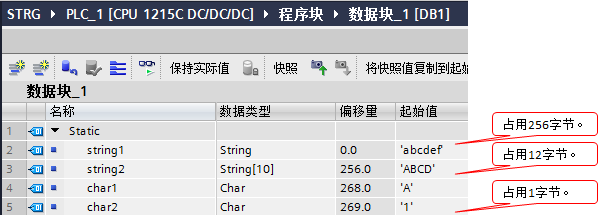{width="598" height="216"}
图.01

### 1、string 数据类型的格式

下载到 PLC 中，通过监视表逐个查看每个字节中的值。如下图所示：

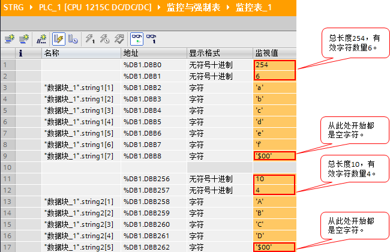{width="652" height="422"}
图.02

可以看出：

- a.数据类型为 string 的字符串，通过查看 DB 块偏移地址可见该字符串占用256字节；查看字符串第一个字节，其最多存储字符总数量为254个。
- b.数据类型为 string\[10\] 的字符串，通过查看 DB块偏移地址可见该字符串占用12字节；查看字符串第一个字节，其最多存储字符数量为10个。
- c.字符串的第一个字节为该字符串总长度，第二个字节为当前存储的有效字符数量。

### 2、char 和16进制数的关系

在计算机领域，所有的数据都是以2进制数存储的，那么char，16进制数和2进制数又有什么关系？
如下图所示：
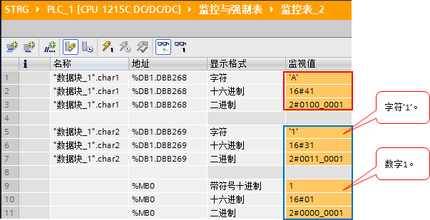{width="618" height="309"}
图.03

可以看出：
- a.通过字符 \'A\' 的16进制数和2进制数，可见字符（char）、16进制数只是在
PLC 中显示的形式不同，实际存储的是一个2进制值。
- b.通过字符 \'1\' 和数值1（MB0的值）的16进制数和2进制数，可见字符 \'1\'
和数值1是两种不同数据。因此，实际使用是必须注意区别。
- c.下图是 ASCII 字符（char）：\'0\',\'1\',......\'E\',\'F\'

对应的2进制，10进制，16进制对应关系的截图。
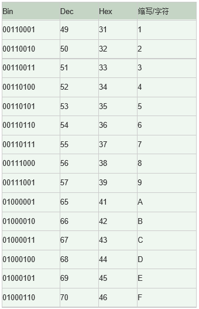{width="340" height="527"}
图.04

更多的 ASCII 字符对应关系，请查看下面的链接。

ASCII 码表链接：[ASCII](http://www.asciima.com/)

## 三、使用 string 数据类型在 HMI 上显示汉字

例如，在某些不支持 WString 数据类型（关于 WString 参见： **跳转链接** ）的 HMI 设备上显示汉字，也是可以使用 string 数据类型显示的。但由于 string 数据类型中存储的汉字编码标准为 GBK 编码；因此，需要在 HMI 设备上选择相应的编码标准。

如下图所示，在 string 数据类型的起始值中定义汉字 '你好'，且字符背景底色为浅黄色（编译时会有警告信息，这是TIA软件建议string 数据类型中不使用汉字的友情提示），但不影响使用。

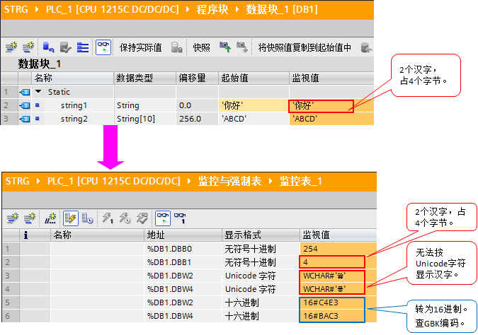{width="675" height="474"}

图.05在线监控时发现汉字无法按 Unicode编码方式正确显示，设置显示格式为16进制数，通过下图所示的字符编码对应关系，发现其对应的是GBK 编码。如下图所示：
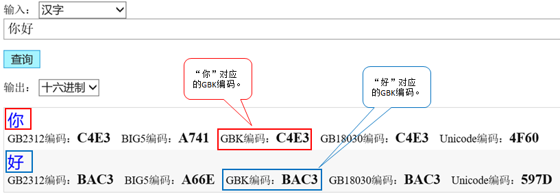{width="817" height="284"}
图.06

所以，在 HMI 设备上显示 string 数据类型中存储的汉字时，需要在 HMI 上设置对应的 GBK 编码方式，是可以显示汉字的。

关于16进制数和 GBK
编码对应关系，可以通过如下网址查询：[GBK](https://www.qqxiuzi.cn/bianma/zifuji.php)

## 四、常问问题：

1、HTA 和 ATH 指令的输入和输出使用限制？

通过 TIA 软件的在线帮助，查看指令功能说明：

指令 HTA 功能------输入范围为16进制数：16#0,1,......E,F，输出范围为由ASCII 字符（char）：\'0\',\'1\',......\'E\',\'F\' 组成的数组或字符串 。
指令 ATH 功能------输入范围为由 ASCII 字符（char）：\'0\',\'1\',......\'E\',\'F\'组成的数组或字符串，输出范围为16进制数：16#0,1,......E,F 。

!!! note "注意"

    指令 ATH 和指令 HTA 的输入和输出都是受到限制的。

2、HTA 和 ATH 指令的作用？\
在具体的应用中需要互相转换字符（\'0\',\'1\',......\'E\',\'F\'）和16进制数值（16#0,1,......E,F），那么HTA和ATH就为转换这两种类型的数据提供了方便。

以 HTA 指令为例，在 OB1 中调用 HTA 指令，实现如下要求的转换：

- a.W#16#12AB需要转换为 ASCII 字符数组，使用 HTA 指令转换结果为
CHAR#\[\'1\'，\'2\'，\'A\'，\'B\'\]。
- b.W#16#12AB需要转换为 ASCII 字符串，使用 HTA 指令转换结果为 \'12AB\' 。

如下图所示：
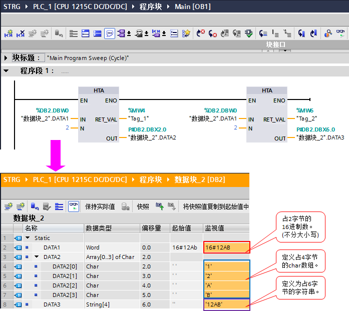{width="697" height="622"}
图.07

结果：使用 HTA
指令转换后，数据类型及占用字节空间发生了变化；同样的，使用 ATH
指令可以做反向转换，这里不再举例说明。

- 3、字符串存储的 \'abcdef\'，通过赋值更新为了 \'DCBA\'，为何查看字符存储单元时，字符 \'e\' 和 \'f\'
还能监视到？该如何处理？

简单测试程序，如下图所示：
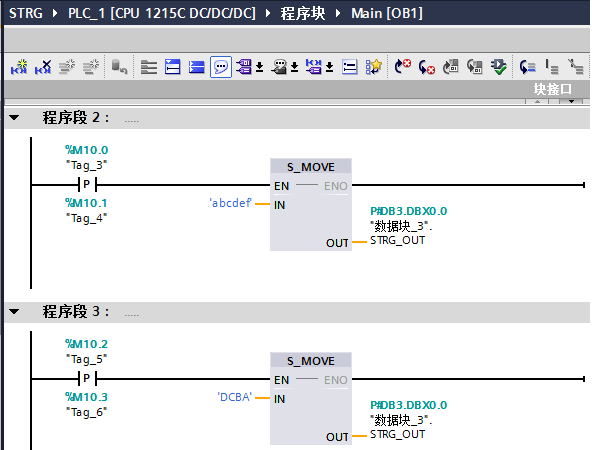{width="592" height="450"}
图.08

当M0.0触发之后，再触发M0.2，结果如下图所示：

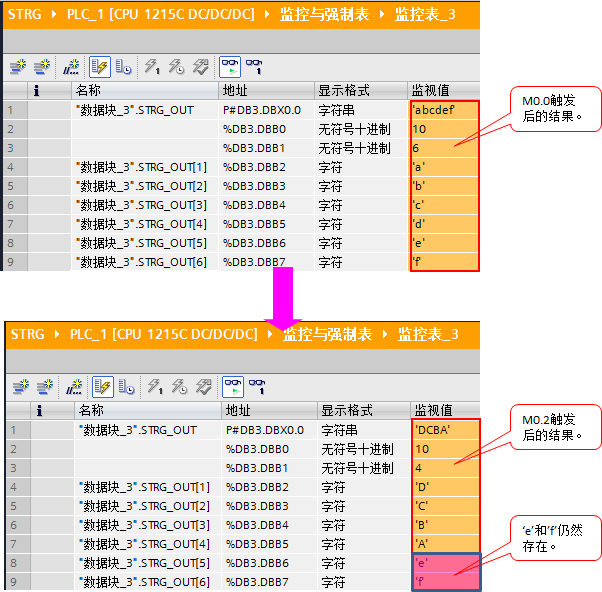{width="602" height="592"}
图.09

例子中，6字符的字符串更新为4字符的字符串，原字符串的后2个字符没有更新；倘若这10个字符的字符串需要通过串口或TCP 通信完整（字符串总长12字节）的发送到通信伙伴，那么在字符串信息更新后的发送信息中将包含这两个不需要发送的字符。

结果：字符串更新时，仅更新有效字符数量的部分。

建议处理方法：更新字符串之前，先清空该字符串中所有字符。

4、如何输入特殊字符（如：回车，换行，\$ 等）？

例如，需要输入的字符串为 \'\$ABCD\$+回车+换行\'，可以参考如下表格：

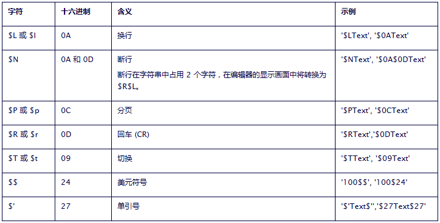{width="716" height="363"}

图.10 根据表格说明，字符串在 PLC 中的书写格式：\'\$\$ABCD\$\$\$R\$L\' 或 \'\$\$ABCD\$\$\$N\'，如下图所示：

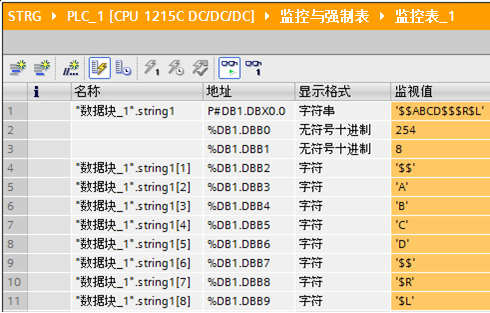{width="490" height="313"}
图.11
