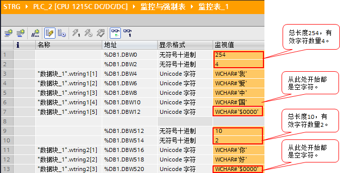

### 一、wchar 和 wstring 的定义：

1、数据类型为 wchar（宽字符）的变量长度为 16 位，占用2个 byte 的内存。
wchar 数据类型将扩展字符集中的单个字符保存为 UFT-16 编码形式。\
2、数据类型为 wstring
（宽字符串）的操作数用于在一个字符串中存储多个数据类型为 wchar 的
Unicode 字符。如果未指定长度，则字符串的长度为预置的 254 个字。

Unicode
是国际标准字符集，可译为万国码或统一码等，包含中日韩越汉字和世界上绝大多数语言文字。\
如需了解 Unicode
码，请查看下面链接：[Unicode码](https://baike.baidu.com/item/Unicode%E7%A0%81/7704811)

### 二、wchar 和 wstring 在西门子 PLC 中的格式

本节以汉字为例说明汉字在西门子 PLC 中的格式。\
例如，在 PLC 中创建一个 DB 块，并将属性设置为标准 DB 块，在 DB1
块中创建如下的汉字字符串和汉字字符，并赋予起始值。如下图所示：\
{width="602" height="219"}\
图.01

1、wstring 数据类型的格式\
下载到 PLC 中，通过监视表逐个查看每个字中的值。如下图所示：\
{width="675" height="345"}\
图.02

可以看出：\
a.数据类型为 wstring 的汉字字符串，通过查看 DB
块偏移地址可见该字符串占用254字；查看字符串第一个字，其最多存储汉字字符总数量为254个。\
b.数据类型为 wstring\[10\] 的汉字字符串，通过查看 DB
块偏移地址可见该字符串占用12字；查看字符串第一个字，其最多存储汉字字符数量为10个。\
c.汉字字符串的第一个字为该字符串总长度，第二个字为当前存储的有效字符数量。

2、wchar 和16进制数的关系\
在计算机领域，所有的数据都是以2进制数存储的，那么
wchar，16进制数和2进制数又有什么关系？\
如下图所示：\
{width="672" height="233"}\
图.03

可以看出：\
a.通过汉字字符 \'好\'
的16进制数和2进制数，可见字符（wchar）、16进制数只是在PLC中显示的形式不同，实际存储的是一个2进制值。\
通过下面的网页，可以查看汉字和16进制数的对应关系。\
unicode 转中文，中文转
unicode，链接：[Unicode码](http://www.bejson.com/convert/unicode_chinese/)\
b.通过汉字字符 \'1\' 的16进制数和2进制数，可见汉字字符（wchar）\'1\'
显示的16进制数为16#0031，而字符（char）\'1\'
对应的16进制数为16#31。因此，如果使用 wchar 存储仅占一个字节的 char
字符时，则高八位为16#00，低八位是相同的，都是2进制的2#0011_0001。

### 三、常问问题：

1、定义为 wstring 的字符串，是否能保存数字和英文字母的字符？\
可以。\
例如，wchar#\'A\'，实际存储时，对应的16进制数为16#0041，wchar#\'1\'，实际存储时，对应的16进制数为16#0031。\
如下图所示：\
{width="651" height="533"}\
图.04

也就是说，使用 wchar 存储仅占一个字节的英文字母或数字时，对应 wchar
的字的高八位将为16#00。

2、如何输入特殊字符（如：回车，换行，\$ 等）？\
例如，需要输入的汉字字符串为
\'\$早上好\$+回车+换行\'，可以参考如下表格：\
{width="761" height="365"}\
图.05

根据表格说明，字符串在 PLC
中的书写格式：\'\$\$早上好\$\$\$R\$L\'或\'\$\$早上好\$\$\$N\'，如下图所示：\
{width="576" height="311"}\
图.06
