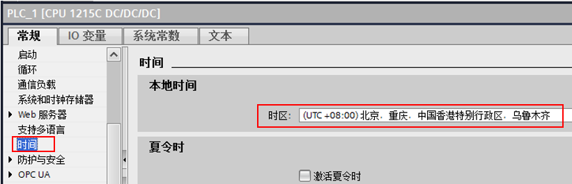
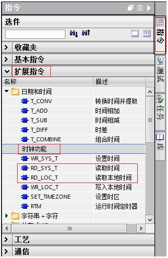
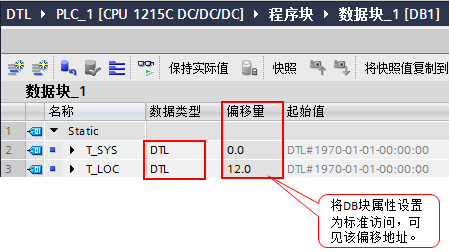
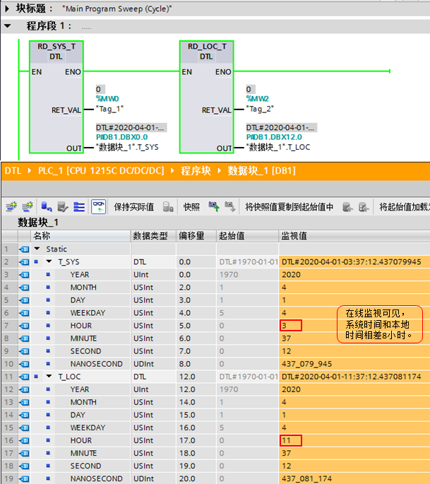
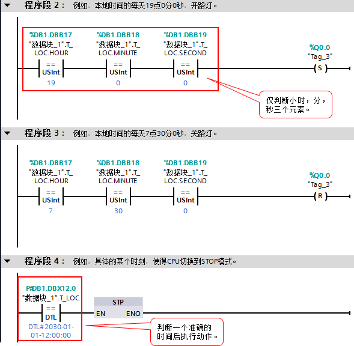

### 数据类型 DTL 介绍、使用

**硬件：**

① S7-1200 CPU （本文中使用 V4.4 版本的 S7-1215C DC/DC/DC）

② PC（带以太网卡），TP 电缆（以太网电缆）

**软件：**

① 文档中使用 TIA Portal V16

### 一、DTL 时间数据类型

日期和时间的数据类型 DTL 的操作数长度为 12
个字节，用于存储日期和时间信息。下表列出了数据类型 DTL 的属性：

  ------------------------------------------------------------------------------------------------------------------
  字节长度          格式                           值范围                              输入值示例
  ----------------- ------------------------------ ----------------------------------- -----------------------------
  12                DTL#年-月-日-小时:分:秒:纳秒   DTL#1970-01-01-00:00:00.0 到\       DTL#2008-12-16-20:30:20.250
                                                   DTL#2262-04-11-23:47:16.854775807   

  ------------------------------------------------------------------------------------------------------------------

数据类型 DTL
的结构由几个部分组成，每一部分都包含不同的数据类型和取值范围。指定值的数据类型必须与相应元素的数据类型相匹配。下表给出了数据类型
DTL 的结构组成及其属性：\

  字节   组件   数据类型   值范围
  ------ ------ ---------- -----------------------------------------------
  0      年     UInt       1970 - 2262
  1             USInt      
  2      月     USInt      1 - 12
  3      日     USInt      1 - 31
  4      星期   USInt      1（星期日） - 7（星期六），作为输入时无需考虑
  5      小时   USInt      0 - 23
  6      分钟   USInt      0 - 59
  7      秒     USInt      0 - 59
  8      纳秒   UDInt      0 - 999999999
  9                        
  10                       
  11                       

### 二、系统/本地时间区别

系统时间（System Time）：UTC 时间，即以前的格林威治标准时间。

本地时间（Local Time）：根据 S7-1200 CPU 所处时区设置的本地标准时间。

例如，北京时间与系统时间相差 8 小时。

在 CPU 属性中进行设置，如图 1 所示：

{width="821" height="265"}

图.01 组态时区

### 三、读取 S7-1200 CPU 的系统/本地时钟

1\. 读取 S7-1200 CPU 的系统/本地时钟指令的调用。如图 2 所示：

{width="334" height="513"}

图.02 读写时间指令

2\. 读取 S7-1200 CPU 的系统/本地时钟，需要在 DB 块中创建数据类型为 DTL
的变量。 如图 3 所示：

{width="449" height="252"}

图.03 DTL 数据类型变量

3\. 在 OB1
中编程，读出的系统/本地时间通过输出管脚\"OUT\"放入数据块相应的变量中。如图
4 所示：

{width="609" height="685"}

图.04 读取到的时间

从上图可以看出，读出的系统时间和本地时间相差 8 小时，这是因为 S7-1200
CPU 所设置的时区与格林威治时间相差 8
小时。输出管脚\"RET_VAL\"为指令状态输出，具体含义参见指令帮助。

### 四、应用举例

例如，使用本地时钟：

1.  设定每天晚上7点开灯，早上7点30分关灯；
2.  设定 2030-01-01-12:00:00 执行某个操作。

{width="589" height="576"}

图.05 编程
