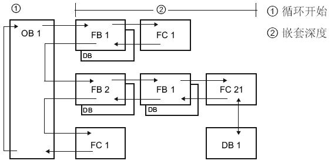

# OB 组织块简介

## OB 组织块

什么是组织块?

    组织块是操作系统和用户程序之间的接口。OB 用于执行具体的程序：
    
    *   在 CPU 启动时
    *   循环程序处理
    *   在循环或延时时间到达时
    *   当发生外部条件触发时
    *   当发生故障、错误时

OB 内部调用 FB、FC，并且这些 FB、FC 还可以继续向下嵌套调用 FB、FC。除主程序和启动 OB 以外，其他 OB 的执行是根据各种中断条件（错误、时间、硬件等）来触发的，OB 无法被 FB、FC 调用。

每个组织块都有各自的优先级，在低优先级 OB 运行过程中，高优先级 OB 到来会打断低优先级执行。

以主循环程序为例，在没有其他 OB 执行时，程序循环中的程序，即主程序在周而复始的执行，当有高优先级中断（例如循环中断）出现时，立即停止主程序执行，转而执行高优先级中断 OB 的程序，当高优先级中断 OB 的程序执行完，则继续从中断处的主程序执行。两个不同优先级 OB 的程序之间的打断也是同样道理。

## OB 事件

!!! info "组织块 OB 的类型"

    | &nbsp;                                    | 允许的数量 | 默认的优先级                                                                                                                                                                                           |
    | ----------------------------------------- | ---------- | ------------------------------------------------------------------------------------------------------------------------------------------------------------------------------------------------------ |
    | 程序循环（Program cycle）                 | &gt;=0     | 1                                                                                                                                                                                                      |
    | 启动OB（Startup）                         | &gt;=0     | 1                                                                                                                                                                                                      |
    | 时间中断（Time of day）**                 | &lt;=2     | 2                                                                                                                                                                                                      |
    | 延时中断（Time delay interrupt）*         | &lt;=4     | OB 20：3        OB 21：4        OB 22：5        OB 23：6        OB 123 - OB 32767：3                                                                                                       |
    | 循环中断（Cyclic interrupt）*             | &lt;=4     | OB 30：8        OB 31：9        OB 32：10        OB 33：11        OB 34：12        OB 35：13        OB 36：14        OB 37：16        OB 38：17        OB 123 - OB 32767：7 |
    | 硬件中断（Hardware interrupt）            | &lt;=50    | 18                                                                                                                                                                                                     |
    | 时间错误（Time error interrupt）          | &lt;=1     | 22或26                                                                                                                                                                                                 |
    | 诊断中断（Diagnostic error interrupt）    | &lt;=1     | 5                                                                                                                                                                                                      |
    | 插拔中断（Pull or plug of modules）**     | &lt;=1     | 6                                                                                                                                                                                                      |
    | 机架或站故障（Rack or station failure）** | &lt;=1     | 6                                                                                                                                                                                                      |
    | 状态中断（Status）**                      | &lt;=1     | 4                                                                                                                                                                                                      |
    | 更新中断（Update）**                      | &lt;=1     | 4                                                                                                                                                                                                      |
    | 配置文件中断（Profile）**                 | &lt;=1     | 4                                                                                                                                                                                                      |
    | MC-Servo ***                              | &lt;=1     | 25                                                                                                                                                                                                     |
    | MC-Interpolator ***                       | &lt;=1     | 24                                                                                                                                                                                                     |
    | MC-PreServo ****                          | &lt;=1     | -                                                                                                                                                                                                      |
    | MC-PostServo ****                         | &lt;=1     | -                                                                                                                                                                                                      |

    \* V4.0 版本 CPU 以前，延时中断 OB + 循环中断 OB 数量 <=4

    \*\* V4.0 版本 CPU 开始支持

    \*\*\* V4.1 版本 CPU 开始支持

    \*\*\*\* V4.2 版本 CPU 开始支持

最后的 4 个 MC OB 是闭环运动控制使用，其中前两个是组态闭环 TO 轴自动生成，无法编写任何程序，系统内部使用，后两个是需要手动创建，使用参见[链接](../../../10-Technology/03-MC/08-FAQ/01-FAQ.html#_Toc6)。

主要组织块文档说明链接：

*   [OB1 程序循环](02-OB1.md)
*   [OB100 启动 OB](08-OB100.md)
*   [OB10 时间中断](09-OB10.md)
*   [OB20 延时中断](03-OB20.md)
*   [OB30 循环中断](04-OB30.md)
*   [OB40 硬件中断](05-OB40.md)
*   [OB80 时间错误](06-OB80.md)
*   [OB82 诊断中断](07-OB82.md)
*   [OB83 插拔中断](10-OB83.md)
*   [OB86 机架或站故障](11-OB86.md)

## 通信优先级

通信任务的优先级为 1。因为 1 是最低优先级，所以其他事件可以中断通信处理。其他事件导致的中断可能会对扫描周期的通信处理产生负面影响。可以调整"通信造成的周期负载"百分比，以增加专用于通信处理的扫描周期部分。 调整该参数，参见[链接](../../01-operation/02-CPU_Properties.md#通信负载)。

### CPU 为每个 OB 优先级提供了临时（本地）存储器

- 1、16 KB 用于启动和程序循环（包括相关的 FB 和 FC）
- 2、6 KB 用于其他中断事件（包括 FB 和 FC）

### 嵌套深度：是指可从 OB 调用功能 (FC) 或功能块 (FB) 等程序代码块的深度

如图 1 所示。

- 1、从程序循环 OB 或启动 OB 开始调用 FC 和 FB 等程序代码块，嵌套深度为 16 层；
- 2、从其他中断 OB 开始调用 FC 和 FB 等程序代码块，嵌套深度为 6 层。

注意：安全程序嵌套深度为 4 层。

图 1. 嵌套深度