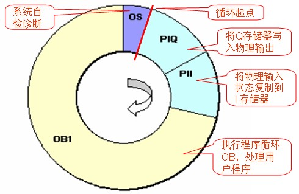
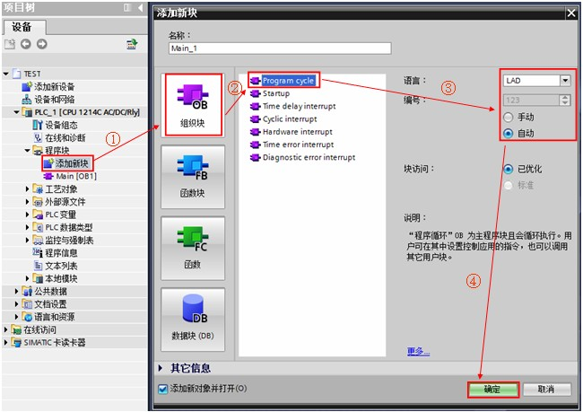
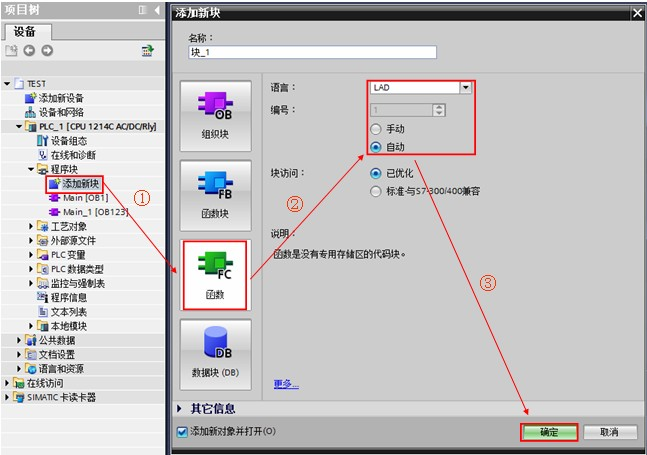
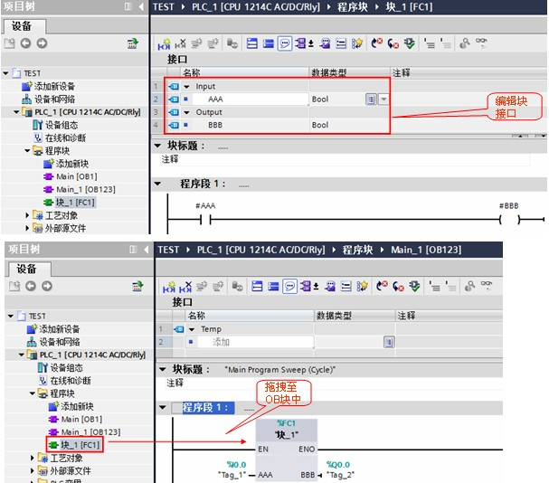

# 程序循环 OB

## 程序循环 OB 的功能

程序循环 OB 在 CPU 处于 RUN 模式时，周期性地循环执行。可在程序循环 OB 中放置控制程序的指令或调用其它功能块（FC 或 FB）。主程序（Main）为程序循环 OB ，要启动程序执行，项目中至少有一个程序循环 OB 。操作系统每个周期调用该程序循环 OB 一次，从而启动用户程序的执行。

S7-1200 允许使用多个程序循环 OB ，按 OB 的编号顺序执行。OB1 是默认设置，其它程序循环 OB 的编号必须大于或等于 123。程序循环 OB 的优先级为 1，可被高优先级的组织块中断；程序循环执行一次需要的时间即为程序的循环扫描周期时间。最长循环时间缺省设置为 150ms。如果程序循环时间超过最长循环时间，响应参见 OB80 文档常见问题 2 [链接](06-OB80.md#常见问题)。

## 操作系统的执行过程

如图 1 所示

1、操作系统启动扫描循环监视时间；

2、操作系统将输出过程映像区的值写到输出模块；

3、操作系统读取输入模块的输入状态，并更新输入过程映像区；

4、操作系统处理用户程序并执行程序中包含的运算；

5、当循环结束时，操作系统执行所有未决的任务，例如加载和删除块，或调用其他循环 OB ；

6、最后，CPU 返回循环起点，并重新启动扫描循环监视时间。

图 1. 程序循环图例

## 程序循环 OB 的使用示例：

!!! tip "例如"

    在循环组织块 OB123 中调用 FC1 

具体实现过程如下：

1、按如下步骤创建循环组织块 OB123 。如图 2 所示。

图 2. 创建循环组织块

2、通过上述类似方法创建功能 FC1 。如图 3 所示。

图 3. 创建 FC1

3、在循环组织块 OB123 中调用 FC1 。如图 4 所示。

图 4. 调用 FC1