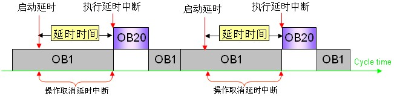
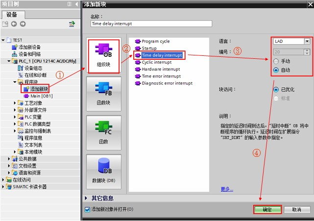
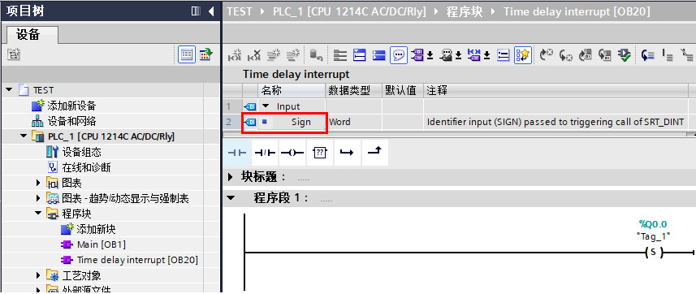
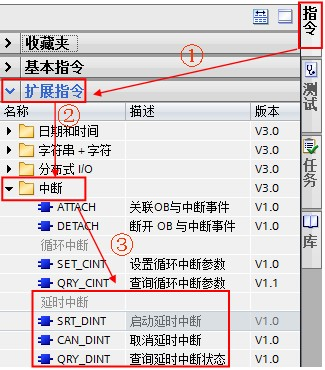
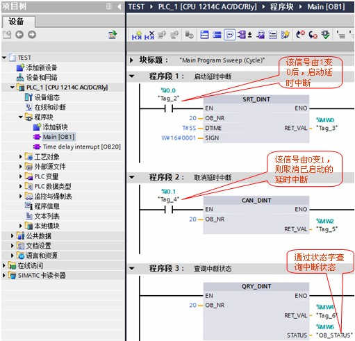

# 延时中断OB

## 延时中断 OB 的功能

延时中断 OB 在经过一段指定的时间延时后，才执行相应的 OB 中的程序。

S7-1200 最多支持 4 个延时中断 OB ，通过调用“SRT\_DINT”指令启动延时中断 OB 。在使用“SRT\_DINT”指令编程时，需要提供 OB 号、延时时间，当到达设定的延时时间，操作系统将启动相应的延时中断 OB ；尚未启动的延时中断 OB 也可以通过“CAN\_DINT”指令取消执行，同时还可以使用“QRY\_DINT”指令查询延时中断的状态。延时中断 OB 的编号必须为 20~23，或大于、等于 123。

## 与延时中断 OB 相关的指令功能

| 指令名称 | 功能说明                                                                                                        |
| -------- | --------------------------------------------------------------------------------------------------------------- |
| SRT_DINT | 当指令的使能输入 EN 上生成下降沿时，开始延时时间，超出参数 DTIME 中指定的延时时间之后，执行相应的延时中断 OB 。 |
| CAN_DINT | 使用该指令取消已启动的延时中断（由 OB_NR 参数指定的 OB 编号）。                                                 |
| QRY_DINT | 使用该指令查询延时中断的状态。                                                                                  |

以上指令的相关详细信息，请查看下面[链接](../../../source/index.md)中 S7-1200 系统手册，第 9.5.4 章：延时中断。

## 延时中断 OB 的执行过程，如图 1 所示：

1、调用“SRT\_DINT”指令启动延时中断；

2、当到达设定的延时时间，操作系统将启动相应的延时中断 OB ；

3、图例中，延时中断 OB20 中断程序循环 OB1 优先执行；

4、当启动延时中断后，在延时时间到达之前，调用“CAN\_DINT”指令可取消已启动的延时中断。



图 1. 延时中断 OB 执行图例

## 延时中断 OB 的使用示例：

:::{tip} 例如 

当 I0.0 由 1 变 0 时，延时 5s 后启动延时中断 OB20 ，并将输出 Q0.0 置位。


具体实现过程如下：

1、按如下步骤创建延时中断 OB20 。如图 2 所示。



图 2. 创建延时中断 OB20

2、打开 OB20 ，在 OB20 中编程，当延时中断执行时，置位 Q0.0。如图 3 所示。



图 3. OB20 中编程

3、在 OB1 中编程调用"SRT\_DINT"指令启动延时中断；调用"CAN\_DINT"指令取消延时中断；调用"QRY\_DINT"指令查询中断状态。在"指令->扩展指令->中断->延时中断"中可以找相关指令，如图 4 所示。



图 4. 调用延时中断指令

OB1 中的编程如图 5 所示：



图 5. OB1 中的编程

``` c

“SRT_DINT”指令参数说明：

EN :=%I0.0 //当 EN 端出现下降沿时，延时计时开始 
OB_NR :=20 //延时时间后要执行的 OB 的编号 
DTIME :=T#5S //延时时间（1 至 60000 ms） 
SIGN :=W#16#0001 //注： 调用时必须为此参数赋值。 此值将用于修改延时中断接口区 SIGN 的值，参考图 3 中红框，用于区分多个延时指令对应一个延时中断时的操作 
RET_VAL :=%MW0 //状态返回值（详细信息请查看在线帮助） 

```

``` c
“CAN_DINT”指令参数说明：

EN :=%I0.1 //当 EN 端出现上升沿时，取消延时中断 
OB_NR :=20 //需要取消的 OB 的编号 
RET_VAL :=%MW2 //状态返回值（详细信息请查看在线帮助） 

```

``` c
“QRY_DINT”指令参数说明：

OB_NR :=20 //需要查询状态的 OB 编号 
RET_VAL :=%MW4 //状态返回值（详细信息请查看 S7-1200 系统手册的指令参数帮助） 
STATUS :=%MW6 //延时中断的状态（详细信息请查看在线帮助） 

```

4、测试结果：当 I0.0 由 1 变 0 时，延时 5s 后延时中断执行，可看到 CPU 的输出 Q0.0 指示灯亮；当 I0.0 由 1 变 0 时，在延时的 5s 到达之前，如果 I0.1 由 0 变 1 则取消延时中断，OB20 将不会执行。

:::

## 常见问题

:::{hint}  使用延时中断需要注意什么?

- 1、延时中断数量 <= 4；

- 2、延时时间 1~60000ms，设置错误的时间，状态返回值 RET\_VAL 将报错 16#8091；

- 3、延时中断必须通过“SRT\_DINT”指令设置参数，使能输入 EN 下降沿开始计时；

- 4、使用“CAN\_DINT”指令取消已启动的延时中断；

- 5、启动延时中断的间隔时间必须大于延时时间与延时中断执行时间之和；否则会导致时间错误。

:::