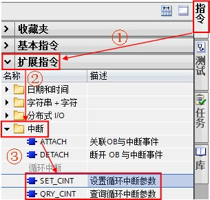
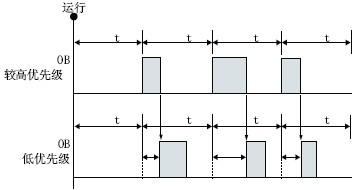

# 循环中断 OB30

## 循环中断 OB 的功能

循环中断 OB 在经过一段固定的时间间隔后执行相应的中断 OB 中的程序。

S7-1200 最多支持 4 个循环中断 OB ，在创建循环中断 OB 时设定固定的间隔扫描时间。在 CPU 运行期间，可以使用“SET\_CINT”指令重新设置循环中断的间隔扫描时间、相移时间；同时还可以使用“QRY\_CINT”指令查询循环中断的状态。循环中断 OB 的编号必须为30~38，或大于、等于123。

## 与循环中断 OB 相关的指令功能

| 指令名称 | 功能说明                                                                     |
| -------- | ---------------------------------------------------------------------------- |
| SET_CINT | 设置指定的中断 OB 的间隔扫描时间、相移时间，以开始新的循环中断程序扫描过程。 |
| QRY_CINT | 使用该指令查询循环中断的状态。                                               |

以上指令的相关详细信息，请查看[链接](../../../01-resource/source/index.md)中 S7-1200 系统手册，第 9.5.2 章：循环中断。

## 循环中断 OB 的执行过程

如图 1 所示：

- 1、PLC 启动后开始计时；
- 2、当到达固定的时间间隔后，操作系统将启动相应的循环中断 OB ；
- 3、图例中，到达固定的时间间隔后，循环中断 OB30 中断程序循环 OB1 优先执行。

循环中断的执行过程请参考下图：


图 1. 循环中断 OB 执行图例

## 循环中断 OB 的使用示例

:::{note} 例如

运用循环中断，使 Q0.0 500ms 输出为 1，500ms 输出为 0，即实现周期为 1s 的方波输出。
:::

具体实现过程如下：

### 1、按如下步骤创建循环中断 OB30 。

如图 2 所示。


图 2. 创建循环中断 OB30

### 2、OB30 中编程，当循环中断执行时，Q0.0 以方波形式输出。

如图 3 所示。


图 3. OB30 中编程

### 3、在 OB1 中编程调用“SET\_CINT”指令，可以重新设置循环中断时间，

:::{note} 例如

CYCLE=1s（即周期为2s）；调用“QRY\_CINT”指令可以查询中断状态。在“指令->扩展指令->中断->循环中断”中可以找相关指令。

如图 4 所示。



图 4. 调用循环中断指令

OB1 中的编程如图 5 所示：


图 5. OB1 中的编程

```c

“SET_CINT”指令参数说明：
EN :=%M100.0 //当 EN 端出现上升沿时，设置新参数 
OB_NR :=30 //需要设置的 OB 的编号 
CYCLE :=1000000 //时间间隔（微秒） 
PHASE :=0 //相移时间（微秒） 
RET_VAL :=%MW0 //状态返回值（详细信息请查看在线帮助） 

```


```c

“QRY_CINT”指令参数说明：
OB_NR :=30 //需要查询的 OB 的编号 
RET_VAL :=%MW2 //状态返回值（详细信息请查看在线帮助） 
CYCLE :=%MD4 //查询结果：时间间隔（微秒） 
PHASE :=%MD8 //查询结果：相移时间（微秒） 
STATUS :=%MW12 //循环中断的状态（详细信息请查看在线帮助） 

```

4、测试结果：程序下载后，可看到 CPU 的输出 Q0.0 指示灯 0.5s 亮，0.5s 灭交替切换；当 M100.0 由 0 变 1 时，通过“SET\_CINT”将循环间隔时间设置为 1s，这时，可看到 CPU 的输出 Q0.0 指示灯 1s 亮，1s 灭交替切换。

:::

## 相移时间（Phase shift）功能

当使用多个时间间隔相同的循环中断事件时，设置相移时间可使时间间隔相同的循环中断事彼此错开一定的相移时间执行。请通过如下两幅图例理解相移时间的概念。

:::{note}  "如图 6 所示"

没有设置相移时间，以相同的时间间隔调用两个 OB ，则低优先级的 OB 块将不能以固定间隔时间 t 执行；何时执行受高优先级的 OB 执行时间影响。



图 6. 没有相移的循环 OB 调用
:::

:::{note}  "如图 7 所示"

低优先级的 OB 块可以以固定间隔时间 t 执行；相移时间应大于较高优先级 OB 块的执行时间。


图 7. 有相移的循环 OB 调用
:::

:::{note} "小结"

- 如果以相同的时间间隔调用优先级较高和优先级较低的循环中断 OB ，则只有在优先级较高的 OB 完成处理后才会执行优先级较低的 OB 。
- 低优先级 OB 的执行起始时间会根据优先级较高的 OB 的处理时间而延迟，如果希望以固定的时间间隔来执行优先级较低的 OB ，则优先级较低的 OB 需要设置相移时间，且相移时间应大于优先级较高的 OB 的执行时间。

 如何设置相移时间?

- 如图 8 所示。
- 请注意，如果程序中调用“SET\_CINT”指令设置相移时间，则以程序中设定的时间为准


图 8. 相移的设置步骤
:::

## 常见问题:

:::{hint}  使用循环中断需要注意什么?
:::

- 1、循环中断数量 <= 4；

- 2、循环间隔时间 1~60000ms，通过指令“SET\_CINT”设置错误的时间将报错 16#8091；

- 3、CPU 运行期间，可通过“SET\_CINT”指令设置循环中断间隔时间、 相移时间；

- 4、如果“SET\_CINT”指令的使能端 EN 为脉冲信号触发；则 CPU 的操作模式从 STOP 切换到 RUN 时执行一次，包括启动模式处于 RUN 模式时上电和执行 STOP 到 RUN 命令切换，循环中断间隔时间将复位为 OB 块属性中设置的数值；

- 5、如果循环中断执行时间大于间隔时间，将会导致时间错误。

