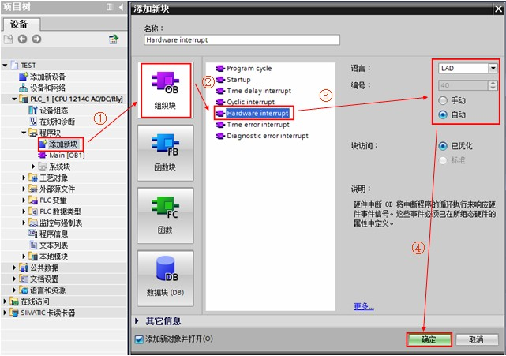
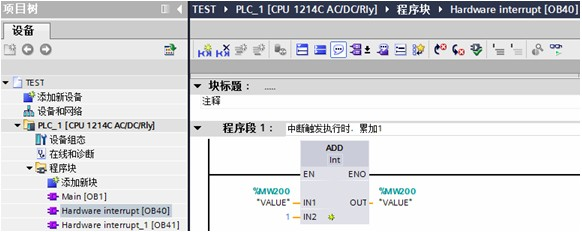
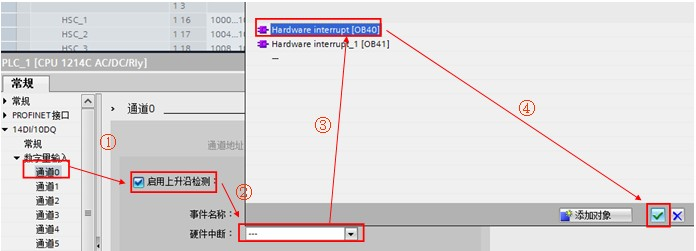

# 硬件中断 OB40

## 硬件中断 OB 的功能

硬件中断 OB 在发生相关硬件事件时执行，可以快速的响应并执行硬件中断 OB 中的程序（例如立即停止某些关键设备）。

硬件中断事件包括内置数字输入端的上升沿和下降沿事件以及 HSC（高速计数器）事件。当发生硬件中断事件，硬件中断 OB 将中断正常的循环程序而优先执行。S7-1200 可以在硬件配置的属性中预先定义硬件中断事件，一个硬件中断事件只允许对应一个硬件中断 OB ，而一个硬件中断 OB 可以分配给多个硬件中断事件。在 CPU 运行期间，可使用“ATTACH”附加指令和“DETACH”分离指令对中断事件重新分配。硬件中断 OB 的编号必须为 40~47，或大于、等于 123。

## 与硬件中断 OB 相关的指令功能

| 指令名称 | 功能说明                               |
| -------- | -------------------------------------- |
| ATTACH   | 将硬件中断事件和硬件中断 OB 进行关联。 |
| DETACH   | 将硬件中断事件和硬件中断 OB 进行分离。 |

以上指令的相关详细信息，请查看[链接](../../../source/index.md#s7-1200手册下载)中 S7-1200 系统手册，第 9.5.1 章：附加/分离 OB 和中断事件。

## 硬件中断 OB 的使用示例

:::{tip} 例如

当硬件输入 I0.0 上升沿时，触发硬件中断 OB40（执行累加程序），当硬件输入 I0.1 上升沿时，触发硬件中断 OB41（执行递减程序），硬件中断事件和硬件中断 OB 关系如图 1 所示。


图 1. 硬件中断关系

### 1、按如下步骤创建硬件中断 OB40 ，同样的方法创建 OB41

如图 2 所示。



图 2. 创建硬件中断 OB40

### 2、OB40 中编程，当硬件输入 I0.0 上升沿时，触发硬件中断执行 MW200 加1

如图 3 所示。



图 3. OB 40 中编程

### 3、OB41 中编程，当硬件输入 I0.1 上升沿时，触发硬件中断执行 MW200 减1

如图 4 所示。


图 4. OB41 中编程

### 4、在 CPU 属性窗口中关联硬件中断事件，如下图所示，分别将 I0.0 和 OB40 关联，I0.1 和 OB41 关联

如图 5、6 所示。



图 5. I0.0 和 OB40 关联


图 6. I0.1 和 OB41 关联

### 5、测试结果：程序下载后，在监控表中查看 MW200 的数据

① 当 I0.0 接通，触发中断 OB40 ，MW200 的数值累加1。结果如图 7 所示。


图 7. I0.0 硬件中断结果

② 当 I0.1 接通，触发中断 OB41 ，MW200 的数值递减1。结果如图 8 所示。


图 8. I0.1 硬件中断结果

### 6、如果需要在 CPU 运行期间对中断事件重新分配，可通过“ATTACH”附加指令实现，OB1 中编程步骤如下图

如图 9 所示。


图 9. “ATTACH”指令

① 如果“ATTACH”附加指令的引脚“ADD”为 FALSE，EVENT 中的事件将 **替换** OB40 中的原有事件。即硬件中断事件 I0.1“上升沿1”事件将替换原来 OB40 中关联的 I0.0“上升沿0”事件，如图 10 所示：


图 10. 硬件中断关系

② 如果“ATTACH”附加指令的引脚“ADD”为 TRUE，EVENT 中的事件将**添加**至 OB40，OB40 在 I0.0“上升沿0”和 I0.1“上升沿1”事件触发时均会执行，如图 11 所示：


图 11. 硬件中断关系

```c

“ATTACH”指令参数说明：

EN :=%M100.0 //当 EN 端出现上升沿时，使能该指令  
OB_NR :=40 //需要关联的 OB 的编号 
EVENT :=“上升沿 1” //需要关联的硬件中断事件名称 
ADD :=FALSE //ADD=FALSE（默认值）：该事件将取代先前为此 OB 分配的所有事件。ADD=TRUE:该事件将添加到此 OB 中。
 
RET_VAL :=%MW0 //状态返回值（详细信息请查看在线帮助） 

```


7、如果需要在 CPU 运行期间对中断事件进行分离，可通过“DETACH”指令实现，OB 1 中编程如图 12 所示。


图 12. “DETACH”指令

当 M100.2 置 1 使能指令 DETACH 后，硬件中断事件和硬件中断 OB 关系如下图。如图 13 所示。


图 13. 硬件中断关系

```c

“DETACH”指令参数说明：

EN :=%M100.2 //当 EN 端出现上升沿时，使能该指令 
OB_NR :=40 //需要分离的 OB 的编号 
EVENT :=“上升沿0” //需要分离的硬件中断事件名称 
RET_VAL :=%MW2 //状态返回值（详细信息请查看在线帮助） 

```
:::

## 常见问题

:::{hint}  使用硬件中断需要注意什么?
:::

- 1、一个硬件中断事件只能分配给一个硬件中断 OB ，而一个硬件中断 OB 可以分配给多个硬件中断事件；

- 2、用户程序中最多可使用 50 个互相独立的硬件中断 OB ；数字量输入和高速计数器均可触发硬件中断；

- 3、中断 OB 和中断事件在硬件组态中定义；在 CPU 运行时可通过“ATTACH”和“DETACH”指令进行中断事件重新分配；

- 4、如果“ATTACH”指令的使能端 EN 为脉冲信号触发，在使用“ATTACH”指令进行中断事件重新分配后；若 CPU 的操作模式从 STOP 切换到 RUN 时执行一次，包括启动模式处于 RUN 模式时上电和执行 STOP 到 RUN 命令切换，则硬件中断 OB 和硬件中断事件将恢复为在硬件组态中定义的分配关系；

- 5、如果一个中断事件发生，在该中断 OB 执行期间，同一个中断事件再次发生，则新发生的中断事件丢失；

- 6、如果一个中断事件发生，在该中断 OB 执行期间，又发生多个不同的中断事件中，则新发生的中断事件进入排队，等待第一个中断 OB 执行完毕后依次执行。