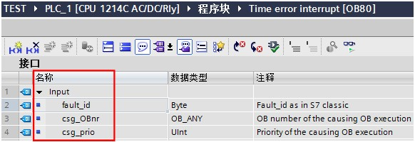
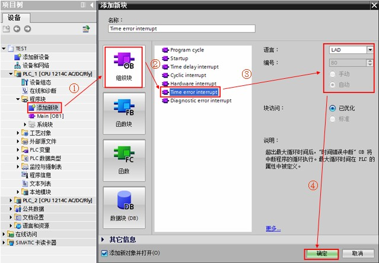
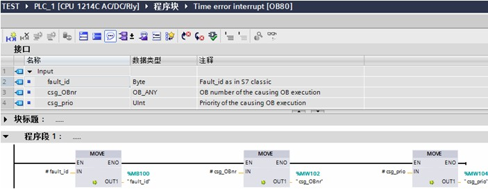
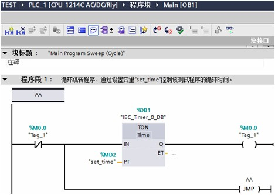
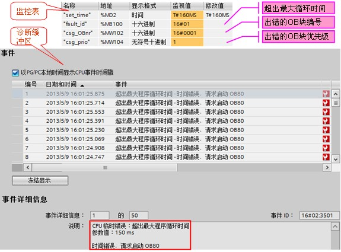
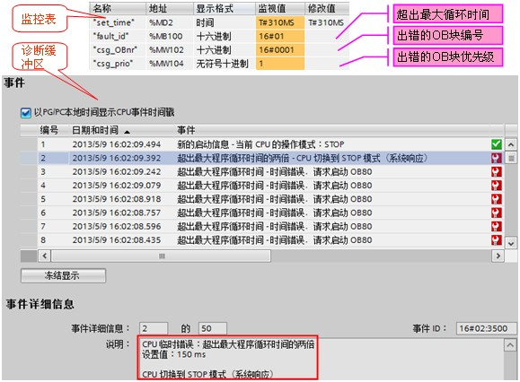
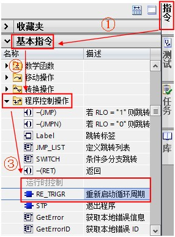
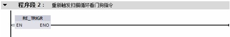
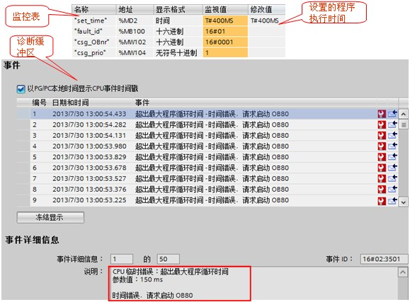

# 时间错误 OB80

## 时间错误 OB80 的功能

当 CPU 中的程序执行时间超过最大循环时间或者发生时间错误事件（例如，循环中断 OB 仍在执行前一次调用时，该循环中断 OB 的启动事件再次发生）时，将触发时间错误中断优先执行 OB80 。由于 OB80 的优先级最高，它将中断所有正常循环程序或其它所有 OB 事件的执行而优先执行。

## 与时间错误 OB80 相关的信息

当触发时间错误中断时，通过 OB80 的接口变量读取相应的启动信息。OB80 的接口变量及启动信息如图 1、表 1 所示。

图 1. OB80 接口变量

| 输入数据  | 类型    | 说明                                                                                          |
| --------- | ------- | --------------------------------------------------------------------------------------------- |
| fault\_id | BYTE    | 16#01 - 超出最大循环时间    16#02 - 请求的 OB 无法启动    16#07 和 16#09 - 发生队列溢出 |
| csg\_OBnr | OB\_ANY | 出错时正在执行的 OB 的编号                                                                    |
| csg\_prio | UINT    | 导致错误的 OB 的优先级                                                                        |

表 1. OB80 启动信息

## 时间错误 OB 的使用示例：

:::{seealso} 例如
在 OB1 中做一个循环跳转程序，可通过设置时间控制该部分程序的循环时间，当该部分程序的执行时间大于 CPU 设定的最大循环时间时，触发时间错误事件。
:::

1、按如下步骤创建时间错误 OB80 。如图 2 所示。

图 2. 创建时间错误 OB80

2、OB80 中编程如下图，创建地址为 MB100、MW102、MW104 的变量用于存储出现时间错误时读取到的启动信息。如图 3 所示。

图 3. OB80 中编程

3、在 OB1 中编写一个循环跳转程序，其循环执行时间可通过变量“set\_time”设定。如图 4 所示。

图 4. OB1 中编程

4、程序下载，测试：

① 如果在监控表中将变量“set\_time”设置为 160ms，则 CPU 报故障且没有停机，可从监控表中读取到 OB80 的启动信息，同时查看故障缓冲区。如图 5 所示。

图 5. 测试结果 1

② 如果在监控表中将变量“set\_time”设置为 310ms，则 CPU 立即停机，可从监控表中读取到 OB80 的启动信息，同时查看故障缓冲区。如图 6 所示。

图 6. 测试结果 2

:::{warning}

S7-1200 CPU 默认最大循环时间为 150ms。
:::

## 重新触发扫描循环看门狗指令“RE\_TRIGR”

“RE\_TRIGR”指令用于在单个扫描循环期间重新启动扫描循环监视定时器。其功能是执行一次“RE\_TRIGR”指令，使允许的最大扫描周期延长一个最大循环时间段。

关于指令“RE\_TRIGR”的相关详细信息，请查看下面[链接](../../../source/index.md)中 S7-1200 系统手册，第 8.8.6 章：重置周期监视时间。

使用示例：在上个示例中的时间错误 OB80 块中调用指令“RE\_TRIGR”，当 OB1 中的循环跳转程序执行时间大于 CPU 设定的最大循环时间时，触发时间错误 OB80 并执行指令“RE\_TRIGR”重新触发扫描循环看门狗。

1、在 OB80 中编程调用“RE\_TRIGR”指令。在“指令>基本指令>程序控制操作>运行时控制”中可以找相关指令。如图 7 所示。

图 7. 调用重新触发扫描循环看门狗指令

2、OB80 中编程如下图，在程序段 2 中增加重新触发扫描循环看门狗指令“RE\_TRIGR”。如图 8 所示。

图 8. OB80 中编程

3、程序下载，测试：

如果在监控表中将变量“set\_time”设置为 400ms(大于两倍最大循环时间 300ms)，由于“RE\_TRIGR”指令的作用 CPU 报故障但没有停机，可从监控表中读取到 OB80 的启动信息，同时查看故障缓冲区。如图 9 所示。

图 9. 测试结果 3

## 常见问题

:::{hint}  哪些情况会触发时间错误中断，以及 CPU 在这些情况下如何响应?
:::

1.超出最大循环时间

- 当 CPU 中的程序执行时间超过最大循环时间时

  * 如果 OB80 不存在

      -  从未调用过 OB80 的情况下，CPU 不停机，只报错，要求启动 OB80
      -  调用过 OB80，但是后边又删除了 OB80，CPU 停机，要求启动 OB80

  * 如果 OB80 存在，则 CPU 执行 OB80 只报错不停机；

- 如果同一程序循环超过两倍最大程序循环时间且没有通过指令“RE\_TRIGR”复位循环定时器

  * 无论 OB80 是否存在，CPU 都将停机

2.请求的 OB 无法启动 

如果循环中断、延时中断请求 OB ，但请求的 OB 已经在执行，就会出现请求的 OB 无法启动这种情况。

3.发生队列溢出

如果中断的出现频率超过其处理频率，就会出现发生队列溢出这种情况。如果 OB80 不存在，则 CPU 将切换到 STOP 模式；如果 OB80 存在，则执行 OB80 ，CPU 将保持为 RUN 模式。

4.总结：发生任何上述事件都将在诊断缓冲区生成一个描述相应事件的条目。无论是否存在 OB80 ，都将生成诊断缓冲区条目。