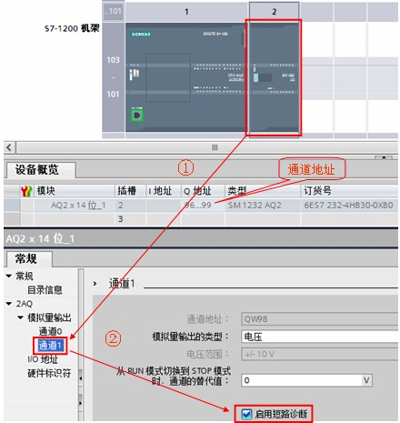

# 诊断错误 OB82

## 诊断错误 OB82 的功能

S7-1200 支持诊断错误中断，可以为具有诊断功能的模块启用诊断错误中断功能来检测模块状态。

出现故障（进入事件），故障解除（离开事件）均会触发诊断中断 OB82 。当模块检测到故障并且在软件中使能了诊断错误中断时，操作系统将启动诊断错误中断，诊断错误中断 OB82 将中断正常的循环程序优先执行。此时无论程序中有没有诊断中断 OB82，CPU 都会保持 RUN 模式，同时 CPU 的 ERROR 指示灯闪烁。如果希望 CPU 在接收到该类型的错误时进入 STOP 模式，可以在 OB82 中加入 STP 指令使 CPU 进入 STOP 模式。

## 与诊断错误 OB82 相关的信息

当触发诊断错误中断时，通过 OB82 的接口变量可以读取相应的启动信息，可以帮助确定事件发生的设备、通道和错误原因。OB82 的接口变量及启动信息如图 1、表 1 所示。

图 1. OB82 接口变量

| 输入       | 数据类型 | 说明                                                                                                                                                                                                                                                                                                                                              |
| ---------- | -------- | ------------------------------------------------------------------------------------------------------------------------------------------------------------------------------------------------------------------------------------------------------------------------------------------------------------------------------------------------- |
| IOstate    | WORD     | 设备的 IO 状态：   如果组态正确，则位 0 = 1，如果组态不正确，则位 0= 0    如果出现错误（如断线），则位 4 = 1。（如果没有错误， 则位 4 = 0）   如果组态不正确，则位 5 = 1，如果组态再次正确，则 位 5 = 0。    如果发生了 I/O 访问错误，则位 7 = 1。有关存在访问错误 的 I/O 的硬件标识符，请参见 laddr。（如果没有错误， 则位 6 = 0。） |
| laddr      | HW_ANY   | 报告错误的设备或功能单元的硬件标识符                                                                                                                                                                                                                                                                                                              |
| channel    | UINT     | 通道号                                                                                                                                                                                                                                                                                                                                            |
| multierror | BOOL     | 如果存在多个错误，参数值为 TRUE                                                                                                                                                                                                                                                                                                                   |

表 1. OB82 启动信息

## 诊断错误 OB 的使用示例：

例如：模拟量输出模块 SM1232 的电压输出通道，对于通道1使能短路诊断，当通道1出现短路错误时，随即触发诊断错误 OB82 ，此时可从 OB82 的启动参数中读取诊断信息。

1、按如下步骤创建诊断错误 OB82 。如图 2 所示。

图 2. 创建诊断错误 OB82

2、OB82 中编程如下图，创建地址为 MW100、MW102、MW104 的变量用于存储出现诊断错误时读取到的启动信息。如图 3 所示。

图 3. OB82 中编程

3、在硬件组态窗口中，选中模拟量输出模块，选择模拟量输出通道 1 的“启用短路诊断”功能。如图 4 所示。

图 4. 设置诊断功能

4、测试结果：程序下载后，在监控表中给“channel1”设置输出值 5000，如果此时出现了短路故障，则将立即触发诊断错误功能。如图 5 所示。

图 5. 测试结果

## 常见问题

触发诊断错误中断时，CPU 如何响应?

    1、启用诊断错误中断且 CPU 中创建了 OB82 ；

    2、OB82 是唯一支持诊断错误事件的 OB ；一次只能报告一个通道的诊断错误；

    3、如果多通道设备的两个通道出现错误，则第二个错误只会在以下情况触发 OB82 ：第一个通道错误已清除，由第一个错误触发的 OB82 已执行完毕，并且第二个错误仍然存在；

    4、事件的进入或离开都会触发一次 OB82 ；

    5、触发 OB82 ，CPU 不会进入 STOP 模式。

:::{question}  "哪些情况会触发诊断错误中断?

    如下错误将触发诊断错误中断 OB82 ：

    ① 无用户电源

    ② 超出上限

    ③ 超出下限

    ④ 断路（电流输出、电流4~20mA输入、RTD、TC）

    ⑤ 短路（电压输出）