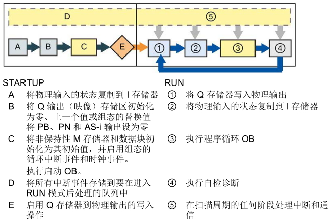
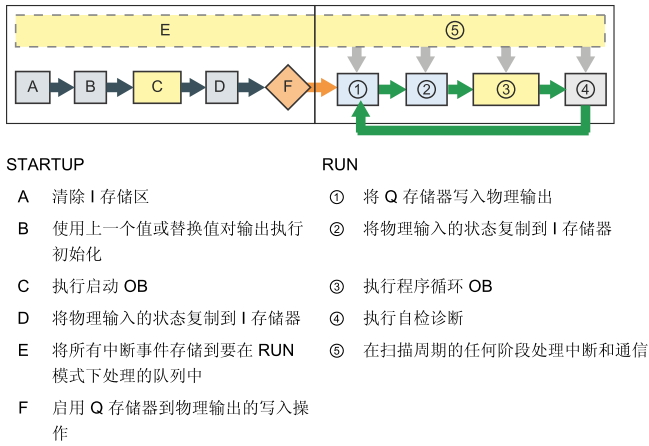
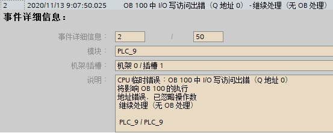
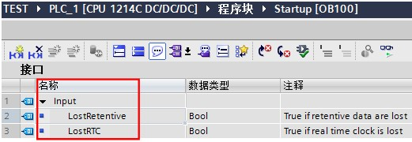
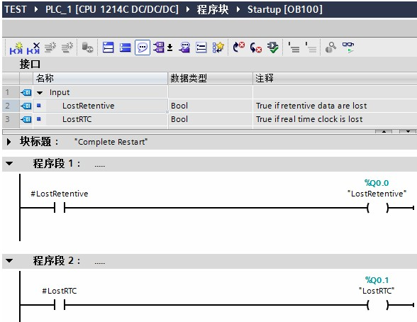
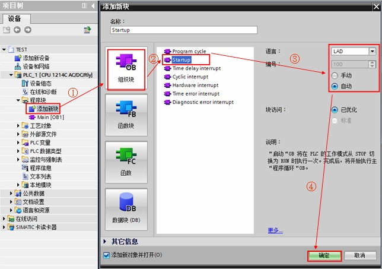
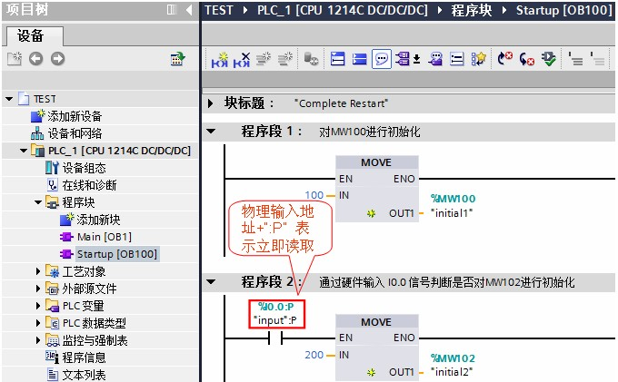
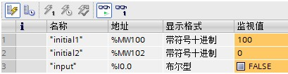
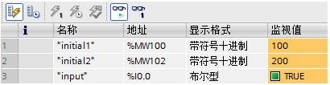

# 启动 OB100

## 启动 OB 的功能

如果 CPU 的操作模式从 STOP 切换到 RUN 时，包括启动模式处于 RUN 模式时 CPU 断电再上电和执行 STOP 到 RUN 命令切换时，启动组织块 OB 将被执行一次。启动组织块执行完毕后才开始执行主“程序循环”OB 。S7-1200 CPU 中支持多个启动 OB ，按照编号顺序（由小到大）依次执行，OB100 是默认设置。其它启动 OB 的编号必须大于、等于123。

## 启动 OB 的执行过程

V4.0 版本以后的 CPU 如图 1 所示，V3.0 版本及其以前的 CPU 如图 2 所示：

图 1. V4.0 版本以后 CPU 启动过程和运行过程图例

图 2. V3.0 版本及其以前 CPU 启动过程和运行过程图例

:::{tip} 

早先版本和目前新版本的最大区别是对物理输入的状态复制到I存储器（也就是过程映像）的执行时间，早先版本是在执行完启动 OB 后进行，目前新版本是在在执行启动 OB 之前进行。也就是对于新版本来说如果上电前的 I 点已经接通，则在启动 OB 中是可以读取到I点的状态的，而不是必须读 I:P。

此外，在启动 OB 执行过程中是无法输出的，即使编程输出到 Q:P 也是一样的，都会在启动 OB 结束后输出。并且如果在启动 OB 中出现了 Q:P，在 CPU 的诊断缓冲区中还会出现如图 3 所示的报警。

图 3. 输出到 Q:P 的报警
:::

## 与启动 OB 相关的信息

启动 OB 中包含启动信息，可以用于判断保持性数据和实时时钟是否丢失，可以在启动 OB 中编写指令。启动 OB 的接口变量及启动信息如图 4、表 1 所示。

图 4. 启动 OB 的接口变量

| 输入          | 数据类型 | 说明                                  |
| ------------- | -------- | ------------------------------------- |
| LostRetentive | Bool     | 如果保持性数据存储区丢失，该位为 True |
| LostRTC       | Bool     | 如果时钟（实时时钟）丢失，该位为 True |

表 1. 启动 OB 的启动信息

:::{tip}  **读取启动 OB 的启动信息的使用示例**
:::

当发生保持性数据丢失，输出 Q0.0 为1，当发生实时时钟丢失，输出 Q0.1 为1。

在启动 OB 中编程如图 5 所示：

图 5. 检测保持性数据或时钟丢失例程

## 启动 OB 的使用示例：

:::{tip} 例如

在启动 OB100 中无条件为地址为 MW100 赋初值100；有条件（当 I0.0 = true 时）为 MW102 赋初值 200。
:::

具体实现过程如下：

1、按如下步骤创建启动组织块 OB100 。如图 6 所示。

图 6. 创建启动组织块 OB100

2、OB100 中编程如图 7 所示。

图 7. OB100 中编程

:::{warning}

前面解释过，不同 CPU 版本对由物理输入的状态复制到I存储器（也就是过程映像）的执行时间不同，为了程序低版本和高版本的一致。因此，要在启动模式下读取物理输入的当前状态，必须对输入执行立即读取操作，例如 I0.0:P。
:::

3、测试结果：程序下载后，在监控表中查看 MW100、MW102 的数据。

① 当硬件输入 I0.0 为 0 时，CPU 上电启动或 STOP--->RUN 操作时首先执行 OB100 ，即 MW100 被赋值 100，MW102 未被赋值 200。如图 8 所示。

图 8. 测试结果1

② 当硬件输入 I0.0 为 1 时，CPU 上电启动或 STOP--->RUN 操作时首先执行 OB100 ，即 MW100 被赋值 100，MW102 被赋值 200。如图 9 所示。

图 9. 测试结果2

## 常见问题

:::{hnit} "使用启动组织块需要注意什么?
:::

1、在启动阶段，对中断事件进行排队但不进行处理，需要等到启动事件完成后才进行处理；

2、启动 OB 的执行过程没有时间限制，不会激活程序最大循环监视时间；

3、在启动模式下，可以更改 HSC（高速计数器）、PWM（脉冲宽度调制）以及 PtP（点对点通信）模块的组态。