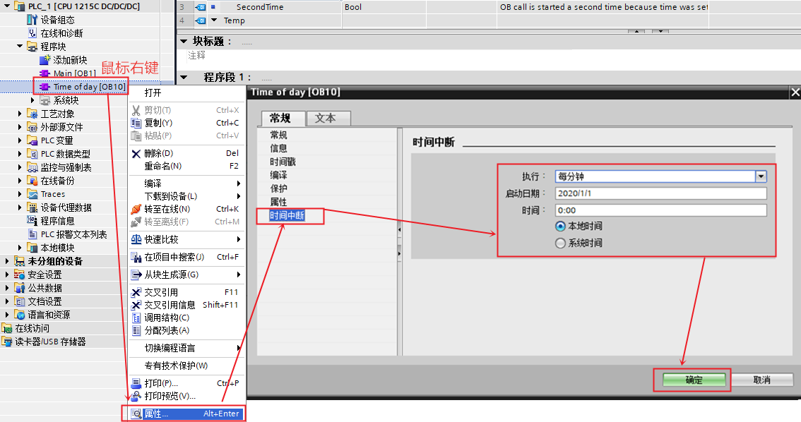
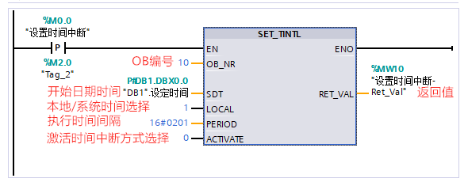
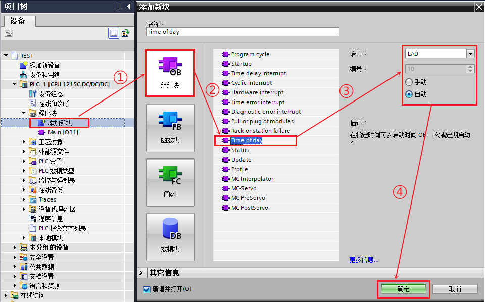
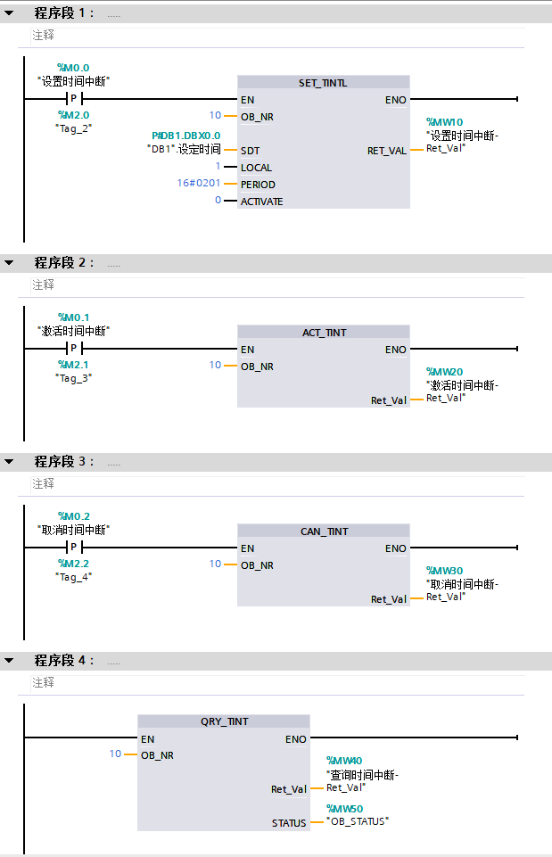

### 时间中断 OB10

#### 时间中断的功能

时间中断 OB
用于在时间可控的应用中定期运行一部分用户程序，可实现在某个预设时间到达时只运行一次；或者在设定的触发日期到达后，按每分/小时/天/周/月等周期运行。

只有在设置并激活了时间中断，且程序中存在相应组织块的情况下，才能运行时间中断。

#### 与时间中断相关的指令

  ------------------------------ ------------------------------------------------------------------------------------
  指令名称                       功能说明
  SET_TINTL（设置时间中断）      设置日期和时间中断。程序中断 OB 可以设置为执行一次，或者在分配的时间段内多次执行。
  CAN_TINT（取消时间中断）       为指定的中断 OB 取消起始日期和时钟中断事件。
  ACT_TINT（激活时间中断）       为指定的中断 OB 激活起始日期和时间中断事件。
  QRY_TINT（查询时间中断状态）   为指定的中断 OB 查询日期和时间中断状态。
  ------------------------------ ------------------------------------------------------------------------------------

以上指令的相关详细信息，请查看[链接](../../../01-resource/03-online_doc.htm)中
S7-1200 系统手册，第 9.5.3 章：时钟中断。

#### 时间中断 OB 的设置和激活方法

1、方法1

通过组态设置激活时间中断，如图 1 所示。

{width="1134" height="598"}

图 1. 通过组态设置激活时间中断

2、方法2

通过调用 SET_TINTL 设置时间中断，调用 ACT_TINT 激活时间中断，如图 2、3
所示。

{width="590" height="230"}

图 2. 设置时间中断

{width="607" height="173"}

图 3. 激活时间中断

#### 时钟中断 OB 的使用示例：

{width="15"
height="15"}例如：从设定时间开始每分钟执行时钟中断 OB10
，每次进入时钟中断将 MD200 加 1。具体实现过程如下：

1、按如下步骤创建延时中断 OB10 。如图 4 所示。

{width="960" height="598"}

图 4. 创建时间中断 OB10

2、OB10 中编程，当触发时间中断时执行 MD200 加1。如图 5 所示。

{width="826" height="440"}

图 5. OB10 中编程

3、OB1
中编程，设置时间中断、激活时间中断、取消时间中断、查询时间中断。如图 6
所示。

{width="619" height="961"}

图 6. OB1 中编程

### 常见问题

{width="15"
height="15"}使用时间中断组织块需要注意什么？

1、每次 CPU 启动之后，必须重新激活先前设置的时间中断；

2、当参数 PERIOD 重复周期设置为每月，则必须将 SDT 参数的起始日期设置为 1
号到 28 号中的一天；

3、如果组态时间中断时设置相应 OB
只执行一次，则启动时间一定不能为过去的时间（与 CPU 的实时时钟相关）；

4、如果组态时间中断时设置周期性执行相应
OB，但启动时间已过，则将在下次的这个时间执行该时间中断；

5、调用 ACT_TINT 激活的时间中断不会在激活结束前执行。
