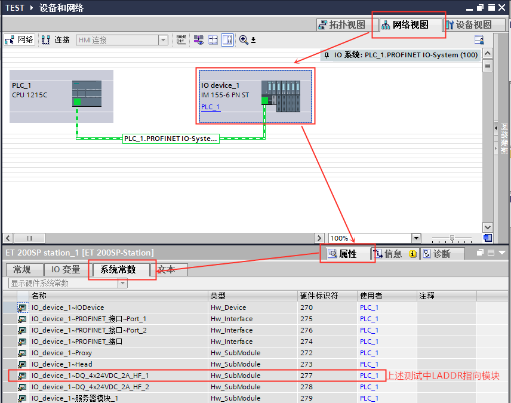

# 插拔中断 OB83

## 插拔中断 OB83 的功能

如果移除或插入了已组态且未禁用的分布式 I/O模块或子模块（PROFIBUS、PROFINET 和 AS-i），编程访问 OB83 的启动信息可以判断触发 OB83 的模块并作出响应。

## 与插拔中断 OB83 相关的信息

当触发插拔中断时，通过 OB83的接口变量可以读取相应的启动信息，可以帮助确定事件发生的设备、发生的事件类别。OB83的接口变量及启动信息以及导致 OB83 的启动事件如图 1、表 1、表 2 所示。

{width="672" height="196"}

图 1. OB83 接口变量
 
  |输入             |       数据类型         |       说明|
  |-----------------------|-----------------------|-----------------------|
  |LADDR                  | HW_IO             |      硬件标识符         |
  |Event_Class            | Byte               |    B#16#38：模块已插入   B#16#39：模块已拔出|
  |Fault_ID               |Byte                |    故障标识符|

表 1. OB83 的启动信息

  |Event_Class B#16#\... |  Fault_ID B#16#\...   |说明                                      |
  |-----------------------|--------------------|--------------------------------------------|
  |39                     | 51                 |  IO 模块已移除|
  |39                     | 54                 |   IO 子模块已移除| 
  |38                     |  54                 |   IO 子模块已插入，且匹配组态的子模块| 
  |38                     |55                   | IO 子模块已插入，但与组态的子模块不匹配| 
  |38                      |56                  |  IO 子模块已插入，但模块参数分配存在错误| 
  |38                      |57                  | IO 子模块或模块已插入，但存在故障或需要维护| 
  |38                      |58                   |IO 子模块，已更正访问错误| 

表 2. Event_Class 与 Fault_ID 关系

## 插拔中断 OB83 的使用示例

### 1、按以下步骤创建插拔中断 OB83 

如图 2 所示。

{width="955" height="598"}

图 2. 创建插拔中断 OB83

### 2、在 OB83 中编程,创建地址为 MW100、MB102、MB103的变量用于存储出现模块插拔时读取到的启动信息

如图 3 所示。

{width="984" height="389"}

图 3. OB83 中编程

### 3、测试结果：程序下载后，在监控表中查看 MW100、MB102 、MB103 的数据

① 当有模块拔出时，触发插拔中断 OB83 ，结果如图 4 所示。

{width="509" height="106"}

图 4. 测试结果 1

② 当有模块插入时，触发插拔中断 OB83 ，结果如图 5 所示。

{width="508" height="103"}

图 5. 测试结果 2

### 4、通过 OB83 启动信息中 LADDR 判断触发 OB83 的模块

LADDR 是受影响模块或子模块的硬件标识符，通过 OB83 中 LADDR的值就可以判断受影响的硬件，LADDR 的查看方式如下，可以在 PLC变量的系统常量中查看 PLC项目中全部系统常量，也可以在网络视图中选择具体的站或者系统查看系统常数，

如图6、7 所示。

{width="1259" height="719"}

图 6. 全部系统常量查看方法

{width="856" height="675"}

图 7. 具体站或系统的系统常数查看方法

## 常见问题：

!!! question "使用插拔组织块需要注意什么？"

    1、插拔组织块 OB 数量 \<=1 ；

    2、无论是否编程 OB83，移除或插入了已组态且未禁用的分布式 I/O
    模块或子模块不会导致 CPU 进入 STOP 模式；

    3、无论是否编程 OB83，移除或插入中央模块将导致 CPU 进入 STOP 模式；

    4、如果希望 CPU 在接收到触发 OB83 的某种启动事件时进入 STOP 模式，可以在
    OB83 中加入 STP 指令，使 CPU 进入 STOP 模式。
