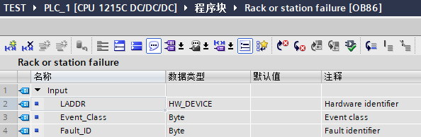
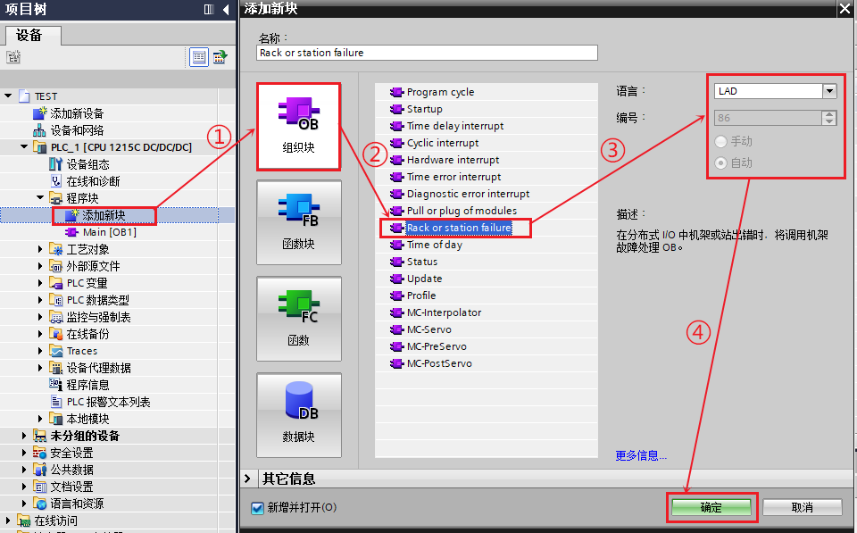
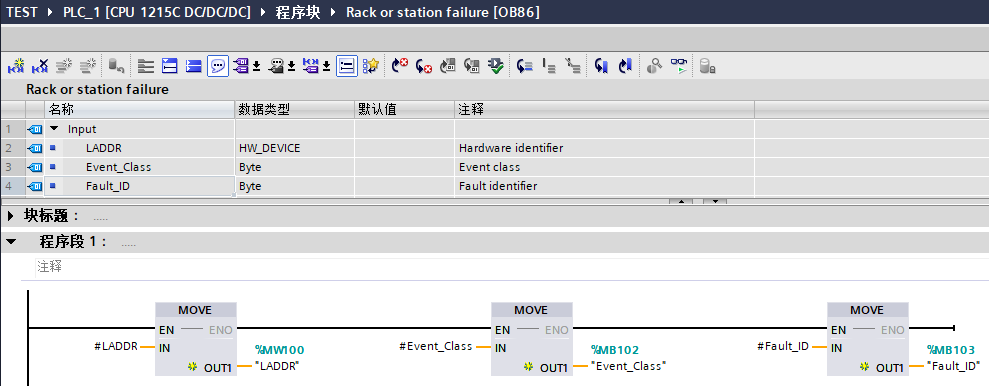
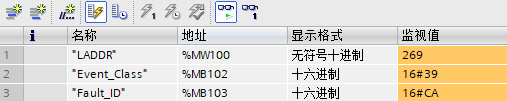
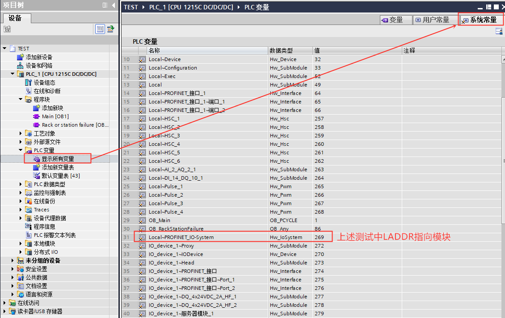
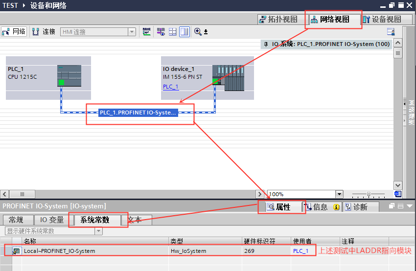

### 机架或站故障 OB86

#### 机架或站故障 OB86 的功能

当 CPU
检测到分布式机架或站出现故障或发生通信丢失时，可以编程访问机架或站故障
OB86 的启动信息判断触发中断的站并作出响应。

#### 与机架或站故障 OB86 相关的信息

当触发 OB86 时，通过 OB86
的接口变量可以读取相应的启动信息，可以帮助确定事件发生的站、发生的事件类别。OB86
的接口变量、启动信息及导致 OB86 的启动事件如图 1、表 1、表 2 所示。

{width="594" height="194"}

图1. OB86 接口变量

  -----------------------------------------------------------------------
  输入                    数据类型                说明
  ----------------------- ----------------------- -----------------------
  LADDR                   HW_IO                   硬件标识符

  Event_Class             Byte                    B#16#32：激活 IO 设备\
                                                  B#16#33：禁用 IO 设备\
                                                  B#16#38：离去事件\
                                                  B#16#39：到达事件

  Fault_ID                Byte                    故障标识符
  -----------------------------------------------------------------------

表 1. OB86 的启动信息

  Event_Class B#16#\...   Fault_ID B#16#\...   说明
  ----------------------- -------------------- -------------------------------------------------------
  39                      C3                   DP 主站系统故障
  39/38                   C4                   DP 从站故障/恢复
  38                      C5                   恢复 DP 从站，但从站仍有故障
  38                      C6                   恢复扩展单元，但模块参数分配存在错误
  38                      C7                   恢复 DP 设备，但模块组态存在错误
  38                      C8                   恢复 DP 设备，但预设组态和实际组态存在差异
  39                      CA                   PROFINET IO 系统故障
  39/38                   CB                   PROFINET IO 设备故障/恢复
  38                      CC                   恢复 PROFINET IO 设备，但存在故障或需要维护
  38                      CD                   恢复 PROFINET IO 设备，但预设组态和实际组态存在差异
  38                      CE                   恢复 PROFINET IO 设备；但模块组态存在错误
  32/33                   CF                   通过"D_ACT_DP"指令激活/禁用 IO 设备
  39/38                   F8                   PROFINET 智能设备的部分子模块的故障/恢复
  38                      F9                   PROFINET 智能设备的部分子模块恢复，但设备组态存在差异

表 2. Event_Class 与 Fault_ID 关系

#### 机架或站故障 OB86 的使用示例

1、按以下步骤创建插拔中断 OB86。如图 2 所示。

{width="960" height="597"}

图 2. 创建机架或站故障 OB86

2、在 OB86 中编程，创建地址为 MW100、MB102、MB103
的变量用于存储出现模块插拔时读取到的启动信息。如图 3 所示。

{width="989" height="386"}

图 3. OB86 中编程

3、测试结果：程序下载后，在监控表中查看 MW100、MB102、MB103
的数据。当出现 PROFINET IO 系统故障时，如图 4 所示。

{width="507" height="101"}

图 4. 测试结果

4、通过 OB86 启动信息中的 LADDR 判断触发 OB86 的故障硬件

LADDR 是故障硬件的硬件标识符，通过 OB86 中 LADDR
的值就可以判断发生故障的硬件，LADDR 的查看方式如下，可以在 PLC
变量的系统常量中查看 PLC
项目中全部系统常量，也可以在网络视图中选择具体的站或者系统查看系统常数，如图
5、6 所示。

{width="1130" height="713"}

图 5. 全部系统常量查看方法

{width="850" height="554"}

图 6. 具体站或系统的系统常数查看方法

### 常见问题

{width="15" height="15"}哪些情况会触发机架或站故障
OB86？

1、检测到 DP 主站系统或 PROFINET IO 系统发生故障（对于到达或离去事件）；

2、检测到 DP 从站或 IO 设备发生故障（对于到达或离去事件）；

3、检测到 PROFINET 智能设备的部分子模块发生故障。

{width="15" height="15"}使用机架或站故障 OB86
需要注意什么？

1、机架或站故障 OB 数量\<=1;

2、无论是否编程 OB86，当出现机架或站故障时不会导致 CPU 进入 STOP 模式；

3、如果希望 CPU 在接收到机架或站故障中的某种错误时进入 STOP 模式，可以在
OB86 中加入 STP 指令，使 CPU 进入 STOP 模式。
