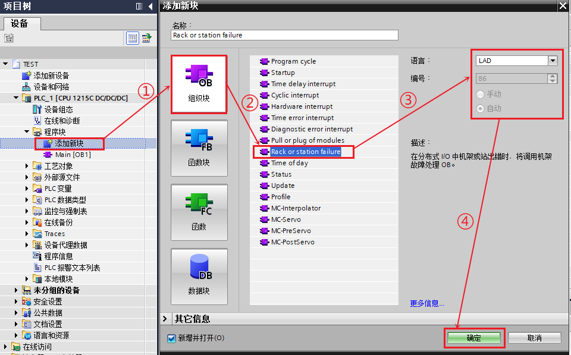
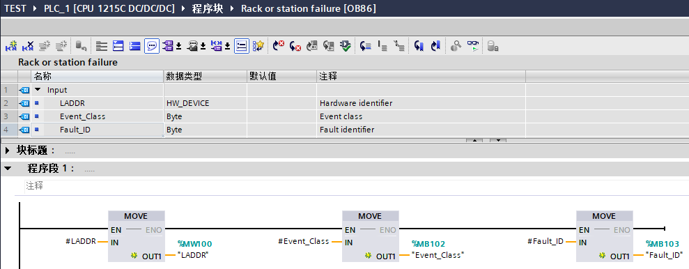
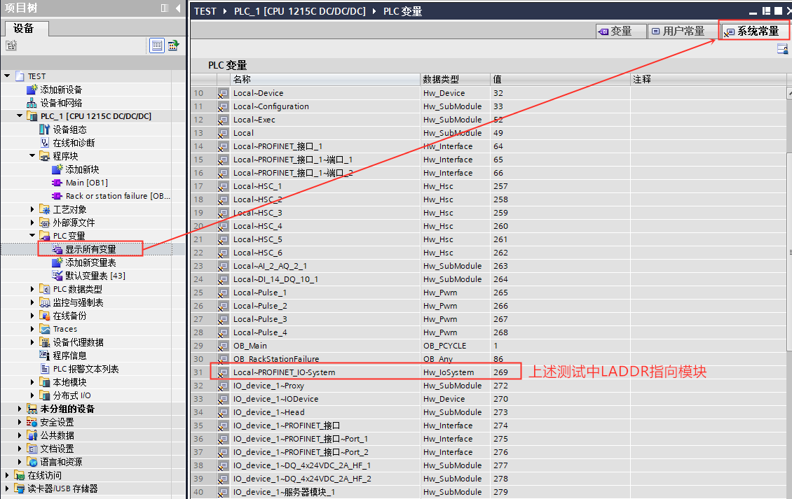
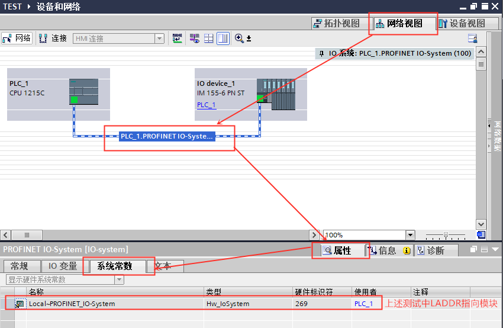

# 机架或站故障 OB86

## 机架或站故障 OB86 的功能

当 CPU
检测到分布式机架或站出现故障或发生通信丢失时，可以编程访问机架或站故障
OB86 的启动信息判断触发中断的站并作出响应。

## 与机架或站故障 OB86 相关的信息

当触发 OB86 时，通过 OB86的接口变量可以读取相应的启动信息，可以帮助确定事件发生的站、发生的事件类别。OB86的接口变量、启动信息及导致 OB86 的启动事件如图 1、表 1、表 2 所示。

{width="594" height="194"}

图1. OB86 接口变量

| 输入        | 数据类型 | 说明                                                                                           |
| ----------- | -------- | ---------------------------------------------------------------------------------------------- |
| LADDR       | HW_IO    | 硬件标识符                                                                                     |
| Event_Class | Byte     | B#16#32：激活 IO 设备   B#16#33：禁用 IO 设备   B#16#38：离去事件   B#16#39：到达事件 |
| Fault_ID    | Byte     | 故障标识符                                                                                     |

表 1. OB86 的启动信息

  | Event_Class B#16#\... | Fault_ID B#16#\... | 说明                                                  |
  | --------------------- | ------------------ | ----------------------------------------------------- |
  | 39                    | C3                 | DP 主站系统故障                                       |
  | 39/38                 | C4                 | DP 从站故障/恢复                                      |
  | 38                    | C5                 | 恢复 DP 从站，但从站仍有故障                          |
  | 38                    | C6                 | 恢复扩展单元，但模块参数分配存在错误                  |
  | 38                    | C7                 | 恢复 DP 设备，但模块组态存在错误                      |
  | 38                    | C8                 | 恢复 DP 设备，但预设组态和实际组态存在差异            |
  | 39                    | CA                 | PROFINET IO 系统故障                                  |
  | 39/38                 | CB                 | vPROFINET IO 设备故障/恢复                            |
  | 38                    | CC                 | 恢复 PROFINET IO 设备，但存在故障或需要维护           |
  | 38                    | CD                 | 恢复 PROFINET IO 设备，但预设组态和实际组态存在差异   |
  | 38                    | CE                 | 恢复 PROFINET IO 设备；但模块组态存在错误             |
  | 32/33                 | CF                 | 通过"D_ACT_DP"指令激活/禁用 IO 设备                   |
  | 39/38                 | F8                 | PROFINET 智能设备的部分子模块的故障/恢复              |
  | 38                    | F9                 | PROFINET 智能设备的部分子模块恢复，但设备组态存在差异 |

表 2. Event_Class 与 Fault_ID 关系

## 机架或站故障 OB86 的使用示例

### 1、按以下步骤创建插拔中断 OB86

如图 2 所示。

{width="960" height="597"}

图 2. 创建机架或站故障 OB86

### 2、在 OB86 中编程，创建地址为 MW100、MB102、MB103的变量用于存储出现模块插拔时读取到的启动信息

如图 3 所示。

{width="989" height="386"}

图 3. OB86 中编程

### 3、测试结果：程序下载后，在监控表中查看 MW100、MB102、MB103的数据。当出现 PROFINET IO 系统故障时

如图 4 所示。

{width="507" height="101"}

图 4. 测试结果

### 4、通过 OB86 启动信息中的 LADDR 判断触发 OB86 的故障硬件

LADDR 是故障硬件的硬件标识符，通过 OB86 中 LADDR的值就可以判断发生故障的硬件，LADDR 的查看方式如下，可以在 PLC变量的系统常量中查看 PLC
项目中全部系统常量，也可以在网络视图中选择具体的站或者系统查看系统常数，

如图5、6 所示。

{width="1130" height="713"}

图 5. 全部系统常量查看方法

{width="850" height="554"}

图 6. 具体站或系统的系统常数查看方法

## 常见问题

哪些情况会触发机架或站故障OB86?

    1、检测到 DP 主站系统或 PROFINET IO 系统发生故障（对于到达或离去事件）；

    2、检测到 DP 从站或 IO 设备发生故障（对于到达或离去事件）；

    3、检测到 PROFINET 智能设备的部分子模块发生故障。

使用机架或站故障 OB86 需要注意什么?

    1、机架或站故障 OB 数量\<=1;

    2、无论是否编程 OB86，当出现机架或站故障时不会导致 CPU 进入 STOP 模式；

    3、如果希望 CPU 在接收到机架或站故障中的某种错误时进入 STOP 模式，可以在
    OB86 中加入 STP 指令，使 CPU 进入 STOP 模式。
