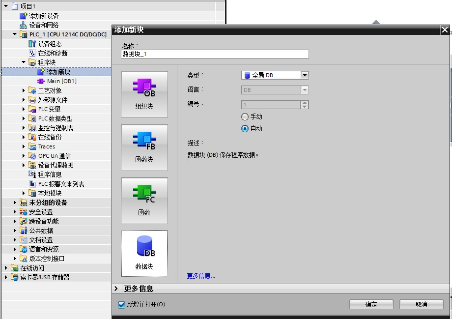
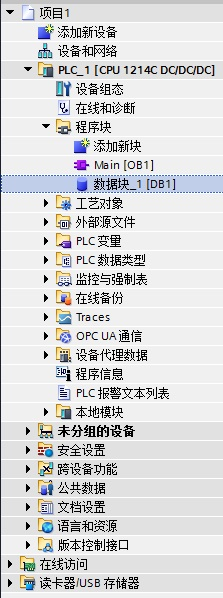
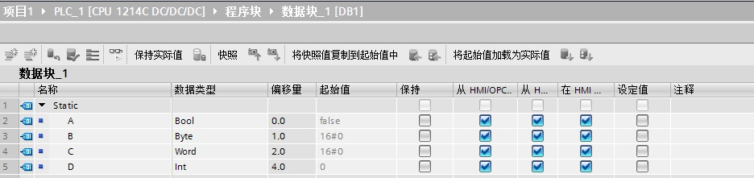
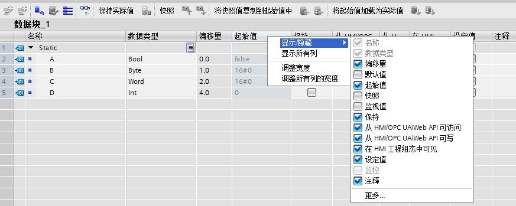
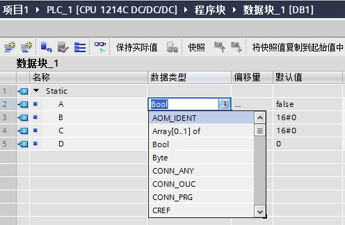
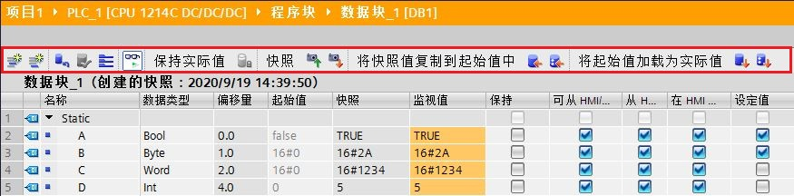
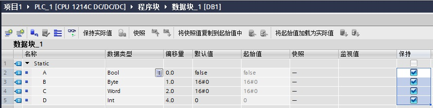
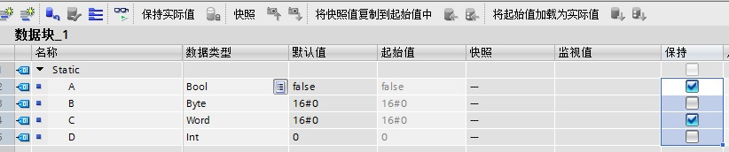
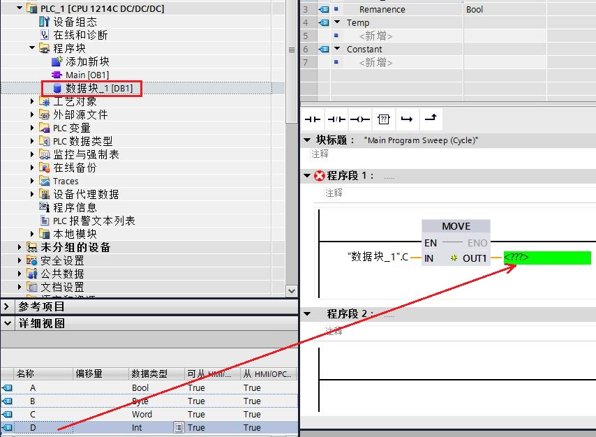
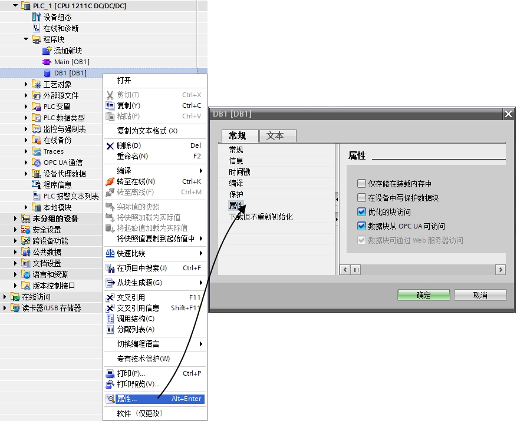

### S7-1200 数据块的使用 {#s7-1200-数据块的使用 .STYLE1}

**硬件环境：**

S7-1200 CPU V4.4(6ES7 214-1AG40-0XB0)

**软件环境：**

（1）Windows 10 Enterprise 64位

（2）STEP7
Professional V16

### 步骤 {#步骤 .STYLE1}

**1. 创建DB块：
在项目中添加了S7-1200设备之后,在项目树中此PLC的\"程序块\"下即可以添加新的数据块。**

{width="920" height="649"}

图1 DB块的创建

在打开的\"添加新块\"窗口下选择数据块。 以下是对此窗口下各项配置的说明：

名称：此处可以键入DB块的符号名。如果不做更改，那么将保留系统分配的默认符号名。例如此处为DB块分配的符号名为"数据块_1"；

类型：此处可以通过下拉菜单选择所要创建的数据块类型-全局数据块、背景数据块，或是基于UDT以及SDT的全局数据块（参见链接[UDT](../01-Data_Type/03-UDT.html)、[SDT](../01-Data_Type/05-SDT.html)）。如果要创建背景数据块，下拉菜单中列出了此项目中已有的FB供用户选择。

语言：对于创建数据块，此处不可更改。

编号：默认配置为"自动"，即系统自动为所生成的数据块配分块号。当然也可以选择"手动"，则"编号"处的下拉菜单变为高亮状态,以便用户自行分配DB块编号。

当以上的数据块属性全部定义完成，点击"确定"按钮即创建完成一个数据块。用户可以在项目树中看到刚刚创建的数据块，如图2所示：

{width="223" height="598"}

图2 项目树中的DB块

**2. 为数据块定义变量：双击打开数据块即可逐行添加变量，如图3 所示。**

{width="936" height="221"}

图3 DB块的编辑

\
如果取消勾选数据块的属性对话框中的"优化的块访问"的复选框，参考图10，则在数据块中可以看到"偏移量"列，并且系统在编译之后在该列生成每个变量的地址偏移量。设置成优化访问的数据块则无此列。

默认情况下会有一些变量属性列未被显示出来，可以通过右键单击任意列标题，可在出现的菜单中选择显示被隐藏的列，见图4：

{width="873" height="349"}

图4 显示隐藏列

表1是对数据块变量定义的所有列的说明：

下表列出了各列的含义。可根据需要显示或隐藏各列。显示的列数取决于 CPU
类型。

+-----------------------------------+-----------------------------------+
| 列                                | 说明                              |
+===================================+===================================+
| ::: {align="left"}                | ::: {align="left"}                |
| {width="27"   | 单                                |
| height="23"}                      | 击符号以移动或复制变量。例如，可  |
| :::                               | 以将变量拖动到程序中作为操作数。  |
|                                   | :::                               |
+-----------------------------------+-----------------------------------+
| ::: {align="left"}                | ::: {align="left"}                |
| 名称                              | 变量名称。                        |
| :::                               | :::                               |
+-----------------------------------+-----------------------------------+
| ::: {align="left"}                | ::: {align="left"}                |
| 数据类型                          | 变量的数据类型。                  |
| :::                               | :::                               |
+-----------------------------------+-----------------------------------+
| ::: {align="left"}                | ::: {align="left"}                |
| 偏移量                            | 在非                              |
| :::                               | 优化的数据块中，显示变量的地址。  |
|                                   | :::                               |
+-----------------------------------+-----------------------------------+
| ::: {align="left"}                | ::: {align="left"}                |
| 默认值                            | 更高级别代码块接口中或 PLC        |
| :::                               | 数据类型中变量的默认值。          |
|                                   | :::                               |
+-----------------------------------+-----------------------------------+
| ::: {align="left"}                | ::: {align="left"}                |
| 起始值                            | 在启动时变量采用的值。            |
| :::                               | 创建数据块时，代码块中定义的默认  |
|                                   | 值将用作起始值。之后，即可使用实  |
|                                   | 例特定的起始值替换所用的默认值。  |
|                                   | :::                               |
+-----------------------------------+-----------------------------------+
| ::: {align="left"}                | ::: {align="left"}                |
| 监视值                            | CPU                               |
| :::                               | 中的                              |
|                                   | 当前数据值。只有当在线连接可用并  |
|                                   | 单击"监视"按钮时，此列才会出现。  |
|                                   | :::                               |
+-----------------------------------+-----------------------------------+
| ::: {align="left"}                | ::: {align="left"}                |
| 快照                              | 显示从                            |
| :::                               | 设备加载的值。快照功能参见链接：  |
|                                   | [DB 快照](03-DB_Snapshots.html)   |
|                                   | :::                               |
+-----------------------------------+-----------------------------------+
| ::: {align="left"}                | ::: {align="left"}                |
| 保持性                            | 将变量                            |
| :::                               | 标记为具有保持性。即使在关断电源  |
|                                   | 后，保持性变量的值也将保留不变。  |
|                                   | :::                               |
+-----------------------------------+-----------------------------------+
| ::: {align="left"}                | ::: {align="left"}                |
| 在 HMI 工程组态中可见             | 显示默认情况下，该变量在 HMI      |
| :::                               | 选择列表中是否显示。              |
|                                   | :::                               |
+-----------------------------------+-----------------------------------+
| ::: {align="left"}                | ::: {align="left"}                |
| 从 HMI/OPC UA 可访问              | 指示在运行过程中，HMI/OPC UA      |
| :::                               | 是否可访问该变量。                |
|                                   | :::                               |
+-----------------------------------+-----------------------------------+
| ::: {align="left"}                | ::: {align="left"}                |
| 从 HMI/OPC UA 可写                | 指示在运行过程中，是否可从        |
| :::                               | HMI/OPC UA 写入变量。             |
|                                   | :::                               |
+-----------------------------------+-----------------------------------+
| ::: {align="left"}                | ::: {align="left"}                |
| 设定值                            | 设定值是指                        |
| :::                               | 在调试过程中可能需要微调的值。经  |
|                                   | 过调试之后，这些变量的值可作为起  |
|                                   | 始值传输到离线程序中并进行保存。  |
|                                   | :::                               |
+-----------------------------------+-----------------------------------+
| ::: {align="left"}                | ::: {align="left"}                |
| 监控                              | 指示是否                          |
| :::                               | 已为该变量的过程诊断创建有监视。  |
|                                   | :::                               |
+-----------------------------------+-----------------------------------+
| ::: {align="left"}                | ::: {align="left"}                |
| 注释                              | 用于说明变量的注释信息。          |
| :::                               | :::                               |
+-----------------------------------+-----------------------------------+

表1 DB块中的列属性

定义变量的数据类型：可以为变量定义基本数据类型，复杂数据类型（时间与日期，字符串，结构体，数组等），PLC数据类型（如用户自定义数据类型），系统数据类型和硬件数据类型。可以直接键入数据类型标识符（例如：使用高速计数器功能时，调用指令CTRL_HSC_EXT指令，其中CTRL引脚填写的数据类型为"HSC_Count"，需要手动直接输入。），或者通过该列中的选择按钮选择。如下图所示：

{width="496" height="324"}

图5 定义数据类型

DB块在线的状态如图6所示，其中红色方框中是DB块中的按钮功能，具体介绍详见表2：

{width="875" height="216"}

图6 DB块的按钮

表2中介绍了DB块中各个按钮的功能：

+-----------------------+-----------------------+-----------------------+
| 按钮                  | 功能                  | 说明                  |
+=======================+=======================+=======================+
| ::: {align="left"}    | ::: {align="left"}    | ::: {align="left"}    |
| {width="28" | :::                   | 变量的前面插入一行。  |
| height="26"}          |                       | :::                   |
| :::                   |                       |                       |
+-----------------------+-----------------------+-----------------------+
| ::: {align="left"}    | ::: {align="left"}    | ::: {align="left"}    |
| {width="26" | :::                   | 变量的后面添加一行。  |
| height="27"}          |                       | :::                   |
| :::                   |                       |                       |
+-----------------------+-----------------------+-----------------------+
| ::: {align="left"}    | ::: {align="left"}    | ::: {align="left"}    |
| {width="27" | :::                   | 特定的起始值指定的所  |
| height="26"}          |                       | 有值复位到其默认值。  |
| :::                   |                       | :::                   |
+-----------------------+-----------------------+-----------------------+
| ::: {align="left"}    | ::: {align="left"}    | ::: {align="left"}    |
| {width="27" | :::                   | 性，不一致可能是由于  |
| height="26"}          |                       | 更改了所使用的函数块  |
| :::                   |                       | 或PLC数据类型所引起。 |
|                       |                       | :::                   |
+-----------------------+-----------------------+-----------------------+
| ::: {align="left"}    | ::: {align="left"}    | ::: {align="left"}    |
| {width="30" | :::                   | 数据类型的所有元素。  |
| height="25"}          |                       | :::                   |
| :::                   |                       |                       |
+-----------------------+-----------------------+-----------------------+
| ::: {align="left"}    | ::: {align="left"}    | :::: {align="left"}   |
| {width="26" | :::                   | 显示变量当前在 CPU    |
| height="27"}          |                       | 中的实际值。          |
| :::                   |                       | :::                   |
|                       |                       | ::::                  |
+-----------------------+-----------------------+-----------------------+
| ::: {align="left"}    | ::: {align="left"}    | :::: {align="left"}   |
| {width="33" | :::                   | 在CPU中，加载对       |
| height="28"}          |                       | 当前数据块的更改而不  |
| :::                   |                       | 会丢失当前值。详细用  |
|                       |                       | 法可以参考"下载但不重 |
|                       |                       | 新初始化"，[链接](..  |
|                       |                       | /../01-operation/05-d |
|                       |                       | ownload_in_run.htm)。 |
|                       |                       | :::                   |
|                       |                       | ::::                  |
+-----------------------+-----------------------+-----------------------+
| ::: {align="left"}    | ::: {align="left"}    | ::: {align="left"}    |
| {width="27" | :::                   | 的实际值保存为快照。  |
| height="28"}          |                       | 该快照通常会捕获数据  |
| :::                   |                       | 块中所有变量的实际值  |
|                       |                       | 。 快照功能参见链接： |
|                       |                       | [DB                   |
|                       |                       | 快照](                |
|                       |                       | 03-DB_Snapshots.html) |
|                       |                       | :::                   |
+-----------------------+-----------------------+-----------------------+
| ::: {align="left"}    | ::: {align="left"}    | ::: {align="left"}    |
| {width="28" | 快照重新初始化实际值  | 快照作为实际值加载到  |
| height="25"}          | :::                   | CPU 中。之后，CPU     |
| :::                   |                       | 将这些值用            |
|                       |                       | 作在线程序中的实际值  |
|                       |                       | 。 快照功能参见链接： |
|                       |                       | [DB                   |
|                       |                       | 快照](                |
|                       |                       | 03-DB_Snapshots.html) |
|                       |                       | :::                   |
+-----------------------+-----------------------+-----------------------+
| ::: {align="left"}    | ::: {align="left"}    | ::: {align="left"}    |
| {width="30" | :::                   | 离线程序中，将快照复  |
| height="42"}          |                       | 制到起始值中。下次从  |
| :::                   |                       | STOP 切换为 RUN       |
|                       |                       | 时，程序              |
|                       |                       | 将以新的起始值运行。  |
|                       |                       |                       |
|                       |                       | 可以复制所有起始      |
|                       |                       | 值，也可仅复制标识为  |
|                       |                       | "设定值"变量的起始值  |
|                       |                       | 。快照功能参见链接：  |
|                       |                       | [DB                   |
|                       |                       | 快照](                |
|                       |                       | 03-DB_Snapshots.html) |
|                       |                       | :::                   |
+-----------------------+-----------------------+-----------------------+
| ::: {align="left"}    | ::: {align="left"}    | ::: {align="left"}    |
| {width="29" | 始值重新初始化实际值  | 值。起始值将直接写入  |
| height="46"}          | :::                   | CPU 工作存储器中。    |
| :::                   |                       |                       |
|                       |                       | 可以复制所有实际      |
|                       |                       | 值，也可仅复制标识为" |
|                       |                       | 设定值"变量的实际值。 |
|                       |                       | :::                   |
+-----------------------+-----------------------+-----------------------+

表2 DB块中的按钮功能

DB块数据的保持性：对于可优化访问的数据块，其中的每个变量可以分别设置其保持与否；而标准数据块仅可设置其中所有的变量保持或不保持，不能对每个变量单独设置。如图7和图8所示：

{width="891" height="223"}

图7 标准数据块中仅可设置所有的变量保持或不保持

{width="822" height="172"}

图8 可优化访问的数据块中可以分别设置每个变量的保持性

在程序中添加DB块中的变量，可以采用拖拽的方式，鼠标左键单击DB块，在"详细视图"中显示DB块中的所有变量，选中相应的变量（例如：变量D），按住鼠标左键，将变量D直接拖动到MOVE指令的OUT1引脚即可，如图9所示：

{width="854" height="626"}

图9 在程序中添加DB块中的变量

**3. 数据块的访问：**

符号访问：\<DB块名\>.\<变量名\>；例如：\"Data_Block_1\".A；

绝对地址访问：\<DB块号\>.\<变量长度及偏移量\>：DB1.DBX0.0；DB1.DBB0；DB1.DBW0；DB1.DBD0。

**注意：复杂数据类型只能符号寻址。**

**4. 数据块的属性：**

(1)双击打开数据块，可以看到起始值列，点击"全部监视"按钮，可以看到监视值列：

起始值：在启动时变量采用的值。创建数据块时，代码块中中定义的默认值将用作起始值。之后，即可使用实例特定的起始值替换所用的默认值。可选择是否指定起始值。如果未指定任何值，

则在启动时变量将采用默认值。如果也没有定义默认值，将使用相应数据类型的有效默认值。例如，将
BOOL 的默认值指定为\"FALSE\"。当CPU下载程序时，下载的是数据块的起始值。

监视值：CPU
中的当前数据值。只有当在线连接可用并单击\"全部监视\"按钮时，此列才会出现。当CPU上传程序时，上传的是数据块的监视值。当执行下载并复位PLC程序时，下载的是数据块的起始值，

并将监视值复制为起始值。

(2)右键点击数据块，在\"属性-\>属性\"中，可以看到数据块的如下属性，如图10所示：

仅存储在装载内存中：激活时，数据块仅存储在装载存储器中，不占用工作存储器的空间，且不链接到程序。处理数据块的指令位于\"扩展指令
-\> 数据块控制"中。

在设备中写保护数据块：指示数据块在目标系统中是否为只读，且在程序运行期间是否无法将其覆盖。

优化的块访问：在带有优化访问功能的块变量声明中，仅包含数据元素的符号名称。系统将自动优化并管理地址。这将提高
CPU 的性能并同时有效防止来自诸如 SIMATIC HMI 的访问错误。

数据块从OPC UA可访问：如果选中该复选框，则该数据块可作为完整的对象从 OPC
UA 进行访问。之后，可为 OPC UA 分别发布或锁定该数据块的各个变量。

数据块可通过 Web
服务器访问：如果选中该复选框，则数据块可作为一个完整的对象从 Web
服务器进行访问。之后，可对该数据块的各变量进行分别发布或锁定。

{width="877" height="715"}

图10 DB属性
