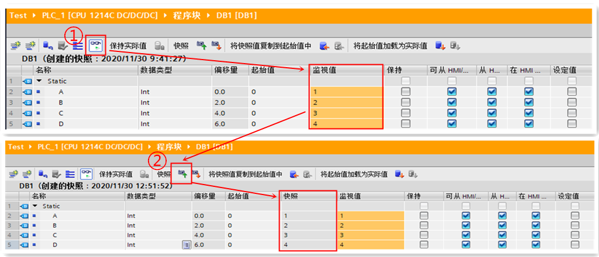
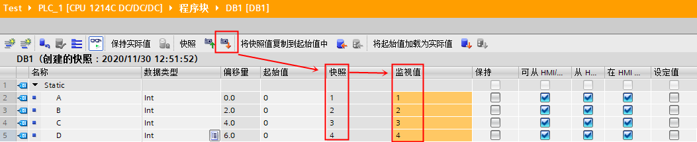
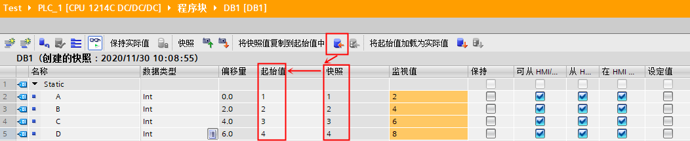
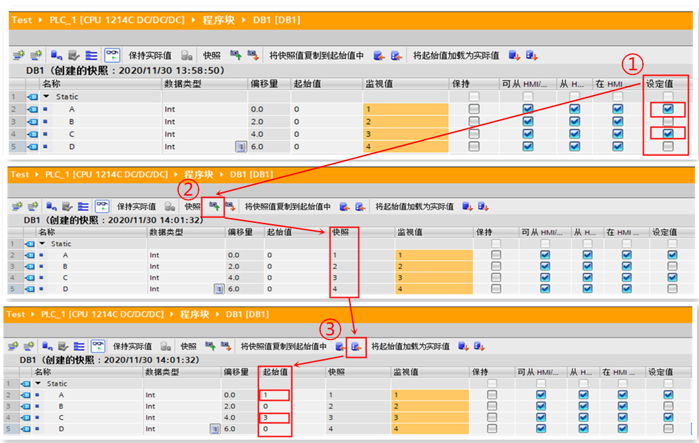
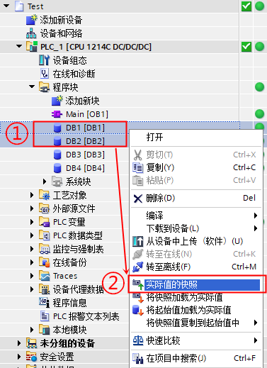
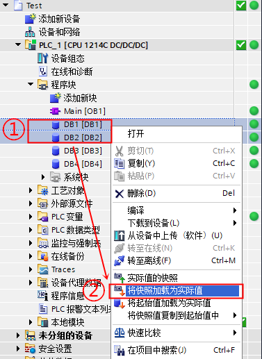
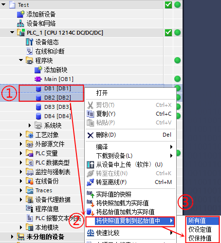

# DB 快照功能

可以通过捕获 DB 块变量实际值快照用于恢复值操作，捕获的实际快照值可以复制到 CPU 中的实际值中，也可以用于替换变量的起始值。

通过快照能解决以下场景的问题：

- 在 HMI中设置了很多工艺参数，担心下载或其他原因导致丢失，可以通过快照方式保存到本地和在线项目的起始值中，这样即使CPU出问题数据丢失，依然可以恢复
- 准备更换新CPU，但是有很多参数是在线修改的，需要通过快照方式将参数保存到本地项目以便下载到新 CPU 可以立即使用
  
上传程序块或者整个项目，同样可以实现将 DB 块的实际值捕捉到 DB 块的快照列，在此不再赘述。

## 创建单个 DB 快照

### 捕获 DB 快照的步骤

1、在 DB 编辑器中单击"监视所有变量"按钮{width="27"
height="26"}：  **监视值**列会显示实际数据值。

2、单击{width="24" height="23"}按钮捕获实际值快照并将其显示在**快照**列中。可以稍后使用该快照更新 CPU 实际值或替换起始值，具体步骤参见图1所示。

{width="1024" height="440"}

图1 捕获 DB 快照步骤

### 将快照值复制到 CPU 中

单击按钮{width="26" height="23"}：将快照值加载到在线CPU的实际值中。 **监视值**列显示了 CPU
中的实际值。具体步骤参见图2所示。

!!! warning "注意"

    如果快照包含状态信息、计时器值或计算信息，CPU 会在进行快照时恢复这些值。

{width="1053" height="215"}

图2 将快照值复制到CPU中

## 将快照值复制到起始值中

单击按钮{width="28" height="29"}：将快照值复制到变量的起始值中，然后编译并将 DB 下载到 CPU
中后， DB 中没有设置保持性的变量会在 CPU停止再重新启动后使用新起始值作为监视值。具体步骤参见图3所示。

{width="1052" height="216"}

图3 将快照值复制到起始值

## 将部分变量快照值复制到起始值中

需要以下步骤实现部分变量的快照值复制到数据块变量的起始值中，如图4所示：

- 1.在 **快照** 列中勾选需要复制到起始值中的变量
- 2.单击{width="24" height="23"}按钮捕获实际值快照并将其显示在 **快照** 列中
- 3.单击{width="30" height="26"}按钮将设定值中勾选变量的快照值复制到起始值中
- 4.编译并将 DB 下载到 CPU 中后， DB中修改起始值的并且没有设置保持性的变量会在 CPU 停止再重新启动后使用新起始值作为监视值，当然对于其余没有修改起始值也没有设置保持性的变量会在CPU 停止再重新启动后使用原起始值作为监视值

{width="1024" height="650"}

图4 将部分变量快照值复制到起始值中

## 创建多个选定 DB 的快照

### 捕获多个选定 DB 快照的步骤

- 1、项目在线状态下，在项目树中选择 DB 块，可以单独选择块，或者在包含数据块的项目中选择设备、组或者文件夹。

- 2、在右键菜单中，选择 **实际值的快照**，或选择菜单命令 **在线 \>实际值的快照**，具体步骤参见图5所示。

{width="377" height="519"}

图5 捕获多个选定 DB 快照的步骤

### 将多个 DB 快照值复制到 CPU 中

要将快照值复制到 CPU 中数据块变量的实际值中，在右键菜单中，选择 **将快照加载为实际值**，或选择菜单命令 **在线\> 将快照加载为实际值**，具体步骤参见图6所示。

{width="377" height="517"}

图6 将多个 DB 快照值复制到 CPU 中

### 将多个 DB 快照值复制到起始值中

要将快照值复制到数据块变量的起始值中，在右键菜单中，选择 **将快照值复制到起始值中**，然后根据需要选择 **所有值**、 **快照** 或者 **仅保持值** ，具体步骤参见图7所示。

{width="454" height="498"}

图7 将多个 DB 快照值复制到起始值中
