# FB （ Function Block / 功能块）

S7-1200 PLC 编程可以使用的代码块有 OB 块，FC 块和 FB 块。功能块 (FB)
是从另一个代码块（OB、FB 或 FC）进行调用时执行的子例程。在调用 FB
块时会生成与之相匹配的背景数据块，在背景数据块中可以存储定义的接口参数及静态变量。

## FB 块支持的编程语言

S7-1200 使用 FB 块编程支持的编程语言有 LAD、FBD、 SCL 以及 CEM ( TIA
PORTAL V17 开始支持，详见链接 ) ，如图 1 所示。

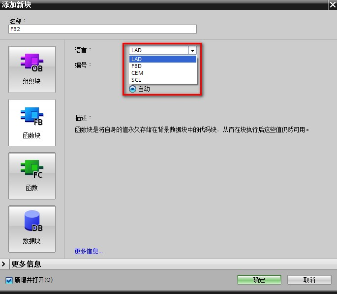{width="685" height="597"}

图 1. FB 块支持的编程语言

---

## FB 块的块接口

FB 块有一个块接口区，可以用来定义块接口。在 FB
的块接口区域中可以定义的接口类型：Input（输入）、Output（输出）、InOut（输入输出）、Static（静态变量）、Temp（临时变量）以及
Constant （常量），如图 2 所示。

{width="786" height="553"}

图 2. FB 块接口区

对于 FB 块的块接口访问如表 1 所示。

表 1. FB 块块接口访问

  
| 接口类型 | 读写访问 | 描述                                                 |
| -------- | -------- | ---------------------------------------------------- |
| Input    | 只读     | 调用 FB 块时，将数据传送到 FB 块，实参可以为常数     |
| Output   | 读写     | 将 FB 块执行的结果输出，实参不可以为常数             |
| Inout    | 读写     | 读取外部实参数值并且将结果返回到实参，实参不可为常数 |
| Static   | 读写     | 静态变量存储在背景 DB 块中，不参与对外的参数传递     |
| Temp     | 读写     | \-                                                   |
| Constant | 只读     | \-                                                   |

对于带参数的 FB 块，有形参和实参 2 个概念，如图 3 所示。

- **形参**：块接口区域定义的 Input，Output，InOut 参数；在调用 FB 块时，会以引脚方式出现在 FB 块上。Input 和 InOut 类型的变量出现在 FB块的左侧；Output 类型的变量出现在 FB 块的右侧。
- **实参**：在调用带参数的 FB 块时，为形参填写的实际变量。

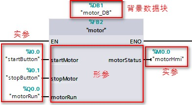{width="393" height="215"}

图 3.形参和实参


---

## FB 块编程

FB 块在编程时可以选择是否在块接口区定义变量。可以主要分为有 2 种情况：

::::{tab-set}

:::{tab-item} 情况1

```c

FB 块带参数------定义块接口，FB块中通常不出现任何全局变量（DB、I、Q、M）；

优点：模块化编程，对于相同的功能/逻辑只需要编写一个 FB块，无需重复多次编写相同的代码，进行大量重复性工作；

还可将 FB 块做成项目库或全局库，以便后续其他项目或其他工程师使用。

```
:::

:::{tab-item} 情况2

```c

FB 块不带参数------不定义任何块接口，FB 块编程中，使用全局变量；

此种方式不推荐。

```
:::

::::

### 情况1: FB 块带参数

FB 块编写程序代码，如图 4 所示。

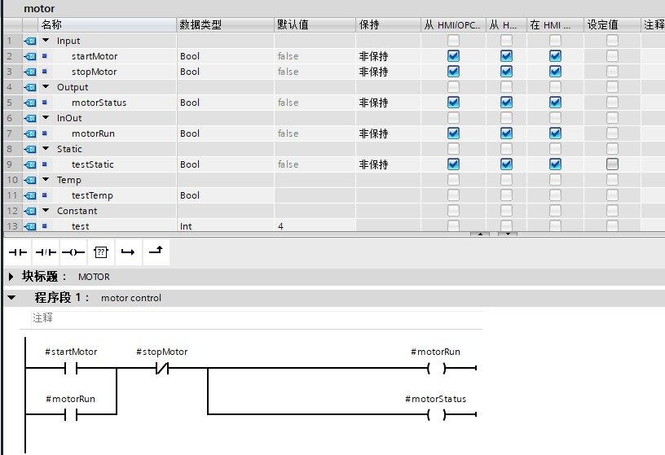{width="816" height="559"}

图 4.带参数的 FB 块编程

FB 块调用以及实参参数的填写，参考图 3 。

右键打开图 3 中 FB 块的背景数据块 "motor_DB"，显示内容如图 5 所示。

在背景数据块中可显示 Input、Output、InOut 及 Static 变量，Temp 和
Constant 变量不会出现在背景数据块中。

{width="709" height="221"}

图 5. FB 块背景数据块显示内容

编写的带参数的 FB 块，可以多次调用，只需为每次调用的 FB
块填写不同的实参。同样的功能仅需编写一次即可，无需重复编写相同的代码。

:::{warning}

一般情况下每次调用需要生成不同的背景数据块。对于部分系统 FB 指令，可能有不同要求，详见具体指令说明。
:::

### 情况2. FB 块不带参数

如果在 FB 块中编程时不定义任何块接口变量，那么，在 FB 块中编程时只能使用全局变量。FB 块编程如图 6 所示。

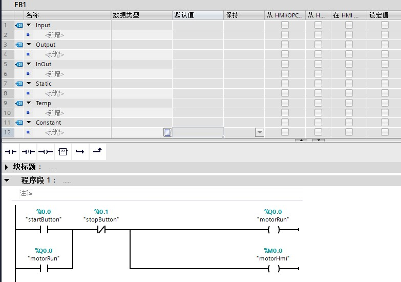{width="783" height="550"}

图 6.不带参数 FB 块编程

不带参数的 FB 块调用及其背景数据块，如图 7 所示。

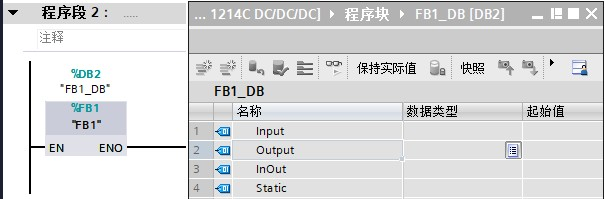{width="605" height="199"}

图 7.不带参数 FB 块调用及其背景数据块

---

## FB 块的调用

编写好 FB 块程序后，需要进行调用才可以执行 FB 块中的程序。FB 块可以由 OB
块、FC 块或其他 FB 块调用。被不同的块调用，出现的调用方式也会不同，如图
8-10 所示。

- 在 OB 中调用 FB 块，仅支持单个实例调用（如图 8 所示）
- 在 FC 块中调用 FB 块，支持单个实例和参数实例调用（如图 9 所示）
- 在 FB 块中调用另外一个 FB 块，支持单个实例，多重背景和参数实例三种方式（如图 10 所示）。

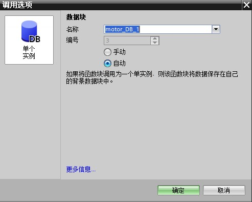{width="493" height="394"}

图 8. OB 调用 FB 块

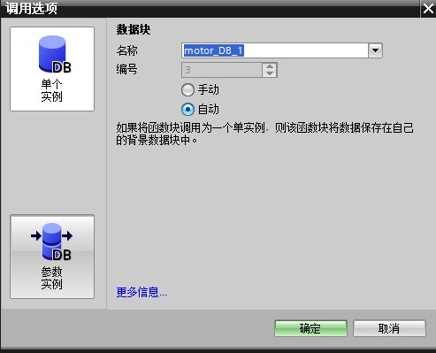{width="493" height="399"}

图 9. FC 调用 FB 块

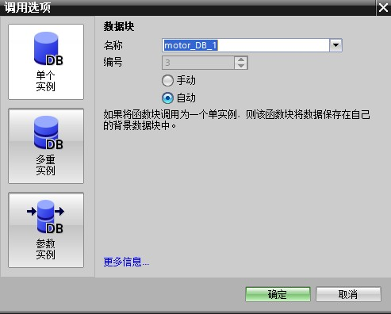{width="493" height="396"}

图 10. FB 调用 FB 块

***下面针对各个调用选项进行详细说明：***

### 单个实例

选择单个实例后，系统会自动生成该 FB
块的背景数据块，出现在程序块文件夹下方，并且自动在 FB
上方填写上该背景数据块，如图 11 所示。

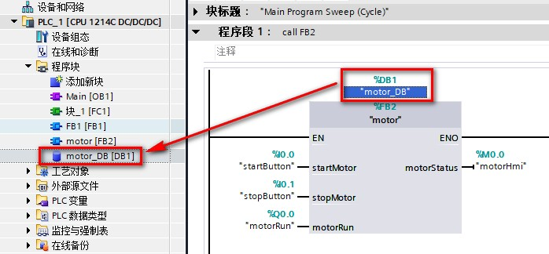{width="698" height="324"}

图 11.单个实例调用

### 参数实例

参数实例需要 TIA Portal V14 开始才支持，对 CPU 版本没有限制。

选择参数实例后，将实例作为调用块的一个 InOut
参数进行传递，需要生成一个背景数据块作为实参填写在形参上。

除此以外，参数实例的实参也可以是 DB_ANY
类型变量，详见[链接](../01-Data_Type/08-DB_ANY.md#5-用于参数实例的实参)。

如图 12 所示，FC1 中调用 FB2 **motor** ，并且调用选项选择参数实例，此时
FC1 的块接口中会新增一个 InOut 类型的参数，参数类型为 motor（FB2
的背景数据块）。

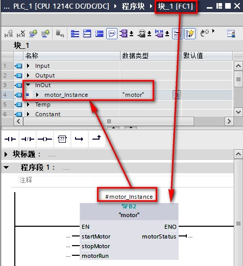{width="476" height="522"}

图 12.FC1 中参数实例调用 FB2

添加新块，选择 DB 块，类型选择 motor(FB2 的背景数据块)，如图 13 所示。

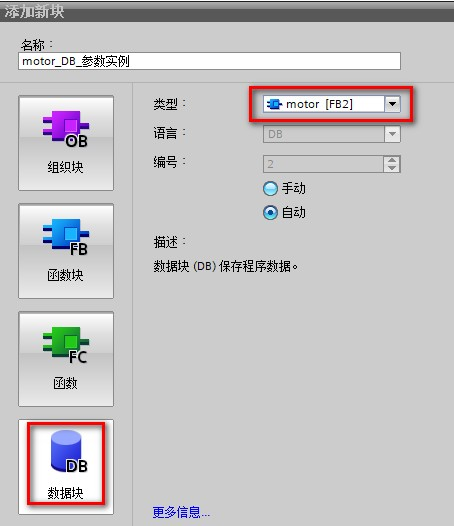{width="454" height="526"}

图 13.新建 FB2 背景数据块

如图 14 所示，在 OB1 中调用 FC1 时会出现一个 InOut
形参参数需要填写，此时将图 13 新建的背景数据块填写到 FC1 的 InOut
参数上即可。

{width="650" height="234"}

图 14.参数实例填写

### 多重实例

选择多重实例后，无需为被调用的 FB 块创建单独的背景 DB 块，被调用的 FB 块的背景数据块存储在外层 FB 块的静态变量区域。对于多重实例，还可以以数组形式存在，方便块的多次调用，详见[链接](../01-Data_Type/04-Array.md#array使用)。

如图 15 所示，FB1 中调用 2 次 FB2，选择多重实例方式。

{width="600" height="724"}

图 15.多重实例调用

---

## FB 块的背景数据块属性修改

FB 块的背景数据块伴随着 FB 块调用出现，在背景数据块中可以存储
Input（输入）、Output（输出）、InOut（输入/输出）以及
Static（静态变量），下面说明 2 点 FB 块背景数据块属性如何修改。

### 1.背景数据块的断电保持性的设置

背景数据块的断电保持性：取决于 FB 块接口中对变量保持性的设置，如图 16 所示（图中左侧为 FB 块接口，右侧为 FB 块的背景数据块。）。

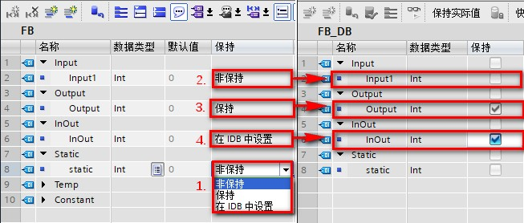{width="653" height="278"}

图 16. FB 块接口设置保持性

-   标注 1：保持性有 3 种选项，非保持、保持以及在 IDB 中设置；
-   标注2：块接口中选择为非保持的变量，背景数据块中为不勾选保持性且不可修改；
-   标注3：块接口中选择为保持的变量，背景数据块中为勾选保持性且不可修改；
-   标注 4：块接口中选择为在 IDB 中设置的变量，背景数据块中会有复选框预留，由用户自行决定是否勾选保持性，可在背景数据块中操作。此外该功能可以用于优化FB 块 的 AT 功能的使用，详见[链接](../../03-instruction/03-Address/01-AT.md)。

:::{warning}

对于非优化 FB 的保持性无法在 FB 接口处设置，只能在背景数据块中设置，并且所有变量参数的保持性是一致的，无法单独设置某一个变量参数的保持性。
:::

### 2.背景数据块的优化和非优化如何设置

背景数据块的优化或非优化：由 FB 块属性的 **优化的块访问** 设置决定

- FB 块创建后，默认是优化的 FB 块，其背景数据块也默认是优化的。
- 如果需要修改该属性，可以在 FB 块属性中，将 **优化的块访问** 复选框取消勾选，即修改为非优化，如图 17 所示。

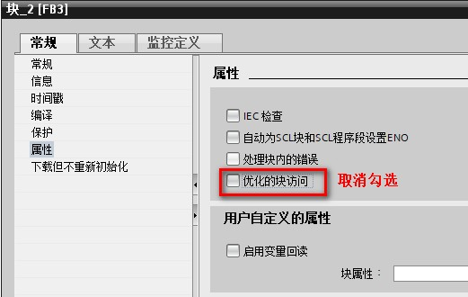{width="521" height="330"}

图 17. FB 块属性修改为非优化

对程序进行编译程序后，查看 FB 的背景数据块的属性也随之修改为非优化，如图18 所示。

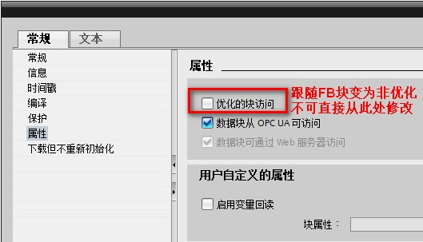{width="529" height="303"}

图 18. FB 背景数据块非优化
